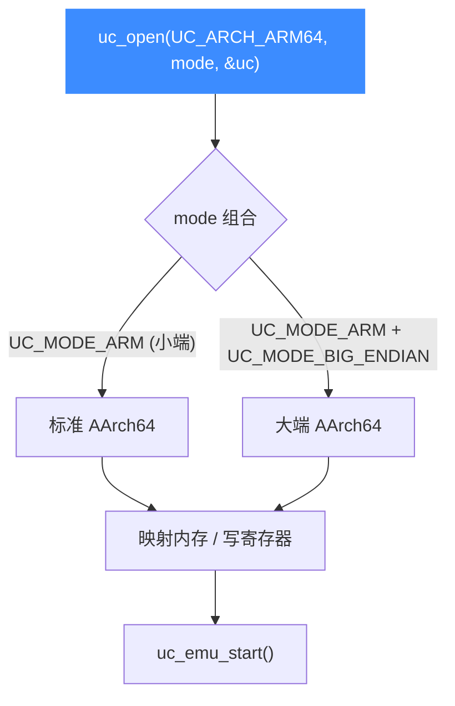

# ARM64 / AArch64 架构概览

本页讲清 Unicorn 如何模拟 64 位 ARM（AArch64）：用 [`UC_ARCH_ARM64`](https://github.com/android-security-engineer/unicorn-skills/blob/master/include/unicorn/unicorn.h#L100) + `UC_MODE_ARM` 开启，认识 X0-X30 等 64 位寄存器族，了解它在现代移动/服务器逆向中的典型用途。读完你能独立初始化一个 ARM64 引擎并知道去哪查更细的内容。

## 🚀 什么是 AArch64

AArch64 是 ARMv8 引入的 64 位执行状态，几乎所有现代 Android 手机、Apple Silicon、以及大量 ARM 服务器都跑在这个状态上。相比 32 位的 [ARM/Thumb](/arch/arm/)，它有更多、更宽的通用寄存器，指令集是全新的 **A64**（定长 4 字节），并把系统控制搬到了 EL0-EL3 异常级别体系里。

在 Unicorn 中，AArch64 对应的架构常量是 `UC_ARCH_ARM64`（注意与 32 位的 `UC_ARCH_ARM` 区分）。



## 🔧 最小初始化

AArch64 只需一种基本模式：`UC_MODE_ARM`（此处不代表 32 位，而是"非 Thumb 的标准 ARM 执行"语义），默认小端。要大端就叠加 `UC_MODE_BIG_ENDIAN`。

```c
#include <unicorn/unicorn.h>

uc_engine *uc;
uc_err err;

// 标准小端 AArch64
err = uc_open(UC_ARCH_ARM64, UC_MODE_ARM, &uc);
if (err != UC_ERR_OK) {
    printf("uc_open 失败: %s\n", uc_strerror(err));
    return;
}
// ... 映射内存、写寄存器、启动仿真 ...
uc_close(uc);
```

大端写法与 `sample_arm64.c` 中 `test_arm64eb` 一致：

```c
// 大端：mode 用加法叠加字节序标志
err = uc_open(UC_ARCH_ARM64, UC_MODE_ARM + UC_MODE_BIG_ENDIAN, &uc);
```

::: tip 小端是绝大多数场景
Android / iOS / Linux ARM64 用户态一律小端。只有极少数网络/嵌入式固件才用大端，除非你确定，否则不要加 `UC_MODE_BIG_ENDIAN`。字节序细节见 [字节序](/features/endianness)。
:::

## 🧩 64 位寄存器族一览

| 寄存器族 | 说明 | Unicorn 常量前缀 |
| --- | --- | --- |
| X0-X30 | 31 个 64 位通用寄存器 | `UC_ARM64_REG_X0` … `UC_ARM64_REG_X30` |
| W0-W30 | X 寄存器低 32 位视图 | `UC_ARM64_REG_W0` … `UC_ARM64_REG_W30` |
| SP / PC | 栈指针 / 程序计数器 | `UC_ARM64_REG_SP` / `UC_ARM64_REG_PC` |
| NZCV / PSTATE | 条件标志 / 处理器状态 | `UC_ARM64_REG_NZCV` / `UC_ARM64_REG_PSTATE` |
| V/Q/D/S/H/B | NEON/SIMD 向量与浮点视图 | `UC_ARM64_REG_V0` / `UC_ARM64_REG_Q0` … |
| 系统寄存器 | 通过 `UC_ARM64_REG_CP_REG` 访问 | 见寄存器参考页 |

完整清单与分类见 [ARM64 寄存器参考](/arch/arm64/registers)。

## 🎯 典型用途

- 📱 **移动逆向**：Android so 库、iOS 二进制的函数级仿真、脱壳、算法还原。
- 🖥️ **服务器/云**：ARM 服务器固件、云原生 ARM64 二进制分析。
- 🔐 **现代防护研究**：指针认证（PAC）、SVE、异常级别切换等 ARMv8.x 新特性验证。

Unicorn 的 ARM64 后端支持到 `UC_CPU_ARM64_MAX` 这样的"全特性"型号，方便开启 PAC 等高级能力（见 [CPU 型号](/arch/arm64/cpu-models)）。

## 📚 本架构其余页面

- [寄存器参考](/arch/arm64/registers) — X/W、SP/PC、NZCV/PSTATE、V/Q/D/S、系统寄存器。
- [模式与字节序](/arch/arm64/modes) — `UC_MODE_ARM` + 字节序，EL 异常级别。
- [指令与特性](/arch/arm64/instructions) — A64、MRS/MSR、SVC/HVC 异常。
- [CPU 型号](/arch/arm64/cpu-models) — `UC_CPU_ARM64_*` 与特性开关。
- [实战示例](/arch/arm64/example) — 完整可运行仿真走读。

## 📂 相关源码

| 文件 | 角色 |
|------|------|
| [`include/unicorn/arm64.h`](https://github.com/android-security-engineer/unicorn-skills/blob/master/include/unicorn/arm64.h#L41) | `UC_ARM64_REG_*` 寄存器枚举与 `uc_cpu_*` CPU 型号定义 |
| [`qemu/target/arm/unicorn_aarch64.c`](https://github.com/android-security-engineer/unicorn-skills/blob/master/qemu/target/arm/unicorn_aarch64.c) | 后端：`reg_read`/`reg_write`/`uc_init` 等函数指针实现 |
| [`qemu/target/arm/translate-a64.c`](https://github.com/android-security-engineer/unicorn-skills/blob/master/qemu/target/arm/translate-a64.c) | 前端：机器码翻译（TCG） |
| [`samples/sample_arm64.c`](https://github.com/android-security-engineer/unicorn-skills/blob/master/samples/sample_arm64.c) | 该架构的 C 示例程序 |
| [`include/unicorn/unicorn.h`](https://github.com/android-security-engineer/unicorn-skills/blob/master/include/unicorn/unicorn.h#L100) | `UC_ARCH_ARM64` 架构常量与 `UC_MODE_*` 公共模式定义 |

## 相关页面

- [ARM (32 位) 架构](/arch/arm/)
- [sample_arm64.c 走读](/samples/sample-arm64)
- [支持的架构](/features/architectures)
- [字节序](/features/endianness)
