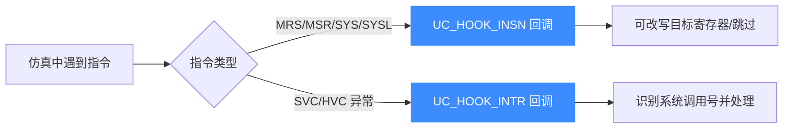

# ARM64 指令与特性

本页讲清在 AArch64 仿真里如何用 Hook 与指令级钩子处理 A64 指令集的关键场景：用 `UC_HOOK_INSN` 拦截 MRS/MSR 系统寄存器访问，用 `UC_HOOK_INTR` 处理 SVC/HVC 等异常。所有指令常量取自 [`include/unicorn/arm64.h`](https://github.com/android-security-engineer/unicorn-skills/blob/master/include/unicorn/arm64.h)。读完你能拦截系统寄存器读写并接管系统调用。

## 🧩 A64 指令集与可 Hook 的指令

AArch64 使用全新的 **A64** 指令集：定长 4 字节、大量寄存器、专门的系统寄存器访问指令。Unicorn 目前为 ARM64 暴露的可 Hook 指令（`uc_arm64_insn` 枚举）如下：

| 常量 | 指令 | 含义 |
| --- | --- | --- |
| `UC_ARM64_INS_MRS` | MRS | 从系统寄存器读到通用寄存器 |
| `UC_ARM64_INS_MSR` | MSR | 从通用寄存器写入系统寄存器 |
| `UC_ARM64_INS_SYS` | SYS | 系统指令 |
| `UC_ARM64_INS_SYSL` | SYSL | 带返回值的系统指令 |



## 🪝 拦截 MRS/MSR：UC_HOOK_INSN

系统寄存器访问指令可以用 [UC_HOOK_INSN](/hooks/insn) 拦截。回调类型是专门的 `uc_cb_insn_sys_t`，携带目标寄存器与系统寄存器编码；**返回非 0 表示跳过该指令**（连同它可能触发的异常）。

```c
// 每条被拦截的指令只允许一个回调
static uint32_t hook_mrs(uc_engine *uc, uc_arm64_reg reg,
                         const uc_arm64_cp_reg *cp_reg, void *user_data)
{
    uint64_t val = 0x114514;
    printf(">>> 拦截 MRS，向目标寄存器写入 0x114514\n");
    uc_reg_write(uc, reg, &val);   // reg 即指令的目标寄存器
    return 1;                      // 返回 1 => 跳过原指令
}
```

注册时把要拦截的指令常量作为**额外参数**传入 `uc_hook_add`：

```c
uc_hook hk;
// 机器码: mrs x2, tpidrro_el0
uc_mem_write(uc, 0x1000, "\x62\xd0\x3b\xd5", 4);
uc_hook_add(uc, &hk, UC_HOOK_INSN, hook_mrs, NULL, 1, 0, UC_ARM64_INS_MRS);
uc_emu_start(uc, 0x1000, 0x1000 + 4, 0, 0);
// 回调把 0x114514 写进 X2，跳过真实的 tpidrro_el0 读取
```

::: tip 一条指令一个回调
头文件注释明确：MRS/MSR/SYS/SYSL 每条指令只允许注册一个 `UC_HOOK_INSN` 回调。若返回 true 跳过写入，即便原本会产生异常也会被一并绕过——这正是伪造系统寄存器值的利器。
:::

## ⚡ 异常与系统调用：UC_HOOK_INTR

`SVC`（超级调用，用户态发起系统调用）、`HVC`（Hypervisor 调用）等会触发异常，交给 [UC_HOOK_INTR](/hooks/intr) 处理。在这里你可以读寄存器识别系统调用号，模拟内核行为后继续执行。

```c
static void hook_intr(uc_engine *uc, uint32_t intno, void *user_data)
{
    uint64_t x8 = 0; // AArch64 Linux 系统调用号常放在 X8
    uc_reg_read(uc, UC_ARM64_REG_X8, &x8);
    printf(">>> 异常 intno=%u, 系统调用号 X8=%" PRIu64 "\n", intno, x8);
    // 依 x8 分发：模拟 write/exit 等，再按需修改返回值寄存器 X0
}

uc_hook ih;
uc_hook_add(uc, &ih, UC_HOOK_INTR, hook_intr, NULL, 1, 0);
```

::: warning 系统调用号约定随 ABI 而定
X8 存放调用号、X0-X5 传参、X0 返回值，是 Linux AArch64 的约定。分析其它 OS（如 XNU/iOS）时约定不同，务必对照目标 ABI，不要照搬。
:::

## 📂 相关源码

| 文件 | 角色 |
|------|------|
| [`include/unicorn/arm64.h`](https://github.com/android-security-engineer/unicorn-skills/blob/master/include/unicorn/arm64.h#L41) | `UC_ARM64_REG_*` 寄存器枚举与 `uc_cpu_*` CPU 型号定义 |
| [`qemu/target/arm/unicorn_aarch64.c`](https://github.com/android-security-engineer/unicorn-skills/blob/master/qemu/target/arm/unicorn_aarch64.c) | 后端：`reg_read`/`reg_write`/`uc_init` 等函数指针实现 |
| [`qemu/target/arm/translate-a64.c`](https://github.com/android-security-engineer/unicorn-skills/blob/master/qemu/target/arm/translate-a64.c) | 前端：机器码翻译（TCG） |
| [`samples/sample_arm64.c`](https://github.com/android-security-engineer/unicorn-skills/blob/master/samples/sample_arm64.c) | 该架构的 C 示例程序 |
| [`include/unicorn/unicorn.h`](https://github.com/android-security-engineer/unicorn-skills/blob/master/include/unicorn/unicorn.h#L100) | `UC_ARCH_ARM64` 架构常量与 `UC_MODE_*` 公共模式定义 |

## 相关页面

- [UC_HOOK_INSN 指令钩子](/hooks/insn)
- [UC_HOOK_INTR 中断钩子](/hooks/intr)
- [ARM64 寄存器参考](/arch/arm64/registers)
- [ARM64 实战示例](/arch/arm64/example)
