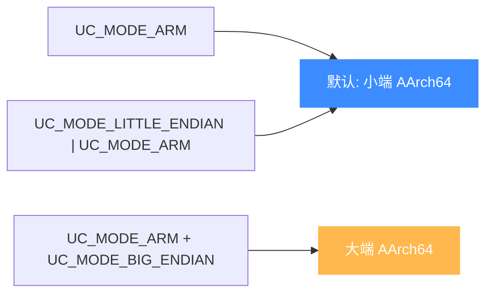

# ARM64 模式与字节序

本页讲清初始化 AArch64 引擎时该给 `uc_open` 传什么 mode：为什么只有 `UC_MODE_ARM`、如何叠加字节序标志，以及 AArch64 特有的 EL0-EL3 异常级别概念。读完你能正确选择模式组合，并理解字节序对内存读写结果的影响。

## 🧩 AArch64 的模式很简单

与 32 位 ARM 需要在 ARM/Thumb 之间切换不同，AArch64 只有一种指令编码（A64，定长 4 字节），因此 mode 侧几乎没有选择：核心就是 `UC_MODE_ARM`，再按需叠加字节序。



## 🔧 模式取值表

| mode 组合 | 字节序 | 说明 |
| --- | --- | --- |
| `UC_MODE_ARM` | 小端 | 最常用，等价于显式小端 |
| `UC_MODE_LITTLE_ENDIAN \| UC_MODE_ARM` | 小端 | 显式写法，见 `test_arm64_sctlr` |
| `UC_MODE_ARM + UC_MODE_BIG_ENDIAN` | 大端 | 大端固件，见 `test_arm64eb` |

三种写法在源码里都能见到，含义清晰：`UC_MODE_ARM` 表示"标准 ARM 执行状态"（在 ARM64 架构下即 AArch64），字节序由是否叠加 `UC_MODE_BIG_ENDIAN` 决定。

```c
// 显式小端（等价于只写 UC_MODE_ARM）
uc_open(UC_ARCH_ARM64, UC_MODE_LITTLE_ENDIAN | UC_MODE_ARM, &uc);

// 大端
uc_open(UC_ARCH_ARM64, UC_MODE_ARM + UC_MODE_BIG_ENDIAN, &uc);
```

## ⚡ 字节序如何影响结果

同一段字节，小端与大端解释出的数值不同。`sample_arm64.c` 用相同代码 `str w11; ldrb w15` 在两种字节序下都断言 X15 应为 0x78，正说明理解字节序对验证仿真结果至关重要。

::: tip 用户态几乎都是小端
Android / iOS / Linux ARM64 用户态程序一律小端。除非分析大端网络设备固件，否则保持默认即可。字节序的完整机制、内存读写差异见 [字节序](/features/endianness)。
:::

## 🧠 异常级别（Exception Level）

AArch64 用 **EL0-EL3** 四个特权层级取代了传统的处理器模式，这是理解系统寄存器与异常的基础：

| 级别 | 典型角色 |
| --- | --- |
| EL0 | 用户态应用 |
| EL1 | 操作系统内核 |
| EL2 | Hypervisor（虚拟化） |
| EL3 | Secure Monitor（安全世界切换） |

许多系统寄存器带 `_ELx` 后缀（如 `SCTLR_EL1`、`VBAR_EL2`、`SCR_EL3`），表示它归属哪个级别。可以用 `CurrentEL` 读当前级别——`sample_arm64.c` 的 `test_arm64_mem_fetch` 就通过 `msr x0, CurrentEL` 取值，再 `x0 >> 2` 得到 EL 编号：

```c
// shellcode: msr x0, CurrentEL
uint64_t x0 = 0;
uc_reg_read(uc, UC_ARM64_REG_X0, &x0);
printf("Exception Level = %" PRIx64 "\n", x0 >> 2); // 右移 2 位得 EL
```

::: warning EL 影响系统寄存器可见性
不同 EL 下同名寄存器可能是不同实体（如 `SP_EL0` vs `SP_EL1`）。跨级别调试时务必确认你读写的是哪个 EL 的副本，可用 [CP_REG 编码](/arch/arm64/registers) 精确指定。
:::

## 📂 相关源码

| 文件 | 角色 |
|------|------|
| [`include/unicorn/arm64.h`](https://github.com/android-security-engineer/unicorn-skills/blob/master/include/unicorn/arm64.h#L41) | `UC_ARM64_REG_*` 寄存器枚举与 `uc_cpu_*` CPU 型号定义 |
| [`qemu/target/arm/unicorn_aarch64.c`](https://github.com/android-security-engineer/unicorn-skills/blob/master/qemu/target/arm/unicorn_aarch64.c) | 后端：`reg_read`/`reg_write`/`uc_init` 等函数指针实现 |
| [`qemu/target/arm/translate-a64.c`](https://github.com/android-security-engineer/unicorn-skills/blob/master/qemu/target/arm/translate-a64.c) | 前端：机器码翻译（TCG） |
| [`samples/sample_arm64.c`](https://github.com/android-security-engineer/unicorn-skills/blob/master/samples/sample_arm64.c) | 该架构的 C 示例程序 |
| [`include/unicorn/unicorn.h`](https://github.com/android-security-engineer/unicorn-skills/blob/master/include/unicorn/unicorn.h#L100) | `UC_ARCH_ARM64` 架构常量与 `UC_MODE_*` 公共模式定义 |

## 相关页面

- [字节序](/features/endianness)
- [ARM64 架构概览](/arch/arm64/)
- [ARM64 寄存器参考](/arch/arm64/registers)
- [uc_open](/api/open)
