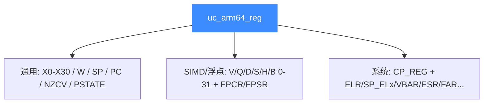

# ARM64 寄存器参考

本页系统梳理 AArch64 在 Unicorn 中可读写的寄存器：X0-X30 通用寄存器及其 W 视图、SP/PC、NZCV/PSTATE、V/Q/D/S/H/B 向量族，以及通过 `UC_ARM64_REG_CP_REG` 或 MRS/MSR 访问的系统寄存器。所有常量均取自 [`include/unicorn/arm64.h`](https://github.com/android-security-engineer/unicorn-skills/blob/master/include/unicorn/arm64.h)。读完你能用 [uc_reg_read](/api/reg-read) 精确读写任意 AArch64 寄存器。

## 🧠 寄存器全景

AArch64 的寄存器数量很多（`uc_arm64_reg` 枚举近 300 项），但可按三类理解：**通用**、**SIMD/浮点**、**系统**。



## 🔧 通用寄存器

| 常量 | 位宽 | 说明 |
| --- | --- | --- |
| `UC_ARM64_REG_X0` … `UC_ARM64_REG_X30` | 64 | 31 个通用寄存器 |
| `UC_ARM64_REG_W0` … `UC_ARM64_REG_W30` | 32 | 对应 X 寄存器的低 32 位视图 |
| `UC_ARM64_REG_SP` / `UC_ARM64_REG_WSP` | 64/32 | 栈指针（及 32 位视图） |
| `UC_ARM64_REG_PC` | 64 | 程序计数器（伪寄存器） |
| `UC_ARM64_REG_XZR` / `UC_ARM64_REG_WZR` | 64/32 | 零寄存器 |
| `UC_ARM64_REG_NZCV` | — | 条件标志（Negative/Zero/Carry/oVerflow） |
| `UC_ARM64_REG_PSTATE` | — | 处理器状态（含 NZCV、EL 等） |

::: tip W 是 X 的低半区
`W5` 与 `X5` 是同一物理寄存器：写 `X5` 会连带改变 `W5`，读 `W5` 得到 `X5` 的低 32 位。测试代码里用 `UC_ARM64_REG_X15` 读取，即使指令是 `ldrb w15`，高位补零后 X15 == 0x78。
:::

### 别名寄存器

`arm64.h` 定义了几个常用别名，值即对应 X 寄存器：

| 别名常量 | 等价于 | 用途 |
| --- | --- | --- |
| `UC_ARM64_REG_IP0` | `UC_ARM64_REG_X16` | 过程内调用临时寄存器 0 |
| `UC_ARM64_REG_IP1` | `UC_ARM64_REG_X17` | 过程内调用临时寄存器 1 |
| `UC_ARM64_REG_FP` | `UC_ARM64_REG_X29` | 帧指针 |
| `UC_ARM64_REG_LR` | `UC_ARM64_REG_X30` | 链接寄存器（返回地址） |

## ⚡ SIMD / 浮点寄存器

同一个 128 位物理向量寄存器有多种宽度视图：

| 常量前缀 | 位宽 | 说明 |
| --- | --- | --- |
| `UC_ARM64_REG_V0` … `V31` | 128 | 完整向量寄存器 |
| `UC_ARM64_REG_Q0` … `Q31` | 128 | Quad 字（128 位视图） |
| `UC_ARM64_REG_D0` … `D31` | 64 | Double 字 / 双精度浮点 |
| `UC_ARM64_REG_S0` … `S31` | 32 | Single 字 / 单精度浮点 |
| `UC_ARM64_REG_H0` … `H31` | 16 | Half 字 / 半精度 |
| `UC_ARM64_REG_B0` … `B31` | 8 | Byte 视图 |
| `UC_ARM64_REG_FPCR` / `UC_ARM64_REG_FPSR` | — | 浮点控制 / 状态寄存器 |

读 128 位向量需用足够大的缓冲区：

```c
uint8_t v0[16];
uc_reg_read(uc, UC_ARM64_REG_V0, v0);   // 读完整 128 位 V0

double d0 = 1.5;
uc_reg_write(uc, UC_ARM64_REG_D0, &d0); // 写 64 位双精度视图
```

## 🔐 系统寄存器

系统寄存器（SCTLR、TTBR、VBAR 等）数量极大，Unicorn 提供两种访问途径：

1. **少量常量直达**：如 `UC_ARM64_REG_CPACR_EL1`、`UC_ARM64_REG_ELR_EL0..EL3`、`UC_ARM64_REG_SP_EL0..EL3`、`UC_ARM64_REG_VBAR_EL0..EL3`、`UC_ARM64_REG_ESR_EL0..EL3`、`UC_ARM64_REG_FAR_EL0..EL3`、`UC_ARM64_REG_TTBR0_EL1` / `TTBR1_EL1`、`UC_ARM64_REG_PAR_EL1`、`UC_ARM64_REG_MAIR_EL1`、`UC_ARM64_REG_TPIDR_EL0` 等。
2. **通用 CP_REG 编码**：用 `UC_ARM64_REG_CP_REG` + `uc_arm64_cp_reg{crn,crm,op0,op1,op2,val}` 精确定位任意系统寄存器。

```c
uc_arm64_cp_reg reg;
// SCTLR_EL1: op0=0b11, op1=0, crn=1, crm=0, op2=0
reg.crn = 1; reg.crm = 0; reg.op0 = 0b11; reg.op1 = 0; reg.op2 = 0;
uc_reg_read(uc, UC_ARM64_REG_CP_REG, &reg);
printf("SCTLR_EL1 = 0x%" PRIx64 "\n", reg.val);
```

::: warning 多数 ELx 寄存器已弃用直达常量
头文件把 `TPIDR_ELx`、`ELR_ELx`、`SP_ELx`、`TTBRx_EL1` 等标注为 depreciated，建议统一改用 `UC_ARM64_REG_CP_REG` 编码方式，可移植性更好。
:::

## 📂 相关源码

| 文件 | 角色 |
|------|------|
| [`include/unicorn/arm64.h`](https://github.com/android-security-engineer/unicorn-skills/blob/master/include/unicorn/arm64.h#L41) | `UC_ARM64_REG_*` 寄存器枚举与 `uc_cpu_*` CPU 型号定义 |
| [`qemu/target/arm/unicorn_aarch64.c`](https://github.com/android-security-engineer/unicorn-skills/blob/master/qemu/target/arm/unicorn_aarch64.c) | 后端：`reg_read`/`reg_write`/`uc_init` 等函数指针实现 |
| [`qemu/target/arm/translate-a64.c`](https://github.com/android-security-engineer/unicorn-skills/blob/master/qemu/target/arm/translate-a64.c) | 前端：机器码翻译（TCG） |
| [`samples/sample_arm64.c`](https://github.com/android-security-engineer/unicorn-skills/blob/master/samples/sample_arm64.c) | 该架构的 C 示例程序 |
| [`include/unicorn/unicorn.h`](https://github.com/android-security-engineer/unicorn-skills/blob/master/include/unicorn/unicorn.h#L100) | `UC_ARCH_ARM64` 架构常量与 `UC_MODE_*` 公共模式定义 |

## 相关页面

- [uc_reg_read](/api/reg-read)
- [ARM64 架构概览](/arch/arm64/)
- [ARM64 指令与特性](/arch/arm64/instructions)
- [寄存器体系](/features/registers)
