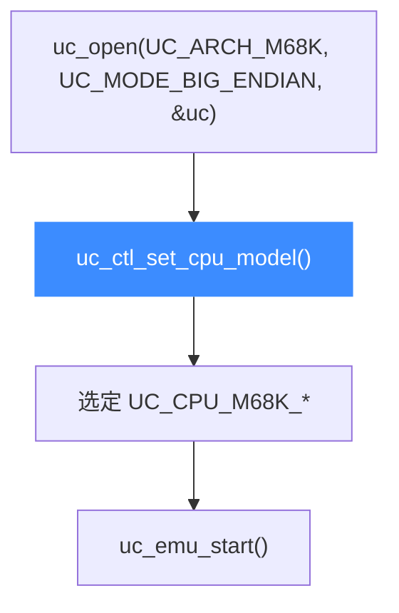
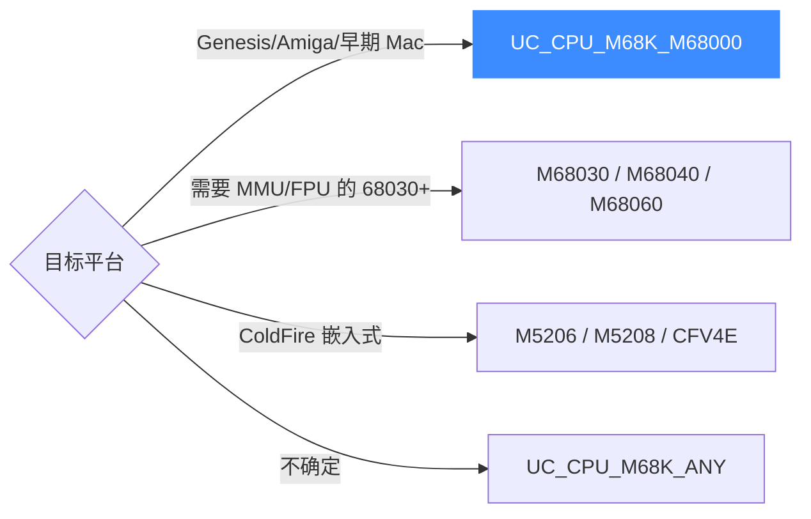

# M68K CPU 型号

本页讲清 Unicorn 支持的 M68K 处理器型号：`UC_CPU_M68K_*` 的真实取值、用 [uc_ctl_set_cpu_model](/ctl/set-cpu-model) 选择处理器核，以及不同型号对应的指令集/特性差异（68000 基础核、68020/030/040/060 逐代增强、以及 ColdFire 系列）。读完你能为一段 68K 代码选对 CPU。

## 🧠 型号从哪来

Unicorn 的 M68K 后端沿用 QEMU 的 CPU 定义，全部型号集中在 [`include/unicorn/m68k.h`](https://github.com/android-security-engineer/unicorn-skills/blob/master/include/unicorn/m68k.h) 的 `enum uc_cpu_m68k` 中，默认值（枚举 0）是 `UC_CPU_M68K_M5206`。



## 📋 型号列表

以下常量全部来自 [`include/unicorn/m68k.h`](https://github.com/android-security-engineer/unicorn-skills/blob/master/include/unicorn/m68k.h)（`enum uc_cpu_m68k`），顺序与头文件一致：

| 常量 | 说明 |
| --- | --- |
| `UC_CPU_M68K_M5206` | ColdFire MCF5206（枚举 0，默认） |
| `UC_CPU_M68K_M68000` | 68000，初代 16/32 位核，Amiga/Mac/Genesis 主力 |
| `UC_CPU_M68K_M68020` | 68020，引入完整 32 位与更多寻址方式 |
| `UC_CPU_M68K_M68030` | 68030，集成 MMU |
| `UC_CPU_M68K_M68040` | 68040，集成 FPU 与更强 MMU |
| `UC_CPU_M68K_M68060` | 68060，末代高性能 68K 核 |
| `UC_CPU_M68K_M5208` | ColdFire MCF5208 |
| `UC_CPU_M68K_CFV4E` | ColdFire V4e 核 |
| `UC_CPU_M68K_ANY` | 通用/任意核 |

::: warning ENDING 不是型号
`UC_CPU_M68K_ENDING` 只是枚举结束标记，不可传给 `uc_ctl_set_cpu_model`。不要臆造头文件里没有的型号名。
:::

## 🔧 选择型号

型号在 `uc_open()` 之后、`uc_emu_start()` 之前设置。`tests/unit/test_m68k.c` 就用 `UC_CPU_M68K_M68000` 跑基础指令：

```c
#include <unicorn/unicorn.h>

uc_engine *uc;
uc_open(UC_ARCH_M68K, UC_MODE_BIG_ENDIAN, &uc);

// 选用初代 68000 核（复古逆向最常见的目标）
uc_err err = uc_ctl_set_cpu_model(uc, UC_CPU_M68K_M68000);
if (err != UC_ERR_OK) {
    printf("设置 CPU 型号失败: %s\n", uc_strerror(err));
}
```

## 🎯 怎么选



::: tip 型号决定可用指令与特性
68020+ 才有完整 32 位寻址与扩展指令，68030 起集成 MMU，68040/060 集成 FPU；ColdFire（M5206/M5208/CFV4E）是精简变体，指令集与经典 68K 有出入。分析世嘉 Genesis 或早期 Amiga/Mac 代码，选 `UC_CPU_M68K_M68000` 最贴近真机。不确定时先用默认核跑通。
:::

## 📂 相关源码

| 文件 | 角色 |
|------|------|
| [`include/unicorn/m68k.h`](https://github.com/android-security-engineer/unicorn-skills/blob/master/include/unicorn/m68k.h#L35) | `UC_M68K_REG_*` 寄存器枚举与 `uc_cpu_*` CPU 型号定义 |
| [`qemu/target/m68k/unicorn.c`](https://github.com/android-security-engineer/unicorn-skills/blob/master/qemu/target/m68k/unicorn.c) | 后端：`reg_read`/`reg_write`/`uc_init` 等函数指针实现 |
| [`qemu/target/m68k/translate.c`](https://github.com/android-security-engineer/unicorn-skills/blob/master/qemu/target/m68k/translate.c) | 前端：机器码翻译（TCG） |
| [`samples/sample_m68k.c`](https://github.com/android-security-engineer/unicorn-skills/blob/master/samples/sample_m68k.c) | 该架构的 C 示例程序 |
| [`include/unicorn/unicorn.h`](https://github.com/android-security-engineer/unicorn-skills/blob/master/include/unicorn/unicorn.h#L105) | `UC_ARCH_M68K` 架构常量与 `UC_MODE_*` 公共模式定义 |

## 相关页面

- [uc_ctl_set_cpu_model](/ctl/set-cpu-model) — 设置 CPU 型号的控制接口
- [CPU 型号特性总览](/features/cpu-models) — 跨架构的型号与特性说明
- [M68K 架构概览](/arch/m68k/) — M68K 入门
- [M68K 实战示例](/arch/m68k/example) — 完整走读
