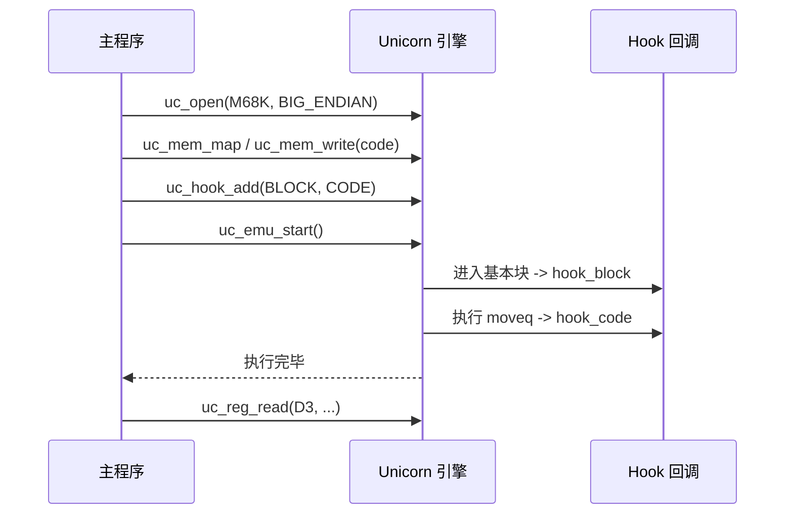

# M68K 实战示例

本页用一个**完整可运行**的 M68K 仿真，把前面各页串起来：打开大端引擎 → 映射内存 → 写入 `moveq #-19, %d3` 的机器码 → 挂 BLOCK/CODE Hook → 启动仿真 → 读回全部寄存器。代码结构与 [`samples/sample_m68k.c`](https://github.com/android-security-engineer/unicorn-skills/blob/master/samples/sample_m68k.c) 一致，读完你能独立跑通并解释每一行输出。

## 🎯 目标代码

我们仿真一条指令：`moveq #-19, %d3`，机器码 `0x76 0xed`。它把 8 位有符号立即数 `-19` 符号扩展成 32 位写入 D3，预期结果 `D3 = 0xFFFFFFED`。



## 🔧 完整代码

```c
#include <unicorn/unicorn.h>
#include <string.h>

// 要仿真的机器码：moveq #-19, %d3
#define M68K_CODE "\x76\xed"

// 仿真起始地址
#define ADDRESS 0x10000

// 基本块 Hook：进入每个基本块时触发
static void hook_block(uc_engine *uc, uint64_t address, uint32_t size,
                       void *user_data)
{
    printf(">>> Tracing basic block at 0x%" PRIx64 ", block size = 0x%x\n",
           address, size);
}

// 指令 Hook：每条指令执行前触发，size 是变长指令的真实长度
static void hook_code(uc_engine *uc, uint64_t address, uint32_t size,
                      void *user_data)
{
    printf(">>> Tracing instruction at 0x%" PRIx64
           ", instruction size = 0x%x\n",
           address, size);
}

int main(void)
{
    uc_engine *uc;
    uc_hook trace1, trace2;
    uc_err err;

    int d3 = 0x0000; // 目标数据寄存器
    int pc = 0x0000; // 程序计数器

    printf("Emulate M68K code\n");

    // 1) 初始化引擎：M68K 固定大端
    err = uc_open(UC_ARCH_M68K, UC_MODE_BIG_ENDIAN, &uc);
    if (err) {
        printf("uc_open() 失败: %u (%s)\n", err, uc_strerror(err));
        return -1;
    }

    // 2) 映射 2MB 内存
    uc_mem_map(uc, ADDRESS, 2 * 1024 * 1024, UC_PROT_ALL);

    // 3) 写入机器码（sizeof-1 去掉字符串结尾的 \0）
    uc_mem_write(uc, ADDRESS, M68K_CODE, sizeof(M68K_CODE) - 1);

    // 4) 初始化寄存器
    uc_reg_write(uc, UC_M68K_REG_D3, &d3);

    // 5) 挂 Hook：基本块 + 每条指令
    uc_hook_add(uc, &trace1, UC_HOOK_BLOCK, hook_block, NULL, 1, 0);
    uc_hook_add(uc, &trace2, UC_HOOK_CODE, hook_code, NULL, 1, 0);

    // 6) 启动仿真，执行到代码末尾
    err = uc_emu_start(uc, ADDRESS, ADDRESS + sizeof(M68K_CODE) - 1, 0, 0);
    if (err) {
        printf("uc_emu_start() 失败: %u\n", err);
    }

    // 7) 读回结果
    printf(">>> Emulation done. Below is the CPU context\n");
    uc_reg_read(uc, UC_M68K_REG_D3, &d3);
    uc_reg_read(uc, UC_M68K_REG_PC, &pc);
    printf(">>> D3 = 0x%x\n", d3);
    printf(">>> PC = 0x%x\n", pc);

    uc_close(uc);
    return 0;
}
```

## 🧠 逐段讲解

| 步骤 | 作用 | 关键点 |
| --- | --- | --- |
| 1 打开引擎 | `uc_open(UC_ARCH_M68K, UC_MODE_BIG_ENDIAN, &uc)` | M68K 只接受大端，见 [模式与字节序](/arch/m68k/modes) |
| 2 映射内存 | `uc_mem_map` 划出 2MB 可读写执行区 | 起始地址须与 `uc_emu_start` 对齐 |
| 3 写机器码 | `uc_mem_write` | `sizeof-1` 去掉字符串结尾 `\0` |
| 4 设寄存器 | `uc_reg_write(UC_M68K_REG_D3, ...)` | 常量来自 `m68k.h`，见 [寄存器参考](/arch/m68k/registers) |
| 5 挂 Hook | BLOCK + CODE | 回调里 `size` 是变长指令真实长度 |
| 6 启动 | `uc_emu_start(uc, 起点, 终点, 0, 0)` | 后两个 0：无超时、不限指令数 |
| 7 读结果 | `uc_reg_read` | D3 得到符号扩展结果 |

## 📤 预期输出

```text
Emulate M68K code
>>> Tracing basic block at 0x10000, block size = 0x2
>>> Tracing instruction at 0x10000, instruction size = 0x2
>>> Emulation done. Below is the CPU context
>>> D3 = 0xffffffed
>>> PC = 0x10002
```

`D3 = 0xffffffed` 正是 `-19` 符号扩展成 32 位的结果；指令长 2 字节，故 PC 从 `0x10000` 前进到 `0x10002`。

::: tip 想看更多寄存器？
[`samples/sample_m68k.c`](https://github.com/android-security-engineer/unicorn-skills/blob/master/samples/sample_m68k.c) 完整初始化并打印了 D0-D7、A0-A7、PC、SR 全部寄存器。本页为聚焦核心只保留了 D3/PC，你可照 [寄存器参考](/arch/m68k/registers) 自行补齐。
:::

::: warning 别漏掉大端
如果把 `UC_MODE_BIG_ENDIAN` 换成小端，`0x76 0xed` 会被解释成完全不同的指令，结果不再是 `0xffffffed`。M68K 必须大端。
:::

## 📂 相关源码

| 文件 | 角色 |
|------|------|
| [`include/unicorn/m68k.h`](https://github.com/android-security-engineer/unicorn-skills/blob/master/include/unicorn/m68k.h#L35) | `UC_M68K_REG_*` 寄存器枚举与 `uc_cpu_*` CPU 型号定义 |
| [`qemu/target/m68k/unicorn.c`](https://github.com/android-security-engineer/unicorn-skills/blob/master/qemu/target/m68k/unicorn.c) | 后端：`reg_read`/`reg_write`/`uc_init` 等函数指针实现 |
| [`qemu/target/m68k/translate.c`](https://github.com/android-security-engineer/unicorn-skills/blob/master/qemu/target/m68k/translate.c) | 前端：机器码翻译（TCG） |
| [`samples/sample_m68k.c`](https://github.com/android-security-engineer/unicorn-skills/blob/master/samples/sample_m68k.c) | 该架构的 C 示例程序 |
| [`include/unicorn/unicorn.h`](https://github.com/android-security-engineer/unicorn-skills/blob/master/include/unicorn/unicorn.h#L105) | `UC_ARCH_M68K` 架构常量与 `UC_MODE_*` 公共模式定义 |

## 相关页面

- [sample_m68k.c 走读](/samples/sample-m68k) — 官方完整样例
- [M68K 架构概览](/arch/m68k/) — 返回本章入口
- [UC_HOOK_CODE — 指令级 Hook](/hooks/code) — 单步追踪
- [M68K 指令与特性](/arch/m68k/instructions) — moveq 符号扩展详解
