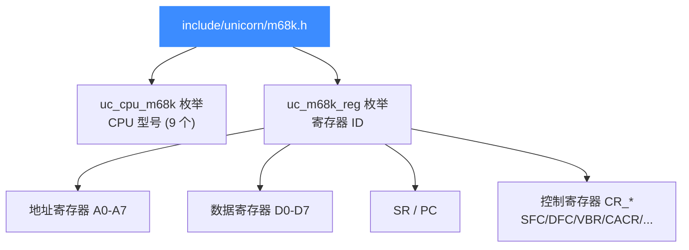
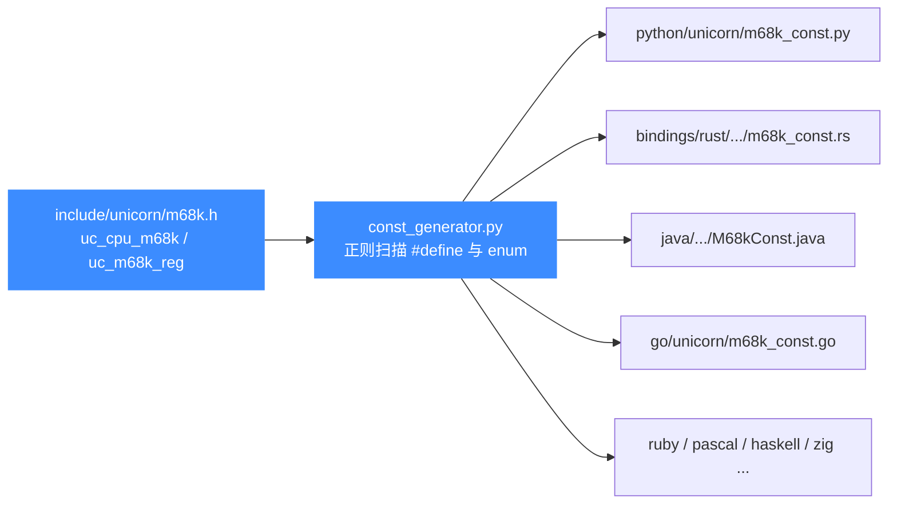

# m68k.h — M68K 头文件常量参考

本页讲 [`include/unicorn/m68k.h`](https://github.com/android-security-engineer/unicorn-skills/blob/master/include/unicorn/m68k.h)：它是摩托罗拉 68000 系列在 Unicorn 中所有公开常量的**真源（source of truth）**，定义了两类枚举——CPU 型号 `uc_cpu_m68k` 与寄存器 ID `uc_m68k_reg`。所有语言绑定（Python/Rust/Go/Java/…）的 M68K 常量都由 `const_generator.py` 从这个头文件自动生成，不要手改绑定里的 `*_const.*`。

## 📌 概述

`m68k.h` 是被 `unicorn.h` 聚合进来的架构头之一。它体量很小，只声明两类对绑定量化的内容：

1. **CPU 型号枚举 `uc_cpu_m68k`** —— 列出全部可模拟的 68K/ColdFire 核（68000/020/030/040/060、ColdFire M5206/M5208/CFV4E 以及通配 `M68K_ANY`），配合 `uc_ctl_set_cpu_model` 使用。
2. **寄存器 ID 枚举 `uc_m68k_reg`** —— 给 `uc_reg_read` / `uc_reg_write` 用的寄存器编号，覆盖地址寄存器 A0-A7、数据寄存器 D0-D7、状态/程序计数器 SR/PC，以及 68040/MMU 时代的一组控制寄存器 `CR_*`。

```c
#include <unicorn/unicorn.h>
/* m68k.h 会被 unicorn.h 自动聚合,无需单独 include */
```

::: tip 📌 这就是 source of truth
改了 `m68k.h` 里的枚举值或新增常量后,必须跑 `bindings/const_generator.py` 重新生成各绑定常量,否则 Python/Rust/Go 等会与 C 头漂移。详见 [常量生成器](/bindings/const-generator)。
:::

## 🧱 文件结构



## 🔧 CPU 型号枚举 uc_cpu_m68k

`m68k.h` 用一个连续递增的 `enum` 列出全部可模拟核。取值传给 [uc_ctl](/api/ctl) 的 `UC_CTL_CPU_MODEL`（便捷宏 `uc_ctl_set_cpu_model`）。完整型号语义见 [M68K CPU 型号](/arch/m68k/cpu-models)。

| 常量 | 值 | 说明 |
|------|----|------|
| `UC_CPU_M68K_M5206` | 0 | Freescale ColdFire M5206（嵌入式微控制器） |
| `UC_CPU_M68K_M68000` | 1 | 经典 68000（16/32 位,无 MMU/FPU） |
| `UC_CPU_M68K_M68020` | 2 | 68020（32 位内核,首个完整 32 位 68K） |
| `UC_CPU_M68K_M68030` | 3 | 68030（内置分页 MMU） |
| `UC_CPU_M68K_M68040` | 4 | 68040（内置 FPU + MMU） |
| `UC_CPU_M68K_M68060` | 5 | 68060（低功耗,超标量流水线） |
| `UC_CPU_M68K_M5208` | 6 | Freescale ColdFire M5208 |
| `UC_CPU_M68K_CFV4E` | 7 | ColdFire Firewire V4 核心（CFV4E） |
| `UC_CPU_M68K_ANY` | 8 | 通配：交由后端选最通用型号 |
| `UC_CPU_M68K_ENDING` | 9 | 枚举上界哨兵,非有效型号 |

## 📖 寄存器 ID 枚举 uc_m68k_reg

这是 `m68k.h` 的主体。下面列出全部寄存器（完整列表以源码为准）。配合 `uc_reg_read` / `uc_reg_write` 使用，详见 [M68K 寄存器](/arch/m68k/registers)。

### 地址寄存器 A0-A7

| 常量 | 值 | 含义 |
|------|----|------|
| `UC_M68K_REG_INVALID` | 0 | 占位,无效值 |
| `UC_M68K_REG_A0` | 1 | 地址寄存器 A0 |
| `UC_M68K_REG_A1` | 2 | 地址寄存器 A1 |
| `UC_M68K_REG_A2` | 3 | 地址寄存器 A2 |
| `UC_M68K_REG_A3` | 4 | 地址寄存器 A3 |
| `UC_M68K_REG_A4` | 5 | 地址寄存器 A4 |
| `UC_M68K_REG_A5` | 6 | 地址寄存器 A5 |
| `UC_M68K_REG_A6` | 7 | 地址寄存器 A6 |
| `UC_M68K_REG_A7` | 8 | 地址寄存器 A7（兼作栈指针 SP） |

### 数据寄存器 D0-D7

| 常量 | 值 | 含义 |
|------|----|------|
| `UC_M68K_REG_D0` | 9 | 数据寄存器 D0 |
| `UC_M68K_REG_D1` | 10 | 数据寄存器 D1 |
| `UC_M68K_REG_D2` | 11 | 数据寄存器 D2 |
| `UC_M68K_REG_D3` | 12 | 数据寄存器 D3 |
| `UC_M68K_REG_D4` | 13 | 数据寄存器 D4 |
| `UC_M68K_REG_D5` | 14 | 数据寄存器 D5 |
| `UC_M68K_REG_D6` | 15 | 数据寄存器 D6 |
| `UC_M68K_REG_D7` | 16 | 数据寄存器 D7 |

### 状态与程序计数器

| 常量 | 值 | 含义 |
|------|----|------|
| `UC_M68K_REG_SR` | 17 | 状态寄存器（含 CCR 条件码 + 系统字节,如中断屏蔽 I0-I2、S/T 位） |
| `UC_M68K_REG_PC` | 18 | 程序计数器 |

### 控制寄存器 CR_*

68030/68040 及 ColdFire 引入的系统控制寄存器，统一以 `UC_M68K_REG_CR_` 前缀。不同型号实际可用的子集不同，访问不支持的 CR 会失败。

| 常量 | 值 | 含义 |
|------|----|------|
| `UC_M68K_REG_CR_SFC` | 19 | 源函数码寄存器（Source Function Code） |
| `UC_M68K_REG_CR_DFC` | 20 | 目标函数码寄存器（Destination Function Code） |
| `UC_M68K_REG_CR_VBR` | 21 | 向量基址寄存器（异常向量表基址） |
| `UC_M68K_REG_CR_CACR` | 22 | 高速缓存控制寄存器（Cache Control） |
| `UC_M68K_REG_CR_TC` | 23 | 翻译控制寄存器（MMU Translation Control,040+/ColdFire） |
| `UC_M68K_REG_CR_MMUSR` | 24 | MMU 状态寄存器（MMU Status） |
| `UC_M68K_REG_CR_SRP` | 25 | 监管根指针（Supervisor Root Pointer） |
| `UC_M68K_REG_CR_USP` | 26 | 用户栈指针（User Stack Pointer） |
| `UC_M68K_REG_CR_MSP` | 27 | 主栈指针（Master Stack Pointer,020+） |
| `UC_M68K_REG_CR_ISP` | 28 | 中断栈指针（Interrupt Stack Pointer,020+） |
| `UC_M68K_REG_CR_URP` | 29 | 用户根指针（User Root Pointer,040 MMU） |
| `UC_M68K_REG_CR_ITT0` | 30 | 指令透明翻译寄存器 0（ITTR0,040） |
| `UC_M68K_REG_CR_ITT1` | 31 | 指令透明翻译寄存器 1（ITTR1,040） |
| `UC_M68K_REG_CR_DTT0` | 32 | 数据透明翻译寄存器 0（DTTR0,040） |
| `UC_M68K_REG_CR_DTT1` | 33 | 数据透明翻译寄存器 1（DTTR1,040） |
| `UC_M68K_REG_ENDING` | 34 | 枚举上界哨兵 |

::: warning ⚠️ CR_* 与 CPU 型号强相关
`CR_*` 寄存器并非所有型号都有。例如经典 68000 没有 VBR，只有 68010+ 才引入；`ITT0/ITT1/DTT0/DTT1` 是 68040 的透明翻译寄存器。用错 CPU 型号去读写某个 CR 会取不到有效值。务必先 [选定 CPU 型号](/arch/m68k/cpu-models) 再访问系统寄存器。
:::

## ⚠️ M68K 特有的 UC_MODE_* 模式位

与 ARM、MIPS 不同，**`m68k.h` 与 `unicorn.h` 都没有为 M68K 定义专属的模式位**——`uc_mode` 枚举里 m68k 段落是一段空注释。M68K 是固定大端架构，打开引擎时直接使用定义在 `unicorn.h` 通用段的 `UC_MODE_BIG_ENDIAN`：

| 值 | 常量 | 是否用于 M68K | 说明 |
|----|------|---------------|------|
| `1<<30` | `UC_MODE_BIG_ENDIAN` | ✅ 必需 | M68K 的唯一正确 mode |
| `0` | `UC_MODE_LITTLE_ENDIAN` | ❌ | 值为 0,语义不适用于 68K |
| — | `UC_MODE_32` / `UC_MODE_64` | ❌ | 属于 x86/MIPS,与 M68K 无关 |

组合方式与字节序细节见 [M68K 模式与字节序](/arch/m68k/modes)。

```c
/* M68K 没有专属 mode 位,直接用通用的 UC_MODE_BIG_ENDIAN */
uc_err err = uc_open(UC_ARCH_M68K, UC_MODE_BIG_ENDIAN, &uc);
```

## 💻 用法：注册并读取一个寄存器

```c
#include <unicorn/unicorn.h>
#include <stdio.h>

int main(void) {
    uc_engine *uc;
    uc_err err = uc_open(UC_ARCH_M68K, UC_MODE_BIG_ENDIAN, &uc);
    if (err != UC_ERR_OK) {
        printf("uc_open: %s\n", uc_strerror(err));
        return 1;
    }

    /* 选择 68040 以便访问 ITT/DTT 等控制寄存器 */
    uc_ctl_set_cpu_model(uc, UC_CPU_M68K_M68040);

    uint32_t d0 = 0x12345678;
    uc_reg_write(uc, UC_M68K_REG_D0, &d0);     /* 写数据寄存器 */

    uint32_t a7 = 0;
    uc_reg_read(uc, UC_M68K_REG_A7, &a7);      /* 读栈指针 (= A7) */
    printf("A7/SP = 0x%x\n", a7);

    uint32_t vbr = 0;
    uc_reg_read(uc, UC_M68K_REG_CR_VBR, &vbr); /* 读向量基址寄存器 */
    printf("VBR = 0x%x\n", vbr);

    uc_close(uc);
    return 0;
}
```

## 📖 关于指令 ID

与 x86、arm64 不同，**`m68k.h` 不提供 `UC_M68K_INS_*` 指令 ID 枚举**。M68K 的指令识别在 Unicorn 中通过 [UC_HOOK_CODE](/hooks/code) / [UC_HOOK_INSN_INVALID](/hooks/insn-invalid) 等代码 Hook 回调地址与原始字节完成，而非 Capstone 风格的指令枚举。如需指令级反汇编，请配合 Capstone 的 `CS_ARCH_M68K` 使用，详见 [M68K 指令与特性](/arch/m68k/instructions)。

## 🔧 头文件如何被绑定生成器消费



::: tip 📌 改了头文件就要重新生成
这些常量是各语言绑定的**真源**。修改 `m68k.h` 的枚举后,务必运行:

```bash
cd bindings
python3 const_generator.py all   # 重新生成全部语言绑定常量
```

跳过这一步会让 C 头文件与绑定常量不一致,埋下"同名常量在不同语言取值不同"的隐患。生成机制与命名前缀映射详见 [常量生成器](/bindings/const-generator)。
:::

::: details 为什么生成器能扫到 enum 值
`const_generator.py` 实际只读 `#define UC_...` 形式的宏。对 `uc_m68k_reg` 这类 `enum`,生成器靠头文件里配套的 `#define UC_M68K_REG_A0 UC_M68K_REG_A0` 风格声明（由构建期宏展开）把它们暴露成可被正则捕获的常量。因此新增寄存器时,枚举与对应 `#define` 都要加,否则绑定里取不到名字。详见 [常量生成器](/bindings/const-generator)。
:::

## 📂 相关源码

| 文件 | 角色 |
|------|------|
| [`include/unicorn/m68k.h`](https://github.com/android-security-engineer/unicorn-skills/blob/master/include/unicorn/m68k.h#L35) | `UC_M68K_REG_*` 寄存器枚举与 `uc_cpu_*` CPU 型号定义 |
| [`qemu/target/m68k/unicorn.c`](https://github.com/android-security-engineer/unicorn-skills/blob/master/qemu/target/m68k/unicorn.c) | 后端：`reg_read`/`reg_write`/`uc_init` 等函数指针实现 |
| [`qemu/target/m68k/translate.c`](https://github.com/android-security-engineer/unicorn-skills/blob/master/qemu/target/m68k/translate.c) | 前端：机器码翻译（TCG） |
| [`samples/sample_m68k.c`](https://github.com/android-security-engineer/unicorn-skills/blob/master/samples/sample_m68k.c) | 该架构的 C 示例程序 |
| [`include/unicorn/unicorn.h`](https://github.com/android-security-engineer/unicorn-skills/blob/master/include/unicorn/unicorn.h#L105) | `UC_ARCH_M68K` 架构常量与 `UC_MODE_*` 公共模式定义 |

## 相关页面

- [M68K 架构概览](/arch/m68k/)
- [M68K 寄存器参考](/arch/m68k/registers)
- [M68K CPU 型号](/arch/m68k/cpu-models)
- [常量生成器 const_generator.py](/bindings/const-generator)
- [unicorn.h — 公共 C API 头文件](/headers/unicorn-h)
