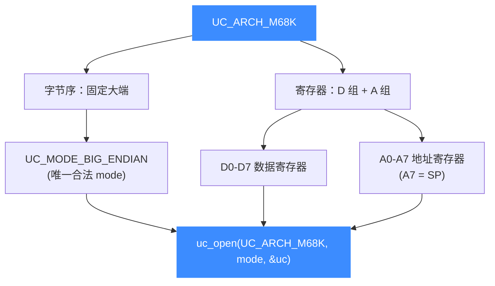
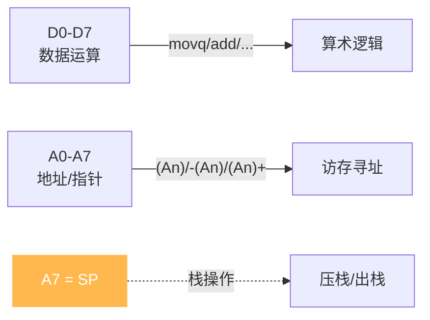

# M68K 架构概览

本页介绍 Unicorn 对摩托罗拉 68000 系列（[`UC_ARCH_M68K`](https://github.com/android-security-engineer/unicorn-skills/blob/master/include/unicorn/unicorn.h#L105)）的支持：它是一颗**固定大端**的经典 CISC 处理器，寄存器分为数据寄存器 D0-D7 与地址寄存器 A0-A7。读完你能用 `uc_open` 正确打开一个 M68K 引擎，并知道后续该看本章哪几页。

## 🧩 为什么还要模拟 M68K

68000（俗称"68K"）诞生于 1979 年，是 1980—1990 年代最具影响力的 16/32 位微处理器之一。你今天仍会在这些场景里遇到它：

- **复古计算**：Commodore Amiga、早期 Apple Macintosh、Atari ST 的固件与游戏。
- **游戏机**：世嘉 Mega Drive / Genesis 的主 CPU 就是 68000，其 ROM 逆向、金手指分析常需仿真。
- **嵌入式与工控**：大量老式打印机、示波器、数控设备使用 68K 及其 ColdFire 衍生核。

Unicorn 让你无需真机或完整模拟器，就能把一段 68K 机器码单独跑起来，配合 [Hook 体系](/features/hooks) 观察寄存器与内存变化——非常适合做定点逆向与算法还原。

## ⚡ 一句话记住 M68K 的两个特点



与 x86 / ARM 不同，M68K 在 Unicorn 里**没有位宽或字节序选择**：它永远是大端。这一点在本章 [模式与字节序](/arch/m68k/modes) 里展开。

## 🔧 最小示例

```c
#include <unicorn/unicorn.h>

uc_engine *uc;
// M68K 必须使用大端；不要传 UC_MODE_LITTLE_ENDIAN
uc_err err = uc_open(UC_ARCH_M68K, UC_MODE_BIG_ENDIAN, &uc);
if (err != UC_ERR_OK) {
    printf("uc_open 失败: %s\n", uc_strerror(err));
    return -1;
}
// ... 映射内存、写机器码、设寄存器、uc_emu_start ...
uc_close(uc);
```

::: tip 大端是硬性要求
M68K 引擎只接受 `UC_MODE_BIG_ENDIAN`。传入小端或位宽相关的 mode 位没有意义。字节序细节见 [字节序](/features/endianness)。
:::

## 🧠 数据寄存器 vs 地址寄存器

68K 最鲜明的架构特征是把通用寄存器**明确分成两组**：D0-D7 用于算术逻辑运算（数据），A0-A7 用于存放地址（指针），其中 **A7 兼作栈指针 SP**。这种"数据/地址分家"的设计影响寻址方式与指令编码，是读 68K 汇编的第一课。完整清单见 [寄存器参考](/arch/m68k/registers)。



## 📚 本章导航

| 页面 | 内容 |
|------|------|
| [寄存器参考](/arch/m68k/registers) | D0-D7、A0-A7、PC、SR 及 `UC_M68K_REG_*` 常量 |
| [模式与字节序](/arch/m68k/modes) | 为何固定大端、`UC_MODE_BIG_ENDIAN` 用法 |
| [指令与特性](/arch/m68k/instructions) | 变长指令、trap 中断、单步观察符号扩展 |
| [CPU 型号](/arch/m68k/cpu-models) | `UC_CPU_M68K_*` 列表与 `uc_ctl_set_cpu_model` |
| [实战示例](/arch/m68k/example) | 完整可运行的 68K 仿真走读 |

## 📂 相关源码

| 文件 | 角色 |
|------|------|
| [`include/unicorn/m68k.h`](https://github.com/android-security-engineer/unicorn-skills/blob/master/include/unicorn/m68k.h#L35) | `UC_M68K_REG_*` 寄存器枚举与 `uc_cpu_*` CPU 型号定义 |
| [`qemu/target/m68k/unicorn.c`](https://github.com/android-security-engineer/unicorn-skills/blob/master/qemu/target/m68k/unicorn.c) | 后端：`reg_read`/`reg_write`/`uc_init` 等函数指针实现 |
| [`qemu/target/m68k/translate.c`](https://github.com/android-security-engineer/unicorn-skills/blob/master/qemu/target/m68k/translate.c) | 前端：机器码翻译（TCG） |
| [`samples/sample_m68k.c`](https://github.com/android-security-engineer/unicorn-skills/blob/master/samples/sample_m68k.c) | 该架构的 C 示例程序 |
| [`include/unicorn/unicorn.h`](https://github.com/android-security-engineer/unicorn-skills/blob/master/include/unicorn/unicorn.h#L105) | `UC_ARCH_M68K` 架构常量与 `UC_MODE_*` 公共模式定义 |

## 相关页面

- [sample_m68k.c 走读](/samples/sample-m68k)
- [字节序（Endianness）](/features/endianness)
- [M68K 寄存器参考](/arch/m68k/registers)
- [M68K 指令与特性](/arch/m68k/instructions)
