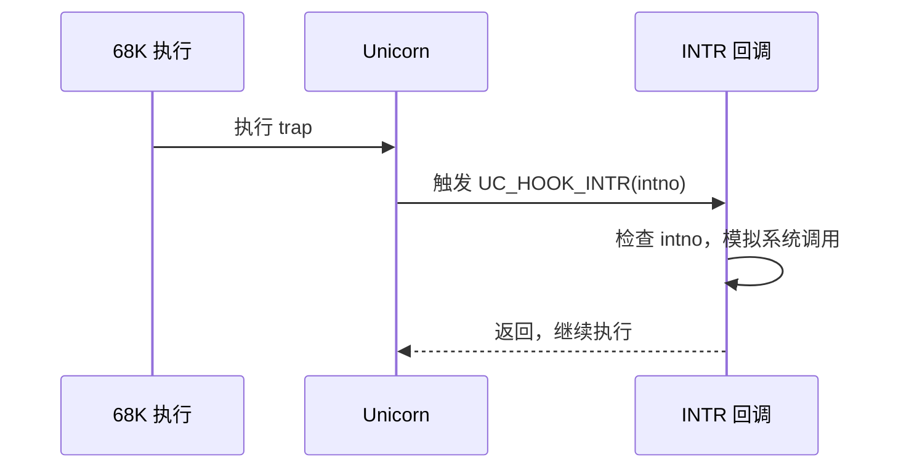

# M68K 指令与特性

本页讲清做 M68K 仿真时最需要理解的三件事：指令是**变长编码**（2~10 字节）、`trap` 类指令如何触发中断并被 [UC_HOOK_INTR](/hooks/intr) 捕获、以及用 [UC_HOOK_CODE](/hooks/code) 单步观察一条指令的效果（如 `moveq` 的符号扩展）。读完你能在 68K 代码里下断、单步并解释寄存器变化。

## 🧩 变长指令

68K 是 CISC，指令**不定长**：最短 2 字节（一个操作字），带立即数、位移、绝对地址的指令会追加扩展字，最长可达 10 字节。这意味着你无法像定长 RISC 那样"地址 +4 就是下一条"，必须靠反汇编或 Hook 回调里的 `size` 参数确定指令边界。


[UC_HOOK_CODE](/hooks/code) 的回调 `(uc, address, size, user_data)` 中，`size` 正是当前指令的真实字节数，是处理变长指令的关键。

## 🪝 单步观察：moveq 的符号扩展

`moveq #imm8, Dn` 把一个 **8 位有符号立即数符号扩展成 32 位**再放进数据寄存器，是理解 68K 数据宽度语义的经典例子。指令 `moveq #-19, %d3` 机器码为 `0x76 0xed`：

```c
#include <unicorn/unicorn.h>

// moveq #-19, %d3  ->  D3 = 0xFFFFFFED（-19 符号扩展为 32 位）
uint8_t code[] = { 0x76, 0xed };

// ... uc_open(大端) / map / write(code) ...
uc_emu_start(uc, code_start, code_start + sizeof(code), 0, 0);

uint32_t d3 = 0, sr = 0;
uc_reg_read(uc, UC_M68K_REG_D3, &d3);
uc_reg_read(uc, UC_M68K_REG_SR, &sr);
// d3 == 0xFFFFFFED
// (sr & 0x8) == 0x8  ->  N（负）标志被置位
```

立即数 `-19`（0xED）符号扩展后填满高位，得到 `0xFFFFFFED`；结果为负，故状态寄存器 SR 的 **N 位（0x8）** 被置 1。这两条断言直接取自 `tests/unit/test_m68k.c`。

::: tip 用 UC_HOOK_CODE 逐条追踪
挂上 CODE Hook 后，每执行一条指令回调触发一次，你能拿到 `address` 与 `size`，配合读寄存器即可实现单步调试器式的观察。
:::

## 🪝 trap 指令与中断 Hook

68K 用 `trap #n`、`chk`、除零、非法指令等触发**异常/陷阱**，语义类似其他架构的软中断。这类事件在 Unicorn 里通过 [UC_HOOK_INTR](/hooks/intr) 捕获，回调形如 `(uc, intno, user_data)`，你可以据此实现系统调用模拟或异常处理逻辑。



```c
// 中断/陷阱回调：intno 区分不同 trap/异常向量
static void hook_intr(uc_engine *uc, uint32_t intno, void *user_data) {
    printf(">>> 捕获中断，intno = %u\n", intno);
    // 依 intno 实现 trap #n 的语义（如系统调用分发）
}

uc_hook h;
uc_hook_add(uc, &h, UC_HOOK_INTR, hook_intr, NULL, 1, 0);
```

::: warning 陷阱需要合理的栈与向量
真实固件里 trap 会经向量表跳转并压栈返回信息。仿真片段时若不实现完整异常流程，通常在 INTR 回调里"截胡"处理，而不是让 CPU 真的走向量表。
:::

## 📂 相关源码

| 文件 | 角色 |
|------|------|
| [`include/unicorn/m68k.h`](https://github.com/android-security-engineer/unicorn-skills/blob/master/include/unicorn/m68k.h#L35) | `UC_M68K_REG_*` 寄存器枚举与 `uc_cpu_*` CPU 型号定义 |
| [`qemu/target/m68k/unicorn.c`](https://github.com/android-security-engineer/unicorn-skills/blob/master/qemu/target/m68k/unicorn.c) | 后端：`reg_read`/`reg_write`/`uc_init` 等函数指针实现 |
| [`qemu/target/m68k/translate.c`](https://github.com/android-security-engineer/unicorn-skills/blob/master/qemu/target/m68k/translate.c) | 前端：机器码翻译（TCG） |
| [`samples/sample_m68k.c`](https://github.com/android-security-engineer/unicorn-skills/blob/master/samples/sample_m68k.c) | 该架构的 C 示例程序 |
| [`include/unicorn/unicorn.h`](https://github.com/android-security-engineer/unicorn-skills/blob/master/include/unicorn/unicorn.h#L105) | `UC_ARCH_M68K` 架构常量与 `UC_MODE_*` 公共模式定义 |

## 相关页面

- [UC_HOOK_CODE — 指令级 Hook](/hooks/code) — 单步与断点
- [UC_HOOK_INTR — 中断/异常 Hook](/hooks/intr) — 捕获 trap
- [M68K 寄存器参考](/arch/m68k/registers) — SR 标志位含义
- [M68K 实战示例](/arch/m68k/example) — 把 Hook 串起来跑
