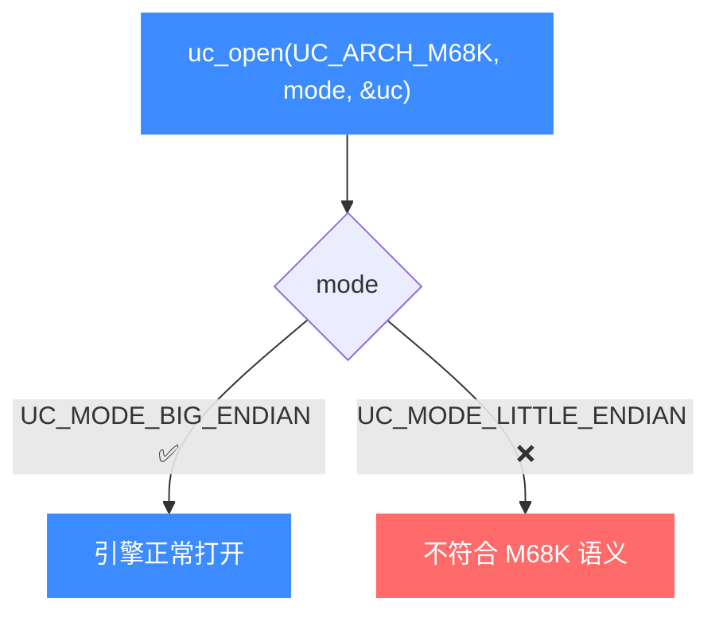
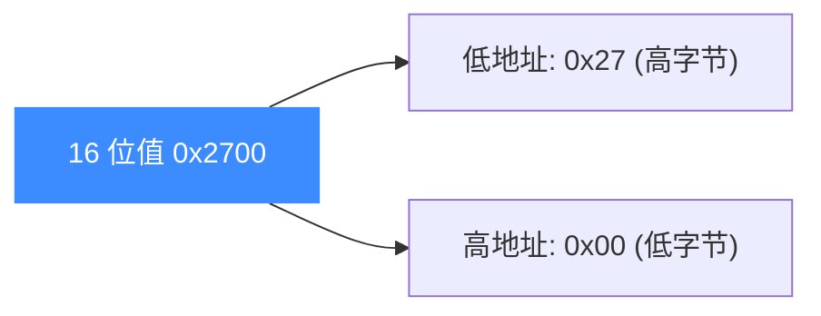

# M68K 模式与字节序

本页讲清 M68K 在 Unicorn 里唯一合法的 mode 组合：它是一颗**固定大端**处理器，`uc_open` 时必须传 `UC_MODE_BIG_ENDIAN`，既没有 32/64 位宽选择，也不能切成小端。读完你能避开"用错 mode 打不开引擎"这个最常见的坑。

## ⚡ 只有一种 mode

不同于 [ARM](/arch/arm/modes) 有 Thumb、[MIPS](/arch/mips/modes) 有 32/64 与大小端四种组合，M68K 的 mode 极其简单——只有大端一种：



## 📋 mode 取值一览

| mode | 是否用于 M68K | 说明 |
| --- | --- | --- |
| `UC_MODE_BIG_ENDIAN` | ✅ 必需 | M68K 的唯一正确 mode |
| `UC_MODE_LITTLE_ENDIAN` | ❌ | 值为 0，语义上不适用于 68K |
| `UC_MODE_32` / `UC_MODE_64` | ❌ | 属于 x86 等架构，与 M68K 无关 |

::: warning 别照搬其他架构的写法
从 x86 或 MIPS 例子里复制 `UC_MODE_32`、`UC_MODE_LITTLE_ENDIAN` 到 M68K 上是典型错误。M68K 直接、且仅使用 `UC_MODE_BIG_ENDIAN`。
:::

## 🔧 打开引擎

无论 sample 还是单元测试，M68K 都以同一种方式打开：

```c
#include <unicorn/unicorn.h>

uc_engine *uc;
// M68K：固定大端
uc_err err = uc_open(UC_ARCH_M68K, UC_MODE_BIG_ENDIAN, &uc);
if (err != UC_ERR_OK) {
    printf("uc_open 失败: %s\n", uc_strerror(err));
    return -1;
}
```

## 🧠 大端意味着什么

大端（big-endian）指多字节数据**高位字节存放在低地址**。这直接影响你往内存里写机器码和立即数时的字节顺序。以指令 `move #$2700, sr`（把 0x2700 写入状态寄存器）为例，其机器码为：

```c
// move #$2700, sr —— 立即数 0x2700 以大端顺序 0x27 0x00 紧跟操作码
char code[] = "\x46\xfc\x27\x00";
```

注意立即数字节是 `0x27 0x00`（高位在前），与小端架构相反。若把 68K 机器码当小端写入，指令会被完全解释错。



::: tip 与 sample 保持一致
[`samples/sample_m68k.c`](https://github.com/android-security-engineer/unicorn-skills/blob/master/samples/sample_m68k.c) 与 `tests/unit/test_m68k.c` 都使用 `uc_open(UC_ARCH_M68K, UC_MODE_BIG_ENDIAN, &uc)`。跟着它写就不会错。
:::

## 📂 相关源码

| 文件 | 角色 |
|------|------|
| [`include/unicorn/m68k.h`](https://github.com/android-security-engineer/unicorn-skills/blob/master/include/unicorn/m68k.h#L35) | `UC_M68K_REG_*` 寄存器枚举与 `uc_cpu_*` CPU 型号定义 |
| [`qemu/target/m68k/unicorn.c`](https://github.com/android-security-engineer/unicorn-skills/blob/master/qemu/target/m68k/unicorn.c) | 后端：`reg_read`/`reg_write`/`uc_init` 等函数指针实现 |
| [`qemu/target/m68k/translate.c`](https://github.com/android-security-engineer/unicorn-skills/blob/master/qemu/target/m68k/translate.c) | 前端：机器码翻译（TCG） |
| [`samples/sample_m68k.c`](https://github.com/android-security-engineer/unicorn-skills/blob/master/samples/sample_m68k.c) | 该架构的 C 示例程序 |
| [`include/unicorn/unicorn.h`](https://github.com/android-security-engineer/unicorn-skills/blob/master/include/unicorn/unicorn.h#L105) | `UC_ARCH_M68K` 架构常量与 `UC_MODE_*` 公共模式定义 |

## 相关页面

- [字节序（Endianness）](/features/endianness) — 大小端原理与跨架构对比
- [M68K 架构概览](/arch/m68k/) — M68K 入门
- [M68K 指令与特性](/arch/m68k/instructions) — 变长指令与机器码
- [uc_open](/api/open) — 打开引擎的函数签名
