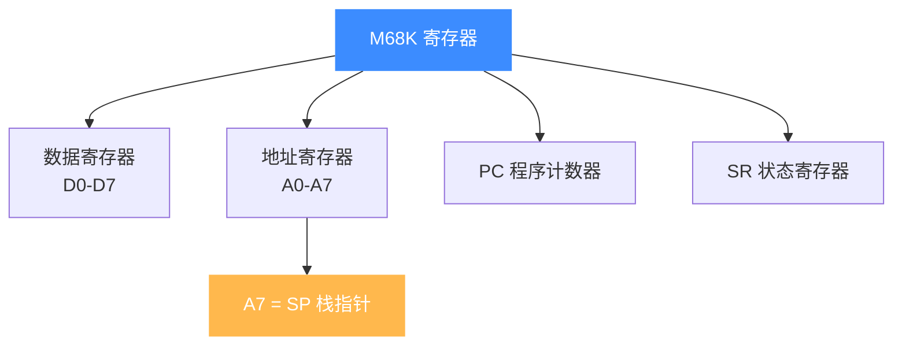

# M68K 寄存器参考

本页列出 Unicorn 在 M68K 架构下可读写的寄存器：8 个数据寄存器 D0-D7、8 个地址寄存器 A0-A7（A7 即栈指针）、程序计数器 PC 与状态寄存器 SR，并给出每个寄存器对应的 `UC_M68K_REG_*` 常量。读完你能用 [uc_reg_read](/api/reg-read) / `uc_reg_write` 正确访问 68K 的 CPU 上下文。

## 🧠 寄存器组结构

68K 的可编程寄存器分成"数据 / 地址"两大组，外加 PC 与 SR：



所有常量定义在 [`include/unicorn/m68k.h`](https://github.com/android-security-engineer/unicorn-skills/blob/master/include/unicorn/m68k.h) 的 `enum uc_m68k_reg` 中，`UC_M68K_REG_INVALID = 0` 是占位无效值。

## 📋 数据寄存器 D0-D7

用于算术、逻辑、移位等数据运算，宽度 32 位。

| 寄存器 | 常量 | 用途 |
| --- | --- | --- |
| D0 | `UC_M68K_REG_D0` | 数据/运算，常作返回值 |
| D1 | `UC_M68K_REG_D1` | 数据/运算 |
| D2 | `UC_M68K_REG_D2` | 数据/运算 |
| D3 | `UC_M68K_REG_D3` | 数据/运算 |
| D4 | `UC_M68K_REG_D4` | 数据/运算 |
| D5 | `UC_M68K_REG_D5` | 数据/运算 |
| D6 | `UC_M68K_REG_D6` | 数据/运算 |
| D7 | `UC_M68K_REG_D7` | 数据/运算 |

## 📋 地址寄存器 A0-A7

用于存放指针，参与 `(An)`、`-(An)`、`(An)+` 等寻址方式，宽度 32 位。

| 寄存器 | 常量 | 用途 |
| --- | --- | --- |
| A0 | `UC_M68K_REG_A0` | 地址/指针 |
| A1 | `UC_M68K_REG_A1` | 地址/指针 |
| A2 | `UC_M68K_REG_A2` | 地址/指针 |
| A3 | `UC_M68K_REG_A3` | 地址/指针 |
| A4 | `UC_M68K_REG_A4` | 地址/指针 |
| A5 | `UC_M68K_REG_A5` | 地址/指针（常作帧/全局基址） |
| A6 | `UC_M68K_REG_A6` | 地址/指针（常作帧指针 FP） |
| A7 | `UC_M68K_REG_A7` | **栈指针 SP** |

::: warning A7 就是栈指针
68K 约定 **A7 兼作栈指针（SP）**，`bsr/jsr` 调用与 `link/unlk` 帧管理都通过它压栈出栈。改写 A7 等于改写栈顶，务必谨慎。
:::

## 📋 控制寄存器：PC 与 SR

| 寄存器 | 常量 | 说明 |
| --- | --- | --- |
| PC | `UC_M68K_REG_PC` | 程序计数器，指向下一条指令 |
| SR | `UC_M68K_REG_SR` | 状态寄存器，含条件码标志（N/Z/V/C 等）与系统位 |

SR 的低字节是条件码寄存器 CCR，其中 **N（bit 3, 0x8）为负标志**。例如执行 `moveq #-19,%d3` 后结果为负，SR 的 N 位被置 1——这在 [指令与特性](/arch/m68k/instructions) 里有可验证的例子。

::: details m68k.h 还定义了一组控制寄存器常量
除上述常用寄存器外，`enum uc_m68k_reg` 还包含 VBR、SFC/DFC、CACR、USP/MSP/ISP、SRP/URP、ITT0/1、DTT0/1、TC、MMUSR 等控制寄存器常量（形如 `UC_M68K_REG_CR_*`），供访问 68020+/MMU 相关状态。日常仿真通常用不到，需要时再查头文件。
:::

## 🔧 读写寄存器

```c
#include <unicorn/unicorn.h>

int d3 = 0;
// 先写一个初值到 D3
uc_reg_write(uc, UC_M68K_REG_D3, &d3);

// ... uc_emu_start 执行代码 ...

// 执行后读回 D3 与状态寄存器 SR
int sr = 0;
uc_reg_read(uc, UC_M68K_REG_D3, &d3);
uc_reg_read(uc, UC_M68K_REG_SR, &sr);
printf("D3 = 0x%x, SR = 0x%x\n", d3, sr);
```

::: tip 值类型
M68K 寄存器为 32 位，示例代码用 `int`（sample_m68k.c 即如此）；只要缓冲区不小于寄存器宽度即可，也可用 `uint32_t`。
:::

## 📂 相关源码

| 文件 | 角色 |
|------|------|
| [`include/unicorn/m68k.h`](https://github.com/android-security-engineer/unicorn-skills/blob/master/include/unicorn/m68k.h#L35) | `UC_M68K_REG_*` 寄存器枚举与 `uc_cpu_*` CPU 型号定义 |
| [`qemu/target/m68k/unicorn.c`](https://github.com/android-security-engineer/unicorn-skills/blob/master/qemu/target/m68k/unicorn.c) | 后端：`reg_read`/`reg_write`/`uc_init` 等函数指针实现 |
| [`qemu/target/m68k/translate.c`](https://github.com/android-security-engineer/unicorn-skills/blob/master/qemu/target/m68k/translate.c) | 前端：机器码翻译（TCG） |
| [`samples/sample_m68k.c`](https://github.com/android-security-engineer/unicorn-skills/blob/master/samples/sample_m68k.c) | 该架构的 C 示例程序 |
| [`include/unicorn/unicorn.h`](https://github.com/android-security-engineer/unicorn-skills/blob/master/include/unicorn/unicorn.h#L105) | `UC_ARCH_M68K` 架构常量与 `UC_MODE_*` 公共模式定义 |

## 相关页面

- [uc_reg_read](/api/reg-read) — 读取单个寄存器
- [M68K 架构概览](/arch/m68k/) — 数据/地址寄存器分组由来
- [M68K 指令与特性](/arch/m68k/instructions) — SR 标志位的可验证例子
- [sample_m68k.c 走读](/samples/sample-m68k) — 完整寄存器读写演示
