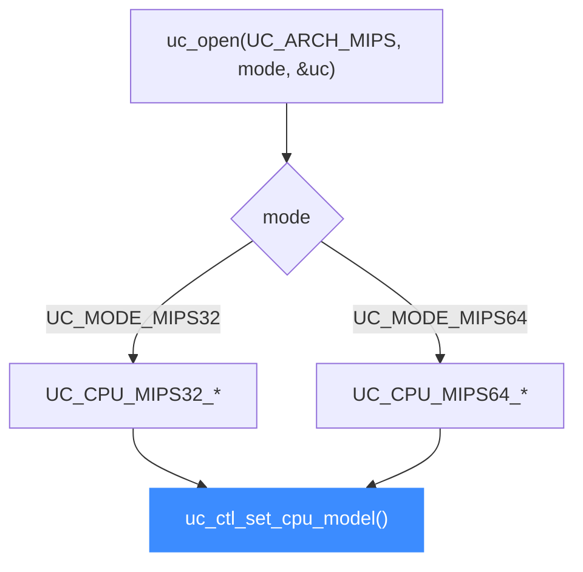

# MIPS CPU 型号

本页讲清 Unicorn 支持的 MIPS CPU 型号：`UC_CPU_MIPS32_*` 与 `UC_CPU_MIPS64_*` 的真实取值、用 [uc_ctl_set_cpu_model](/ctl/set-cpu-model) 切换型号，以及型号如何决定可用的指令集版本与扩展（DSP、MSA、MIPS32R6 等）。读完你能为一段 MIPS 代码选对处理器核。

## 🧠 型号从哪来

Unicorn 的 MIPS 后端沿用 QEMU 的 CPU 定义。可选型号被分成两个枚举——32 位的 `uc_cpu_mips32` 与 64 位的 `uc_cpu_mips64`，都定义在 [`include/unicorn/mips.h`](https://github.com/android-security-engineer/unicorn-skills/blob/master/include/unicorn/mips.h)。选型号前先确定你用的是 `UC_MODE_MIPS32` 还是 `UC_MODE_MIPS64`，两组常量不能混用。



## 📋 MIPS32 型号

常量全部来自 [`include/unicorn/mips.h`](https://github.com/android-security-engineer/unicorn-skills/blob/master/include/unicorn/mips.h)（`enum uc_cpu_mips32`），默认值为枚举 0 的 `UC_CPU_MIPS32_4KC`：

| 常量 | 说明 |
| --- | --- |
| `UC_CPU_MIPS32_4KC` | 4Kc，经典 MIPS32 嵌入式核（默认） |
| `UC_CPU_MIPS32_4KM` | 4Km |
| `UC_CPU_MIPS32_4KECR1` | 4KEc（Release 1） |
| `UC_CPU_MIPS32_4KEMR1` | 4KEm（Release 1） |
| `UC_CPU_MIPS32_4KEC` | 4KEc |
| `UC_CPU_MIPS32_4KEM` | 4KEm |
| `UC_CPU_MIPS32_24KC` | 24Kc |
| `UC_CPU_MIPS32_24KEC` | 24KEc |
| `UC_CPU_MIPS32_24KF` | 24Kf，带 FPU |
| `UC_CPU_MIPS32_34KF` | 34Kf，多线程核 |
| `UC_CPU_MIPS32_74KF` | 74Kf，高性能核 |
| `UC_CPU_MIPS32_M14K` | M14K |
| `UC_CPU_MIPS32_M14KC` | M14Kc |
| `UC_CPU_MIPS32_P5600` | P5600，MSA 向量扩展 |
| `UC_CPU_MIPS32_MIPS32R6_GENERIC` | MIPS32 Release 6 通用核 |
| `UC_CPU_MIPS32_I7200` | I7200 |

## 📋 MIPS64 型号

来自 `enum uc_cpu_mips64`，默认值为 `UC_CPU_MIPS64_R4000`：

| 常量 | 说明 |
| --- | --- |
| `UC_CPU_MIPS64_R4000` | R4000，经典 64 位核（默认） |
| `UC_CPU_MIPS64_VR5432` | NEC VR5432 |
| `UC_CPU_MIPS64_5KC` | 5Kc |
| `UC_CPU_MIPS64_5KF` | 5Kf，带 FPU |
| `UC_CPU_MIPS64_20KC` | 20Kc |
| `UC_CPU_MIPS64_MIPS64R2_GENERIC` | MIPS64 Release 2 通用核 |
| `UC_CPU_MIPS64_5KEC` | 5KEc |
| `UC_CPU_MIPS64_5KEF` | 5KEf |
| `UC_CPU_MIPS64_I6400` | I6400 |
| `UC_CPU_MIPS64_I6500` | I6500 |
| `UC_CPU_MIPS64_LOONGSON_2E` | 龙芯 Loongson 2E |
| `UC_CPU_MIPS64_LOONGSON_2F` | 龙芯 Loongson 2F |
| `UC_CPU_MIPS64_MIPS64DSPR2` | 带 DSP Release 2 扩展 |

::: warning ENDING 不是型号
`UC_CPU_MIPS32_ENDING` / `UC_CPU_MIPS64_ENDING` 仅是列表结束标记，不可传入。不要臆造头文件里没有的常量。
:::

## 🔧 切换型号

型号在 `uc_open()` 之后、`uc_emu_start()` 之前设置：

```c
#include <unicorn/unicorn.h>

uc_engine *uc;

// 大端 MIPS32
uc_open(UC_ARCH_MIPS, UC_MODE_MIPS32 + UC_MODE_BIG_ENDIAN, &uc);

// 选用带 MSA 向量扩展的 P5600 核
uc_err err = uc_ctl_set_cpu_model(uc, UC_CPU_MIPS32_P5600);
if (err != UC_ERR_OK) {
    printf("设置 CPU 型号失败: %s\n", uc_strerror(err));
}
```

::: tip 型号决定指令集版本
是否支持 MIPS32R6、DSP、MSA 等由型号决定。跑 R6 专属指令要选 `UC_CPU_MIPS32_MIPS32R6_GENERIC`；用到 MSA 向量则选 `P5600`；分析龙芯固件可选 `LOONGSON_2E/2F`。不确定时先用默认核跑通基础指令。
:::

## 📂 相关源码

| 文件 | 角色 |
|------|------|
| [`include/unicorn/mips.h`](https://github.com/android-security-engineer/unicorn-skills/blob/master/include/unicorn/mips.h#L65) | `UC_MIPS_REG_*` 寄存器枚举与 `uc_cpu_*` CPU 型号定义 |
| [`qemu/target/mips/unicorn.c`](https://github.com/android-security-engineer/unicorn-skills/blob/master/qemu/target/mips/unicorn.c) | 后端：`reg_read`/`reg_write`/`uc_init` 等函数指针实现 |
| [`qemu/target/mips/translate.c`](https://github.com/android-security-engineer/unicorn-skills/blob/master/qemu/target/mips/translate.c) | 前端：机器码翻译（TCG） |
| [`samples/sample_mips.c`](https://github.com/android-security-engineer/unicorn-skills/blob/master/samples/sample_mips.c) | 该架构的 C 示例程序 |
| [`include/unicorn/unicorn.h`](https://github.com/android-security-engineer/unicorn-skills/blob/master/include/unicorn/unicorn.h#L101) | `UC_ARCH_MIPS` 架构常量与 `UC_MODE_*` 公共模式定义 |

## 相关页面

- [uc_ctl_set_cpu_model](/ctl/set-cpu-model) — 设置 CPU 型号的控制接口
- [CPU 型号特性总览](/features/cpu-models) — 跨架构的型号与特性说明
- [MIPS 架构概览](/arch/mips/) — MIPS 入门与寄存器
- [MIPS 实战示例](/arch/mips/example) — 含大小端对照的完整走读
