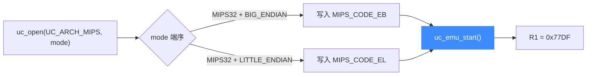

# MIPS 实战示例

本页带你完整跑通 MIPS 仿真，并**大端 / 小端两版对照**：同一条 `ori` 指令，机器码字节序不同，但语义与结果一致。示例改编自官方 `sample_mips.c`，逐段讲解并给出预期输出。读完你能理解 MIPS 的字节序处理，并写出自己的仿真。

## 🎯 我们要模拟什么

目标是一条指令：`ori $at, $at, 0x3456`（把寄存器 `$at` 与立即数 `0x3456` 按位或）。初值 `$at`（即 `UC_MIPS_REG_1`）= `0x6789`。执行后：

```text
0x6789 | 0x3456 = 0x77DF
```

关键点在机器码字节序：

| 端序 | 机器码常量 | 字节 |
| --- | --- | --- |
| 大端 EB | `MIPS_CODE_EB` | `\x34\x21\x34\x56` |
| 小端 EL | `MIPS_CODE_EL` | `\x56\x34\x21\x34` |

同一条指令，两个端序下字节顺序正好相反——这正是字节序的直观体现。详见 [字节序](/features/endianness)。



## 🧩 完整代码（大端版）

以下摘自 [`samples/sample_mips.c`](https://github.com/android-security-engineer/unicorn-skills/blob/master/samples/sample_mips.c) 的 `test_mips_eb`，可直接编译运行：

```c
#include <unicorn/unicorn.h>

// ori $at, $at, 0x3456; （大端字节序）
#define MIPS_CODE_EB "\x34\x21\x34\x56"
#define ADDRESS 0x10000

static void hook_block(uc_engine *uc, uint64_t address, uint32_t size,
                       void *user_data)
{
    printf(">>> Tracing basic block at 0x%" PRIx64 ", block size = 0x%x\n",
           address, size);
}

static void hook_code(uc_engine *uc, uint64_t address, uint32_t size,
                      void *user_data)
{
    printf(">>> Tracing instruction at 0x%" PRIx64
           ", instruction size = 0x%x\n",
           address, size);
}

static void test_mips_eb(void)
{
    uc_engine *uc;
    uc_err err;
    uc_hook trace1, trace2;

    int r1 = 0x6789; // R1（即 $at）初值

    // 1. 初始化引擎：MIPS32 大端
    err = uc_open(UC_ARCH_MIPS, UC_MODE_MIPS32 + UC_MODE_BIG_ENDIAN, &uc);
    if (err) {
        printf("uc_open 失败: %u (%s)\n", err, uc_strerror(err));
        return;
    }

    // 2. 映射 2MB 内存
    uc_mem_map(uc, ADDRESS, 2 * 1024 * 1024, UC_PROT_ALL);

    // 3. 写入大端机器码
    uc_mem_write(uc, ADDRESS, MIPS_CODE_EB, sizeof(MIPS_CODE_EB) - 1);

    // 4. 初始化寄存器 R1 = $at
    uc_reg_write(uc, UC_MIPS_REG_1, &r1);

    // 5. 挂 Hook 跟踪基本块与指令
    uc_hook_add(uc, &trace1, UC_HOOK_BLOCK, hook_block, NULL, 1, 0);
    uc_hook_add(uc, &trace2, UC_HOOK_CODE, hook_code, NULL, ADDRESS, ADDRESS);

    // 6. 启动仿真
    err = uc_emu_start(uc, ADDRESS, ADDRESS + sizeof(MIPS_CODE_EB) - 1, 0, 0);
    if (err) {
        printf("uc_emu_start 失败: %u (%s)\n", err, uc_strerror(err));
    }

    // 7. 读回 R1
    printf(">>> Emulation done. Below is the CPU context\n");
    uc_reg_read(uc, UC_MIPS_REG_1, &r1);
    printf(">>> R1 = 0x%x\n", r1);

    uc_close(uc);
}
```

## 🔁 小端版差异

小端只需改两处：`uc_open` 的端序标志与写入的机器码常量，其余完全相同。

```c
// MIPS32 小端
err = uc_open(UC_ARCH_MIPS, UC_MODE_MIPS32 + UC_MODE_LITTLE_ENDIAN, &uc);
// ...
// 写入小端字节序的同一条指令
uc_mem_write(uc, ADDRESS, MIPS_CODE_EL, sizeof(MIPS_CODE_EL) - 1);
```

::: tip 端序只影响字节排列，不影响结果
`ori` 的语义与运算结果与端序无关，因此两版最终 `R1` 都是 `0x77DF`。端序影响的是**如何把 4 个字节解释成一条指令**，以及多字节访存时的取值顺序。选错端序会把机器码解成完全不同（甚至非法）的指令。
:::

## 🔧 逐段讲解

- **① uc_open**：[`UC_ARCH_MIPS`](https://github.com/android-security-engineer/unicorn-skills/blob/master/include/unicorn/unicorn.h#L101) + `UC_MODE_MIPS32`，再叠加 `UC_MODE_BIG_ENDIAN` 或 `UC_MODE_LITTLE_ENDIAN` 决定端序。64 位则用 `UC_MODE_MIPS64`。
- **② uc_mem_map**：仿真前必须映射内存，权限 `UC_PROT_ALL`。
- **③ uc_mem_write**：写入的机器码字节序必须与 `uc_open` 声明的端序一致，否则指令会被误解码。
- **④ uc_reg_write**：`UC_MIPS_REG_1` 就是别名 `$at`（`UC_MIPS_REG_AT`），寄存器别名见 [MIPS 寄存器](/arch/mips/registers)。
- **⑤ uc_hook_add**：`begin=1, end=0` 让 [Hook](/features/hooks) 对全地址生效。
- **⑥ uc_emu_start**：timeout=0、count=0 表示不限时不限指令数，跑到 end 为止。

## 📤 预期输出（大端版）

```text
Emulate MIPS code (big-endian)
>>> Tracing basic block at 0x10000, block size = 0x4
>>> Tracing instruction at 0x10000, instruction size = 0x4
>>> Emulation done. Below is the CPU context
>>> R1 = 0x77df
```

小端版输出内容一致，仅首行提示为 `Emulate MIPS code (little-endian)`，`R1` 同样是 `0x77df`。

::: warning 端序与型号是两件事
端序由 `uc_open` 的模式标志决定；CPU 型号由 [uc_ctl_set_cpu_model](/ctl/set-cpu-model) 决定。两者独立配置，选型号见 [MIPS CPU 型号](/arch/mips/cpu-models)。
:::

## 📂 相关源码

| 文件 | 角色 |
|------|------|
| [`include/unicorn/mips.h`](https://github.com/android-security-engineer/unicorn-skills/blob/master/include/unicorn/mips.h#L65) | `UC_MIPS_REG_*` 寄存器枚举与 `uc_cpu_*` CPU 型号定义 |
| [`qemu/target/mips/unicorn.c`](https://github.com/android-security-engineer/unicorn-skills/blob/master/qemu/target/mips/unicorn.c) | 后端：`reg_read`/`reg_write`/`uc_init` 等函数指针实现 |
| [`qemu/target/mips/translate.c`](https://github.com/android-security-engineer/unicorn-skills/blob/master/qemu/target/mips/translate.c) | 前端：机器码翻译（TCG） |
| [`samples/sample_mips.c`](https://github.com/android-security-engineer/unicorn-skills/blob/master/samples/sample_mips.c) | 该架构的 C 示例程序 |
| [`include/unicorn/unicorn.h`](https://github.com/android-security-engineer/unicorn-skills/blob/master/include/unicorn/unicorn.h#L101) | `UC_ARCH_MIPS` 架构常量与 `UC_MODE_*` 公共模式定义 |

## 相关页面

- [sample_mips.c 走读](/samples/sample-mips) — 官方样例全量解析
- [MIPS 架构概览](/arch/mips/) — MIPS 入门与寄存器
- [字节序](/features/endianness) — 大端 / 小端机制详解
- [MIPS CPU 型号](/arch/mips/cpu-models) — 型号与指令集版本
