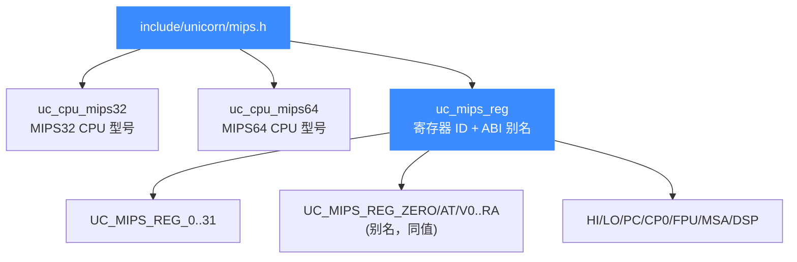
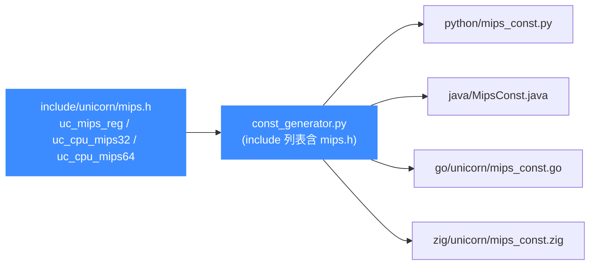

# MIPS 头文件参考（mips.h）

本页是 [`include/unicorn/mips.h`](https://github.com/android-security-engineer/unicorn-skills/blob/master/include/unicorn/mips.h) 的常量参考：它定义了 MIPS 的 CPU 型号枚举（`uc_cpu_mips32` / `uc_cpu_mips64`）与寄存器 ID 枚举（`uc_mips_reg`），是所有语言绑定里 MIPS 常量的唯一真源。读完你能找到每个常量在头文件里的位置，并知道改动后如何同步到各绑定。

## 📌 概述

`mips.h` 只暴露两类枚举，**没有** 指令 ID 枚举（MIPS 不像 x86/ARM 那样提供 `UC_<arch>_INS_*` 指令表），也**不** 定义 `UC_MODE_*` 模式位（模式位统一在 [`unicorn.h`](/headers/unicorn-h) 里，跨架构共用）。文件结构如下：



| 区段 | 内容 | 定义位置（行） |
| --- | --- | --- |
| `enum uc_cpu_mips32` | 16 个 MIPS32 CPU 型号 + `ENDING` | 23–42 |
| `enum uc_cpu_mips64` | 13 个 MIPS64 CPU 型号 + `ENDING` | 45–61 |
| `enum uc_mips_reg` | 寄存器 ID + ABI 别名 + `ENDING` | 64–274 |
| `typedef uc_mips_reg UC_MIPS_REG` | 旧版兼容别名 | 277 |

::: details 为什么 #undef mips
文件顶部有一行 `#undef mips`。GCC 的 MIPS 工具链默认会预定义一个名为 `mips` 的宏，会破坏编译，因此头文件先把它 undef 掉。
:::

## 💡 CPU 型号枚举

两组型号按位宽严格分开：用 `UC_MODE_MIPS32` 打开引擎时只能传 `UC_CPU_MIPS32_*`，用 `UC_MODE_MIPS64` 时只能传 `UC_CPU_MIPS64_*`。完整型号清单与选型建议见 [CPU 型号](/arch/mips/cpu-models)，这里只列枚举的骨架：

| 枚举 | 首项（默认 = 0） | 末项标记 |
| --- | --- | --- |
| `uc_cpu_mips32` | `UC_CPU_MIPS32_4KC` | `UC_CPU_MIPS32_ENDING` |
| `uc_cpu_mips64` | `UC_CPU_MIPS64_R4000` | `UC_CPU_MIPS64_ENDING` |

```c
// MIPS32 枚举（节选）
typedef enum uc_cpu_mips32 {
    UC_CPU_MIPS32_4KC = 0,
    UC_CPU_MIPS32_4KM,
    UC_CPU_MIPS32_24KC,
    UC_CPU_MIPS32_P5600,          // 支持 MSA 向量扩展
    UC_CPU_MIPS32_MIPS32R6_GENERIC,
    UC_CPU_MIPS32_I7200,
    UC_CPU_MIPS32_ENDING
} uc_cpu_mips32;
```

::: warning ENDING 不可传入
`UC_CPU_MIPS32_ENDING` / `UC_CPU_MIPS64_ENDING` 只是列表结束标记，不是合法型号，传给 `uc_ctl_set_cpu_model` 会出错。
:::

## 📋 寄存器 ID 枚举（uc_mips_reg）

`uc_mips_reg` 是头文件的核心。通用寄存器同时给出**数字常量**和 **ABI 别名**，两者值相同（`UC_MIPS_REG_A0 = UC_MIPS_REG_4`）。下表列出常用项，完整说明见 [寄存器参考](/arch/mips/registers)。

| 常量 | 值/别名 | 含义 |
| --- | --- | --- |
| `UC_MIPS_REG_INVALID` | 0 | 非法/哨兵值 |
| `UC_MIPS_REG_PC` | — | 程序计数器 |
| `UC_MIPS_REG_0` … `UC_MIPS_REG_31` | 0..31 | 32 个通用寄存器（数字形式） |
| `UC_MIPS_REG_ZERO` | = `_0` | `$0`，恒为 0 |
| `UC_MIPS_REG_AT` | = `_1` | `$1`，汇编器临时寄存器 |
| `UC_MIPS_REG_V0` / `V1` | = `_2` / `_3` | 函数返回值 |
| `UC_MIPS_REG_A0`…`A3` | = `_4`…`_7` | 前四个函数参数 |
| `UC_MIPS_REG_T0`…`T7` | = `_8`…`_15` | 调用者保存的临时寄存器 |
| `UC_MIPS_REG_S0`…`S7` | = `_16`…`_23` | 被调用者保存 |
| `UC_MIPS_REG_T8` / `T9` | = `_24` / `_25` | 临时值；t9 常存 PIC 跳转目标 |
| `UC_MIPS_REG_K0` / `K1` | = `_26` / `_27` | 内核保留 |
| `UC_MIPS_REG_GP` | = `_28` | 全局指针 |
| `UC_MIPS_REG_SP` | = `_29` | 栈指针 |
| `UC_MIPS_REG_FP` / `S8` | = `_30` | 帧指针（别名 s8） |
| `UC_MIPS_REG_RA` | = `_31` | 返回地址 |
| `UC_MIPS_REG_HI` / `LO` | — | 乘除结果高/低半 |
| `UC_MIPS_REG_AC0`…`AC3` | — | DSP 累加器（`HI0..3`/`LO0..3` 的别名源） |
| `UC_MIPS_REG_CC0`…`CC7` | — | COP 条件码 |
| `UC_MIPS_REG_F0`…`F31` | — | 32 个 FPU 浮点寄存器 |
| `UC_MIPS_REG_FCC0`…`FCC7` | — | 浮点条件码 |
| `UC_MIPS_REG_W0`…`W31` | — | 128 位 MSA 向量寄存器（AFPR128） |
| `UC_MIPS_REG_CP0_STATUS` | — | CP0 状态寄存器 |
| `UC_MIPS_REG_CP0_CONFIG3` | — | CP0 配置寄存器 3 |
| `UC_MIPS_REG_CP0_USERLOCAL` | — | CP0 用户局部寄存器 |
| `UC_MIPS_REG_FIR` | — | FPU 实现寄存器 |
| `UC_MIPS_REG_FCSR` | — | FPU 控制状态字 |
| `UC_MIPS_REG_ENDING` | — | 寄存器列表结束标记 |

DSP 另有 `UC_MIPS_REG_DSPCCOND`、`DSPCARRY`、`DSPEFI`、`DSPOUTFLAG*`、`DSPPOS`、`DSPSCOUNT`；MSA 向量有 `UC_MIPS_REG_P0/P1/P2`、`MPL0/MPL1/MPL2`。别名段还把 `UC_MIPS_REG_HI0..3` 指向 `AC0..3`，`LO0..3` 再指向 `HI0..3`。

## ⚙️ MIPS 模式位（UC_MODE_\*）

`mips.h` **不定义**任何 `UC_MODE_*`，这些宏在 [`unicorn.h`](/headers/unicorn-h) 里与所有架构共用。下表是与 MIPS 相关的模式位，详见 [模式与字节序](/arch/mips/modes)：

| 常量 | 值 | 含义 |
| --- | --- | --- |
| `UC_MODE_MIPS32` | `1 << 2` | MIPS32 ISA |
| `UC_MODE_MIPS64` | `1 << 3` | MIPS64 ISA |
| `UC_MODE_MIPS3` | `1 << 5` | MIPS III ISA（当前不支持） |
| `UC_MODE_MIPS32R6` | `1 << 6` | MIPS32R6 ISA（当前不支持） |
| `UC_MODE_LITTLE_ENDIAN` | `0` | 小端（默认） |
| `UC_MODE_BIG_ENDIAN` | `1 << 30` | 大端（路由器固件常用） |

位宽位与字节序位按位或组合，例如大端 MIPS32：`UC_MODE_MIPS32 + UC_MODE_BIG_ENDIAN`。

## 🚫 没有指令 ID 枚举

与 x86、ARM 不同，MIPS 头文件**不提供** `UC_MIPS_INS_*` 指令 ID 枚举——Unicorn 是 CPU 仿真器而非反汇编器，不内建 MIPS 指令表。需要识别/枚举 MIPS 指令文本时配合 [Capstone](https://www.capstone-engine.org/) 使用；Unicorn 这边只关心机器码执行与寄存器/内存状态。指令执行层面的特性（延迟槽、syscall）见 [指令与特性](/arch/mips/instructions)。

## 🔧 实现：常量如何流向绑定

`mips.h` 是各语言绑定常量的来源。`bindings/const_generator.py` 逐行扫描 [`include/unicorn/mips.h`](https://github.com/android-security-engineer/unicorn-skills/blob/master/include/unicorn/mips.h) 里的 `#define`/枚举，按语言模板套用 `line_format` 输出到对应 `*_const.*` 文件。



::: tip 改了常量必须重新生成
这些枚举是绑定生成的**唯一真源**。如果你在 `mips.h` 里增删或改了一个寄存器/CPU 型号常量，必须运行：

```bash
cd bindings
python3 const_generator.py all
```

否则 C 头文件与各语言常量会不一致，埋下"同名常量在不同语言取值不同"的隐患。机制细节见 [常量生成器 const_generator.py](/bindings/const-generator)。所有生成文件顶部都标有 `AUTO-GENERATED FILE, DO NOT EDIT`，**绝不要手改** `*_const.*`。
:::

## ⚠️ 注意

- `typedef uc_mips_reg UC_MIPS_REG;` 仅为向后兼容，新代码用 `uc_mips_reg` 即可。
- `UC_MIPS_REG_*` 的别名（`ZERO`、`A0`…）是 C 层 `=` 赋值的同值枚举项，绑定生成器会为每种语言按各自规则处理，别假设别名和数字常量在不同语言里取值顺序一致——以生成结果为准。
- 读写寄存器时缓冲区宽度要匹配位宽：MIPS32 通用寄存器 32 位、MIPS64 为 64 位、浮点寄存器读入 `uint64_t`，详见 [寄存器参考](/arch/mips/registers)。

## 📖 参考

- 头文件原文：[`include/unicorn/mips.h`](https://github.com/android-security-engineer/unicorn-skills/blob/master/include/unicorn/mips.h)（LGPL2）
- FCR 寄存器语义参考：MIPS64 Architecture For Programmers Volume I-A（MD00083），头文件第 223–224 行注明了出处。

## 📂 相关源码

| 文件 | 角色 |
|------|------|
| [`include/unicorn/mips.h`](https://github.com/android-security-engineer/unicorn-skills/blob/master/include/unicorn/mips.h#L65) | `UC_MIPS_REG_*` 寄存器枚举与 `uc_cpu_*` CPU 型号定义 |
| [`qemu/target/mips/unicorn.c`](https://github.com/android-security-engineer/unicorn-skills/blob/master/qemu/target/mips/unicorn.c) | 后端：`reg_read`/`reg_write`/`uc_init` 等函数指针实现 |
| [`qemu/target/mips/translate.c`](https://github.com/android-security-engineer/unicorn-skills/blob/master/qemu/target/mips/translate.c) | 前端：机器码翻译（TCG） |
| [`samples/sample_mips.c`](https://github.com/android-security-engineer/unicorn-skills/blob/master/samples/sample_mips.c) | 该架构的 C 示例程序 |
| [`include/unicorn/unicorn.h`](https://github.com/android-security-engineer/unicorn-skills/blob/master/include/unicorn/unicorn.h#L101) | `UC_ARCH_MIPS` 架构常量与 `UC_MODE_*` 公共模式定义 |

## 相关页面

- [MIPS 架构概览](/arch/mips/)
- [MIPS 寄存器参考](/arch/mips/registers)
- [MIPS CPU 型号](/arch/mips/cpu-models)
- [常量生成器 const_generator.py](/bindings/const-generator)
- [unicorn.h 头文件参考](/headers/unicorn-h)
