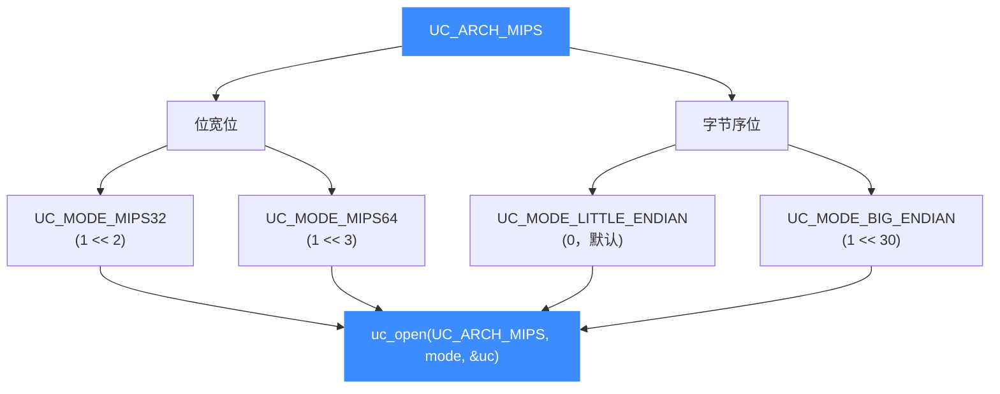

# MIPS 架构概览

本页介绍 Unicorn 对 MIPS 架构（[`UC_ARCH_MIPS`](https://github.com/android-security-engineer/unicorn-skills/blob/master/include/unicorn/unicorn.h#L101)）的支持：32/64 位、大小端四种组合、延迟槽（branch delay slot）这个 MIPS 最鲜明的特性，以及它在路由器/嵌入式固件逆向中的典型用途。读完你能正确地用 `uc_open` 打开一个 MIPS 引擎，并知道后续该看哪几页。

## 🧩 为什么 MIPS 值得单独一章

MIPS 是经典的 RISC 架构，指令定长 4 字节、寄存器规整，长期占据家用路由器、光猫、IP 摄像头等嵌入式设备的固件市场。做 IoT 固件分析时，你面对的二进制十有八九是 **大端 MIPS32**。Unicorn 让你无需真机就能把这些代码片段跑起来，配合 [Hook 体系](/features/hooks) 观察寄存器与内存变化。

MIPS 在 Unicorn 里有两个绕不开的坑：**字节序**（同一条指令大小端机器码完全相反）和**延迟槽**（跳转指令后一条指令照常执行）。这两点在本章 [模式与字节序](/arch/mips/modes) 和 [指令与特性](/arch/mips/instructions) 里重点展开。

## ⚡ 四种位宽 × 字节序组合

Unicorn 用 mode 位组合表达 MIPS 的位宽与字节序，二者**按位或**：



组合出的四种常见目标：

| 组合 | mode 表达式 | 典型目标 |
|------|-------------|----------|
| MIPS32 小端 | `UC_MODE_MIPS32 \| UC_MODE_LITTLE_ENDIAN` | 部分嵌入式、`mipsel` 固件 |
| MIPS32 大端 | `UC_MODE_MIPS32 \| UC_MODE_BIG_ENDIAN` | 绝大多数路由器固件（`mips`） |
| MIPS64 小端 | `UC_MODE_MIPS64 \| UC_MODE_LITTLE_ENDIAN` | 龙芯、部分服务器级芯片 |
| MIPS64 大端 | `UC_MODE_MIPS64 \| UC_MODE_BIG_ENDIAN` | 大端 64 位目标 |

::: tip LITTLE_ENDIAN 的值是 0
`UC_MODE_LITTLE_ENDIAN = 0`，所以"不写它"就等于小端。只有需要大端时才必须显式 `| UC_MODE_BIG_ENDIAN`。字节序细节见 [字节序](/features/endianness)。
:::

## 🔧 最小示例

```c
#include <unicorn/unicorn.h>

uc_engine *uc;
// 打开一个大端 MIPS32 引擎（最常见的路由器固件目标）
uc_err err = uc_open(UC_ARCH_MIPS, UC_MODE_MIPS32 + UC_MODE_BIG_ENDIAN, &uc);
if (err != UC_ERR_OK) {
    printf("uc_open 失败: %s\n", uc_strerror(err));
    return -1;
}
// ... 映射内存、写机器码、设寄存器、uc_emu_start ...
uc_close(uc);
```

## 🌀 延迟槽（先建立直觉）

MIPS 的跳转/分支指令带有一个**延迟槽**：跳转指令之后紧跟的那条指令，会在跳转真正生效之前先执行。这直接影响单步（一次执行"1 条指令"时延迟槽也会跑）和 Hook 行为，是 MIPS 仿真最容易困惑的地方。完整讨论见 [指令与特性](/arch/mips/instructions)。


## 📚 本章导航

| 页面 | 内容 |
|------|------|
| [寄存器参考](/arch/mips/registers) | `$0-$31`、HI/LO、PC、CP0、FPU 及 `UC_MIPS_REG_*` 常量与 ABI 别名 |
| [模式与字节序](/arch/mips/modes) | `UC_MODE_MIPS32/MIPS64/MIPS32R6/MIPS3`、字节序陷阱 |
| [指令与特性](/arch/mips/instructions) | 延迟槽对单步/Hook 的影响、syscall 与中断 |
| [CPU 型号](/arch/mips/cpu-models) | `UC_CPU_MIPS32_*/MIPS64_*` 列表与 `uc_ctl_set_cpu_model` |
| [实战示例](/arch/mips/example) | 完整可运行的大小端仿真走读 |

## 📂 相关源码

| 文件 | 角色 |
|------|------|
| [`include/unicorn/mips.h`](https://github.com/android-security-engineer/unicorn-skills/blob/master/include/unicorn/mips.h#L65) | `UC_MIPS_REG_*` 寄存器枚举与 `uc_cpu_*` CPU 型号定义 |
| [`qemu/target/mips/unicorn.c`](https://github.com/android-security-engineer/unicorn-skills/blob/master/qemu/target/mips/unicorn.c) | 后端：`reg_read`/`reg_write`/`uc_init` 等函数指针实现 |
| [`qemu/target/mips/translate.c`](https://github.com/android-security-engineer/unicorn-skills/blob/master/qemu/target/mips/translate.c) | 前端：机器码翻译（TCG） |
| [`samples/sample_mips.c`](https://github.com/android-security-engineer/unicorn-skills/blob/master/samples/sample_mips.c) | 该架构的 C 示例程序 |
| [`include/unicorn/unicorn.h`](https://github.com/android-security-engineer/unicorn-skills/blob/master/include/unicorn/unicorn.h#L101) | `UC_ARCH_MIPS` 架构常量与 `UC_MODE_*` 公共模式定义 |

## 相关页面

- [sample_mips.c 走读](/samples/sample-mips)
- [字节序（Endianness）](/features/endianness)
- [MIPS 模式与字节序](/arch/mips/modes)
- [MIPS 指令与特性](/arch/mips/instructions)
