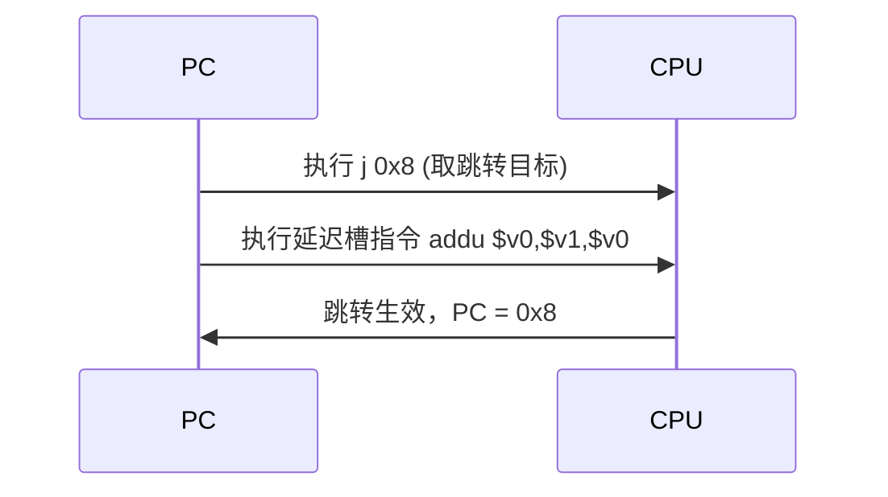

# MIPS 指令与特性

本页聚焦 MIPS 仿真中两个绕不开的行为：**延迟槽（branch delay slot）** 如何影响单步与 Hook，以及**系统调用（syscall）** 如何通过 [UC_HOOK_INTR](/hooks/intr) 拦截。所有示例取自 `tests/unit/test_mips.c`，读完你能预测"执行 N 条指令后 PC 停在哪"。

## 🌀 延迟槽是什么

MIPS 的跳转/分支指令（`j`、`beq`、`jal` 等）之后紧跟的那条指令位于**延迟槽**，会在跳转生效前照常执行。这是 RISC 流水线的历史产物，也是 Unicorn 单步语义的关键。



## ⚠️ 延迟槽对"执行 1 条指令"的影响

`uc_emu_start` 的最后一个参数是"最多执行几条指令"。但当第 1 条是跳转时，**延迟槽也会被执行**——即"1 条"实际跑了跳转+延迟槽两条。看 `test_mips_stop_at_branch`：

```c
// j 0x8; addu $v0, $v1, $v0;
char code[] = "\x02\x00\x00\x08\x21\x10\x62\x00";
uint32_t v1 = 5;
OK(uc_reg_write(uc, UC_MIPS_REG_V1, &v1));
// 只要求执行 1 条指令
OK(uc_emu_start(uc, code_start, code_start + sizeof(code) - 1, 0, 1));

OK(uc_reg_read(uc, UC_MIPS_REG_PC, &r_pc));
// 即便只执行"1 条"，延迟槽里的指令也会执行
TEST_CHECK(r_pc == code_start + 0x8);   // PC 已跳到 0x8
```

::: warning 单步 = 跳转 + 延迟槽
在跳转指令上单步时，别指望停在延迟槽里。Unicorn 会把跳转和它的延迟槽当作一个不可分割的单元执行完，PC 直接落到跳转目标。做单步调试器时务必按此建模。
:::

## 🛑 停在延迟槽的边界情形

如果你把 `uc_emu_start` 的**结束地址**正好设在延迟槽处（即让引擎在跳转指令后停下），跳转不会被提交、PC 不更新。看 `test_mips_stop_at_delay_slot`：

```c
// j 0x8; nop;
char code[] = "\x02\x00\x00\x08\x00\x00\x00\x00\x00\x00\x00\x00";
// 结束地址设在延迟槽（code_start + 4）
OK(uc_emu_start(uc, code_start, code_start + 4, 0, 0));

OK(uc_reg_read(uc, UC_MIPS_REG_PC, &r_pc));
// 跳转未提交，PC 停在原地，需由用户从跳转指令处重启仿真
TEST_CHECK(r_pc == code_start);
```

::: danger 停机边界要对齐指令
在延迟槽边界停机时 PC 不前进，由**用户负责**从跳转指令重新启动仿真。若你的结束地址随手切在跳转与延迟槽之间，会出现"PC 卡住不动"的假象。
:::

## 🪝 用 UC_HOOK_CODE 观察每条指令

配合 [UC_HOOK_CODE](/hooks/code) 可逐条追踪，验证延迟槽确实被执行：

```c
static void hook_code(uc_engine *uc, uint64_t addr, uint32_t size, void *ud) {
    printf(">>> 执行指令 @ 0x%" PRIx64 ", size = 0x%x\n", addr, size);
}
uc_hook trace;
uc_hook_add(uc, &trace, UC_HOOK_CODE, hook_code, NULL, 1, 0);
```

## 📥 系统调用与中断

MIPS 的 `syscall` 指令触发同步异常，Unicorn 通过 [UC_HOOK_INTR](/hooks/intr) 把它交给你的回调处理——这是实现"用户态系统调用模拟"的入口（如 Qiling 框架）。回调里读 `$v0` 取系统调用号、`$a0-$a3` 取参数，模拟内核行为后把返回值写回 `$v0`：

```c
static void hook_intr(uc_engine *uc, uint32_t intno, void *user_data) {
    int syscall_no = 0, a0 = 0;
    uc_reg_read(uc, UC_MIPS_REG_V0, &syscall_no); // 系统调用号
    uc_reg_read(uc, UC_MIPS_REG_A0, &a0);         // 第一个参数
    printf(">>> syscall #%d, a0=0x%x\n", syscall_no, a0);
    // ... 模拟内核处理，把结果写回 $v0 ...
}
uc_hook h;
uc_hook_add(uc, &h, UC_HOOK_INTR, hook_intr, NULL, 1, 0);
```

::: tip intno 区分中断来源
`UC_HOOK_INTR` 对所有软/硬中断触发，回调参数 `intno` 标识来源。MIPS 上需据此区分 `syscall`、断点、地址错误等异常。具体编号依实现而定，建议打印观察。
:::

## 📂 相关源码

| 文件 | 角色 |
|------|------|
| [`include/unicorn/mips.h`](https://github.com/android-security-engineer/unicorn-skills/blob/master/include/unicorn/mips.h#L65) | `UC_MIPS_REG_*` 寄存器枚举与 `uc_cpu_*` CPU 型号定义 |
| [`qemu/target/mips/unicorn.c`](https://github.com/android-security-engineer/unicorn-skills/blob/master/qemu/target/mips/unicorn.c) | 后端：`reg_read`/`reg_write`/`uc_init` 等函数指针实现 |
| [`qemu/target/mips/translate.c`](https://github.com/android-security-engineer/unicorn-skills/blob/master/qemu/target/mips/translate.c) | 前端：机器码翻译（TCG） |
| [`samples/sample_mips.c`](https://github.com/android-security-engineer/unicorn-skills/blob/master/samples/sample_mips.c) | 该架构的 C 示例程序 |
| [`include/unicorn/unicorn.h`](https://github.com/android-security-engineer/unicorn-skills/blob/master/include/unicorn/unicorn.h#L101) | `UC_ARCH_MIPS` 架构常量与 `UC_MODE_*` 公共模式定义 |

## 相关页面

- [UC_HOOK_CODE 指令 Hook](/hooks/code)
- [UC_HOOK_INTR 中断 Hook](/hooks/intr)
- [MIPS 寄存器参考](/arch/mips/registers)
- [MIPS 架构概览](/arch/mips/)
