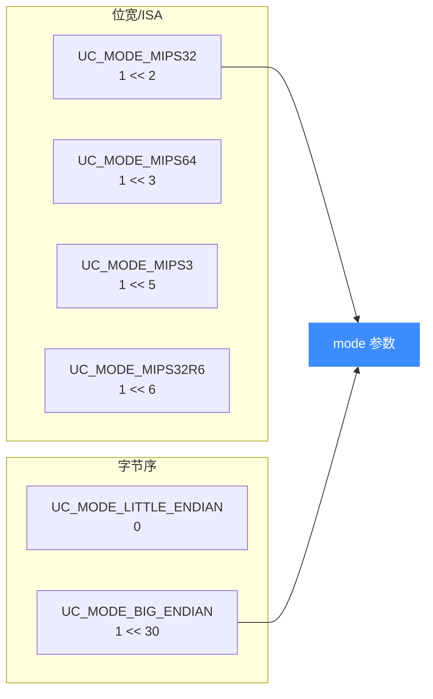

# MIPS 模式与字节序

本页讲清打开 MIPS 引擎时该往 `uc_open` 的 mode 参数里填什么：位宽位（`UC_MODE_MIPS32/MIPS64`）、ISA 变体位（`UC_MODE_MIPS32R6/MIPS3`）以及字节序位如何组合，尤其是**写机器码时的字节序陷阱**——这是 MIPS 示例最常见的翻车点。读完你能一次选对 mode，不再被反转的字节坑到。

## 🧩 mode 位构成

MIPS 的 mode 是若干独立比特的**按位或**（定义见 `unicorn.h`）：



## 📋 可用 mode 位

| 常量 | 值 | 含义 |
|------|-----|------|
| `UC_MODE_MIPS32` | `1 << 2` | MIPS32 ISA |
| `UC_MODE_MIPS64` | `1 << 3` | MIPS64 ISA |
| `UC_MODE_MIPS3` | `1 << 5` | MIPS III ISA（`unicorn.h` 注明 currently unsupported） |
| `UC_MODE_MIPS32R6` | `1 << 6` | MIPS32r6 ISA（`unicorn.h` 注明 currently unsupported） |
| `UC_MODE_LITTLE_ENDIAN` | `0` | 小端（默认，可省略） |
| `UC_MODE_BIG_ENDIAN` | `1 << 30` | 大端 |

::: warning MIPS3 / MIPS32R6 目前不受支持
头文件对 `UC_MODE_MIPS3` 与 `UC_MODE_MIPS32R6` 均标注 "currently unsupported"。实际仿真请以 `UC_MODE_MIPS32` 或 `UC_MODE_MIPS64` 为主。R6 相关型号可通过 [CPU 型号](/arch/mips/cpu-models) 的 `MIPS32R6_GENERIC` 选择。
:::

## 🔧 组合用法

```c
// 大端 MIPS32（最典型的路由器固件）
uc_open(UC_ARCH_MIPS, UC_MODE_MIPS32 | UC_MODE_BIG_ENDIAN, &uc);

// 小端 MIPS32（LITTLE_ENDIAN 是 0，可省略）
uc_open(UC_ARCH_MIPS, UC_MODE_MIPS32, &uc);

// 大端 MIPS64
uc_open(UC_ARCH_MIPS, UC_MODE_MIPS64 | UC_MODE_BIG_ENDIAN, &uc);
```

`sample_mips.c` 里用的是 `+` 而非 `|`：`UC_MODE_MIPS32 + UC_MODE_BIG_ENDIAN`。由于这些位互不重叠，`+` 与 `|` 结果相同，但**推荐用 `|`** 表达"标志位组合"的语义。

## ⚠️ 字节序陷阱：写机器码时最容易错

这是 MIPS 仿真的头号大坑。同一条逻辑指令 `ori $at, $at, 0x3456`，在大端和小端下写进内存的字节序列**完全相反**：

```c
// 来自 sample_mips.c / test_mips.c —— 同一条 ori，字节序相反
#define MIPS_CODE_EB "\x34\x21\x34\x56" // 大端
#define MIPS_CODE_EL "\x56\x34\x21\x34" // 小端
```


如果你用汇编器（如 keystone）产出的是小端字节，却给 `uc_open` 传了 `UC_MODE_BIG_ENDIAN`，引擎会把字节当成大端解码，得到一条完全不同（甚至非法）的指令。两个 `test_mips_el_ori` / `test_mips_eb_ori` 用例分别用相反字节序但都得到 `$at == 0x77df`，正说明"字节序必须与机器码来源一致"。

::: danger 三处必须一致
① 汇编产出的机器码字节序 ② `uc_open` 的字节序 mode ③ 你脑中对内存 dump 的解读——三者错一个，结果就全错。定位"指令莫名其妙"类 bug 时，先怀疑字节序。
:::

::: tip 数据字节序同理
不只是代码，`uc_mem_write` 写入的**数据**也遵循同一字节序。测试里用 `LEINT32(...)` 宏在小端引擎下摆放 32 位值，就是为了对齐字节序。
:::

## 📂 相关源码

| 文件 | 角色 |
|------|------|
| [`include/unicorn/mips.h`](https://github.com/android-security-engineer/unicorn-skills/blob/master/include/unicorn/mips.h#L65) | `UC_MIPS_REG_*` 寄存器枚举与 `uc_cpu_*` CPU 型号定义 |
| [`qemu/target/mips/unicorn.c`](https://github.com/android-security-engineer/unicorn-skills/blob/master/qemu/target/mips/unicorn.c) | 后端：`reg_read`/`reg_write`/`uc_init` 等函数指针实现 |
| [`qemu/target/mips/translate.c`](https://github.com/android-security-engineer/unicorn-skills/blob/master/qemu/target/mips/translate.c) | 前端：机器码翻译（TCG） |
| [`samples/sample_mips.c`](https://github.com/android-security-engineer/unicorn-skills/blob/master/samples/sample_mips.c) | 该架构的 C 示例程序 |
| [`include/unicorn/unicorn.h`](https://github.com/android-security-engineer/unicorn-skills/blob/master/include/unicorn/unicorn.h#L101) | `UC_ARCH_MIPS` 架构常量与 `UC_MODE_*` 公共模式定义 |

## 相关页面

- [字节序（Endianness）](/features/endianness)
- [MIPS CPU 型号](/arch/mips/cpu-models)
- [MIPS 架构概览](/arch/mips/)
