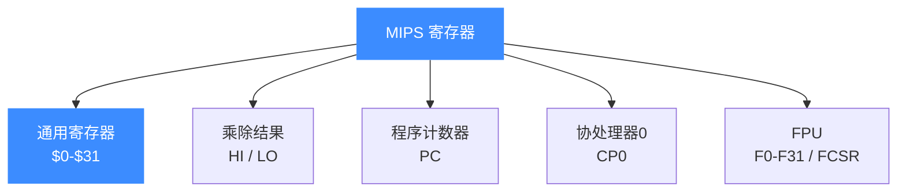

# MIPS 寄存器参考

本页给出 MIPS 在 Unicorn 中的完整寄存器清单：32 个通用寄存器 `$0-$31` 及其 ABI 别名、乘除专用的 HI/LO、程序计数器 PC、协处理器 0（CP0）关键寄存器、以及 FPU 浮点寄存器。所有常量名以 [`include/unicorn/mips.h`](https://github.com/android-security-engineer/unicorn-skills/blob/master/include/unicorn/mips.h) 为准，读完你能在 [uc_reg_read](/api/reg-read) / `uc_reg_write` 里填对寄存器 ID。

## 🧩 寄存器全景



## 📋 通用寄存器 `$0-$31`

MIPS 的 32 个通用寄存器在头文件里同时提供**数字常量**（`UC_MIPS_REG_0` … `UC_MIPS_REG_31`）和 **ABI 别名**（`UC_MIPS_REG_ZERO`、`UC_MIPS_REG_A0` 等，二者指向同一枚举值）。用哪种都行，别名更贴近汇编阅读习惯。

| 编号 | ABI 别名 | UC 别名常量 | UC 数字常量 | 用途 |
|------|----------|-------------|-------------|------|
| $0 | zero | `UC_MIPS_REG_ZERO` | `UC_MIPS_REG_0` | 恒为 0，写入无效 |
| $1 | at | `UC_MIPS_REG_AT` | `UC_MIPS_REG_1` | 汇编器临时寄存器 |
| $2-$3 | v0-v1 | `UC_MIPS_REG_V0/V1` | `UC_MIPS_REG_2/3` | 函数返回值 |
| $4-$7 | a0-a3 | `UC_MIPS_REG_A0`…`A3` | `UC_MIPS_REG_4`…`7` | 前四个函数参数 |
| $8-$15 | t0-t7 | `UC_MIPS_REG_T0`…`T7` | `UC_MIPS_REG_8`…`15` | 调用者保存的临时值 |
| $16-$23 | s0-s7 | `UC_MIPS_REG_S0`…`S7` | `UC_MIPS_REG_16`…`23` | 被调用者保存 |
| $24-$25 | t8-t9 | `UC_MIPS_REG_T8/T9` | `UC_MIPS_REG_24/25` | 临时值；t9 常存 PIC 跳转目标 |
| $26-$27 | k0-k1 | `UC_MIPS_REG_K0/K1` | `UC_MIPS_REG_26/27` | 内核保留 |
| $28 | gp | `UC_MIPS_REG_GP` | `UC_MIPS_REG_28` | 全局指针 |
| $29 | sp | `UC_MIPS_REG_SP` | `UC_MIPS_REG_29` | 栈指针 |
| $30 | fp/s8 | `UC_MIPS_REG_FP` / `UC_MIPS_REG_S8` | `UC_MIPS_REG_30` | 帧指针（别名 s8） |
| $31 | ra | `UC_MIPS_REG_RA` | `UC_MIPS_REG_31` | 返回地址 |

::: tip 别名即同值
`mips.h` 中 `UC_MIPS_REG_A0 = UC_MIPS_REG_4`、`UC_MIPS_REG_FP = UC_MIPS_REG_30 = UC_MIPS_REG_S8`。因此 `$30` 既是 `FP` 又是 `S8`，取决于编译约定。
:::

## 🔧 特殊寄存器：HI / LO / PC

- `UC_MIPS_REG_HI` / `UC_MIPS_REG_LO`：乘法结果的高/低 32 位，除法的余数/商，由 `mfhi`/`mflo` 读取。
- `UC_MIPS_REG_PC`：程序计数器。注意延迟槽会影响停机时 PC 的值，详见 [指令与特性](/arch/mips/instructions)。

DSP 的累加器另有别名：`UC_MIPS_REG_HI0/HI1/HI2/HI3` 与 `UC_MIPS_REG_LO0…LO3` 分别等于 `UC_MIPS_REG_AC0…AC3`。

## 🧠 协处理器 0（CP0）

CP0 管理特权状态与配置。Unicorn 暴露了三个常用寄存器：

| 常量 | 含义 |
|------|------|
| `UC_MIPS_REG_CP0_STATUS` | 状态寄存器（如打开 DSP 需置位第 24 bit） |
| `UC_MIPS_REG_CP0_CONFIG3` | 配置寄存器 3 |
| `UC_MIPS_REG_CP0_USERLOCAL` | 用户局部寄存器 |

真实用法（来自 `tests/unit/test_mips.c`，通过置位 STATUS 打开 DSP 以执行 `lwx`）：

```c
int reg;
OK(uc_reg_read(uc, UC_MIPS_REG_CP0_STATUS, &reg));
reg |= (1 << 24);                 // 打开 DSP
OK(uc_reg_write(uc, UC_MIPS_REG_CP0_STATUS, &reg));
```

## 📤 FPU 浮点寄存器

`UC_MIPS_REG_F0` … `UC_MIPS_REG_F31` 为 32 个浮点寄存器；`UC_MIPS_REG_FCSR`（控制状态字）、`UC_MIPS_REG_FIR`（实现寄存器）、`UC_MIPS_REG_FCC0…FCC7`（浮点条件码）随之提供。此外 `UC_MIPS_REG_W0…W31` 为 128 位 MSA 向量寄存器（AFPR128）。

读取浮点寄存器（`test_mips_mips_fpr`）：

```c
uint64_t r_f1;
// li $t1, 0x42f6e979; mtc1 $t1, $f1
OK(uc_emu_start(uc, code_start, code_start + sizeof(code) - 1, 0, 0));
OK(uc_reg_read(uc, UC_MIPS_REG_F1, (void *)&r_f1));
```

::: warning 读写缓冲区大小
通用寄存器在 MIPS32 下按 32 位读写（示例用 `int`），MIPS64 下为 64 位。浮点寄存器读入 `uint64_t`。缓冲区宽度要与位宽匹配，否则会读到脏数据。
:::

## 📂 相关源码

| 文件 | 角色 |
|------|------|
| [`include/unicorn/mips.h`](https://github.com/android-security-engineer/unicorn-skills/blob/master/include/unicorn/mips.h#L65) | `UC_MIPS_REG_*` 寄存器枚举与 `uc_cpu_*` CPU 型号定义 |
| [`qemu/target/mips/unicorn.c`](https://github.com/android-security-engineer/unicorn-skills/blob/master/qemu/target/mips/unicorn.c) | 后端：`reg_read`/`reg_write`/`uc_init` 等函数指针实现 |
| [`qemu/target/mips/translate.c`](https://github.com/android-security-engineer/unicorn-skills/blob/master/qemu/target/mips/translate.c) | 前端：机器码翻译（TCG） |
| [`samples/sample_mips.c`](https://github.com/android-security-engineer/unicorn-skills/blob/master/samples/sample_mips.c) | 该架构的 C 示例程序 |
| [`include/unicorn/unicorn.h`](https://github.com/android-security-engineer/unicorn-skills/blob/master/include/unicorn/unicorn.h#L101) | `UC_ARCH_MIPS` 架构常量与 `UC_MODE_*` 公共模式定义 |

## 相关页面

- [uc_reg_read / uc_reg_write](/api/reg-read)
- [MIPS 指令与特性](/arch/mips/instructions)
- [MIPS 架构概览](/arch/mips/)
