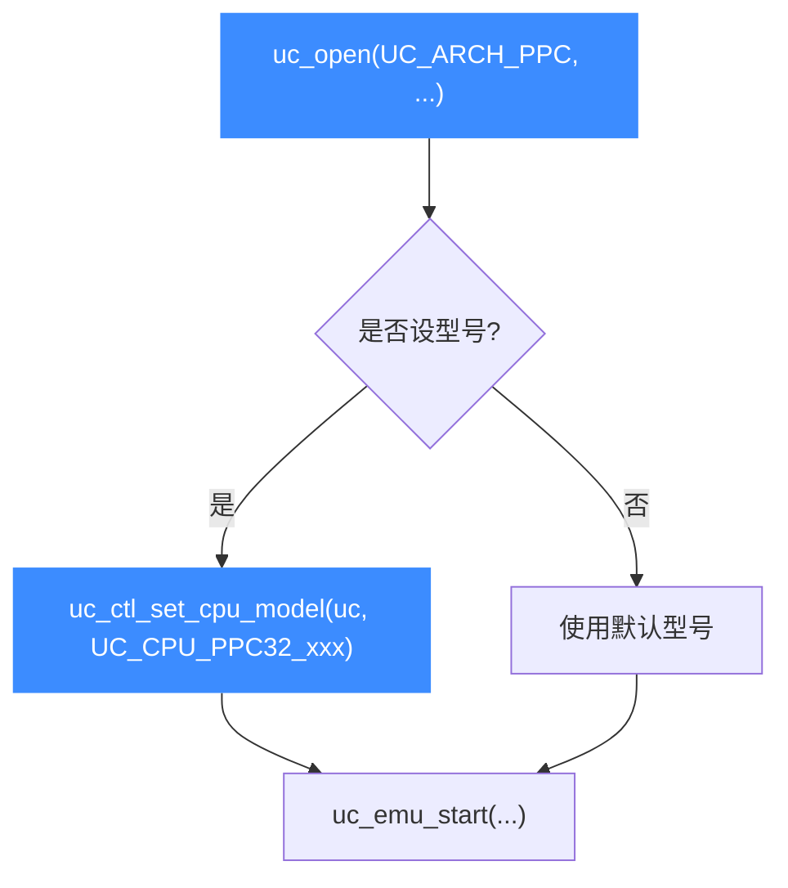

# PowerPC CPU 型号

本页介绍如何为 PPC 引擎选择具体的 CPU 型号：`UC_CPU_PPC32_*`（32 位）与 `UC_CPU_PPC64_*`（64 位）两大枚举，以及用 [uc_ctl_set_cpu_model](/ctl/set-cpu-model) 在打开引擎后切换型号。所有常量均来自 [`include/unicorn/ppc.h`](https://github.com/android-security-engineer/unicorn-skills/blob/master/include/unicorn/ppc.h)，本页只罗列真实存在的代表性型号。

## 🧠 为什么要选型号

不同 PPC 芯片在指令扩展、SPR、浮点/向量单元上有差异。选对型号能让仿真行为更贴近真实硬件。若不设置，Unicorn 使用该架构的默认型号。型号机制的通用说明见 [CPU 型号](/features/cpu-models)。



## 📌 PPC32 型号（`uc_cpu_ppc`）

`ppc.h` 的 `uc_cpu_ppc` 枚举收录了数百个 32 位型号，从 `UC_CPU_PPC32_401`（值为 0）到 `UC_CPU_PPC32_ENDING`（列表结束标记）。下表按系列列出代表性成员：

| 系列 | 代表常量 | 说明 |
|------|----------|------|
| 4xx 嵌入式 | `UC_CPU_PPC32_401`、`UC_CPU_PPC32_403GC`、`UC_CPU_PPC32_405EP`、`UC_CPU_PPC32_440EPX` | IBM/AMCC 嵌入式控制器 |
| 5xx / MPC52xx | `UC_CPU_PPC32_MPC5200_V10`、`UC_CPU_PPC32_MPC5200B_V20` | Freescale 嵌入式 SoC |
| e200 / e300 | `UC_CPU_PPC32_E200Z5`、`UC_CPU_PPC32_E300C1` | 汽车电子内核 |
| MPC83xx | `UC_CPU_PPC32_MPC8343`、`UC_CPU_PPC32_MPC8349E` | 网络/通信 SoC |
| e500 / MPC85xx | `UC_CPU_PPC32_E500_V20`、`UC_CPU_PPC32_MPC8548_V21`、`UC_CPU_PPC32_E500MC` | 高性能嵌入式 |
| 6xx 经典 | `UC_CPU_PPC32_601_V2`、`UC_CPU_PPC32_603`、`UC_CPU_PPC32_604` | 早期桌面 PowerPC |
| 7xx（G3） | `UC_CPU_PPC32_750_V3_1`、`UC_CPU_PPC32_750CX_V2_2`、`UC_CPU_PPC32_755_V2_8` | G3 处理器，老 Mac、GameCube |
| 74xx（G4） | `UC_CPU_PPC32_7400_V2_9`、`UC_CPU_PPC32_7447A_V1_2`、`UC_CPU_PPC32_7457A_V1_2` | G4 处理器，含 AltiVec |

::: tip 完整列表看头文件
上表仅为代表。完整枚举（每个型号的每个修订版本，如 `_V1_0`/`_V2_1`）请以 [`include/unicorn/ppc.h`](https://github.com/android-security-engineer/unicorn-skills/blob/master/include/unicorn/ppc.h) 中的 `uc_cpu_ppc` 为准，切勿凭记忆拼写常量名。
:::

## 📌 PPC64 型号（`uc_cpu_ppc64`）

64 位枚举 `uc_cpu_ppc64` 较短，覆盖 e5500/e6500、970（G5）系列与 POWER5 至 POWER10：

| 型号 | 常量 |
|------|------|
| e5500 / e6500 | `UC_CPU_PPC64_E5500`（值为 0）、`UC_CPU_PPC64_E6500` |
| 970（G5） | `UC_CPU_PPC64_970_V2_2`、`UC_CPU_PPC64_970FX_V3_1`、`UC_CPU_PPC64_970MP_V1_1` |
| POWER5/7 | `UC_CPU_PPC64_POWER5_V2_1`、`UC_CPU_PPC64_POWER7_V2_3` |
| POWER8 | `UC_CPU_PPC64_POWER8E_V2_1`、`UC_CPU_PPC64_POWER8_V2_0`、`UC_CPU_PPC64_POWER8NVL_V1_0` |
| POWER9 | `UC_CPU_PPC64_POWER9_V1_0`、`UC_CPU_PPC64_POWER9_V2_0` |
| POWER10 | `UC_CPU_PPC64_POWER10_V1_0` |

列表末尾同样有 `UC_CPU_PPC64_ENDING` 作为结束标记（不是可用型号）。

## 🔧 设置型号示例

```c
#include <unicorn/unicorn.h>

uc_engine *uc;
uc_open(UC_ARCH_PPC, UC_MODE_PPC32 | UC_MODE_BIG_ENDIAN, &uc);

// 选择 G4（7400）型号
uc_err err = uc_ctl_set_cpu_model(uc, UC_CPU_PPC32_7400_V2_9);
if (err != UC_ERR_OK) {
    printf("设置型号失败: %s\n", uc_strerror(err));
}

// ... 映射内存、写码、uc_emu_start ...
uc_close(uc);
```

::: warning 型号要与位宽匹配
`UC_CPU_PPC32_*` 只能用于以 `UC_MODE_PPC32` 打开的引擎，`UC_CPU_PPC64_*` 只能用于 `UC_MODE_PPC64`。错配会返回错误。设置型号必须在 `uc_emu_start` 之前完成。
:::

## 📂 相关源码

| 文件 | 角色 |
|------|------|
| [`include/unicorn/ppc.h`](https://github.com/android-security-engineer/unicorn-skills/blob/master/include/unicorn/ppc.h#L341) | `UC_PPC_REG_*` 寄存器枚举与 `uc_cpu_*` CPU 型号定义 |
| [`qemu/target/ppc/unicorn.c`](https://github.com/android-security-engineer/unicorn-skills/blob/master/qemu/target/ppc/unicorn.c) | 后端：`reg_read`/`reg_write`/`uc_init` 等函数指针实现 |
| [`qemu/target/ppc/translate.c`](https://github.com/android-security-engineer/unicorn-skills/blob/master/qemu/target/ppc/translate.c) | 前端：机器码翻译（TCG） |
| [`samples/sample_ppc.c`](https://github.com/android-security-engineer/unicorn-skills/blob/master/samples/sample_ppc.c) | 该架构的 C 示例程序 |
| [`include/unicorn/unicorn.h`](https://github.com/android-security-engineer/unicorn-skills/blob/master/include/unicorn/unicorn.h#L103) | `UC_ARCH_PPC` 架构常量与 `UC_MODE_*` 公共模式定义 |

## 相关页面

- [uc_ctl_set_cpu_model — 设置 CPU 型号](/ctl/set-cpu-model)
- [CPU 型号机制](/features/cpu-models)
- [PPC 模式与字节序](/arch/ppc/modes)
- [PPC 架构概览](/arch/ppc/)
