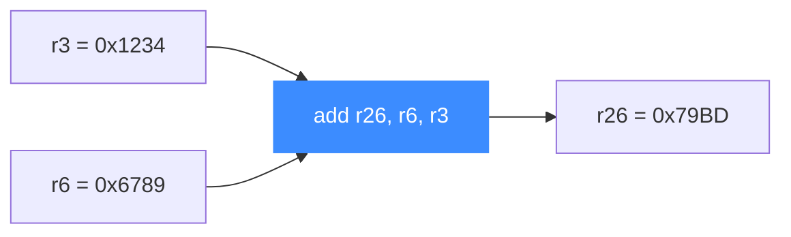

# PowerPC 实战示例

本页把官方 `sample_ppc.c` 拆成可运行的完整流程，逐段讲解：打开大端 PPC32 引擎 → 映射内存 → 写入一条 `add r26, r6, r3` → 设寄存器 → 挂 Hook → 运行 → 读回结果。读完你能独立写出一个最小的 PPC 仿真程序，并预判其输出。

## 🎯 目标指令

我们要仿真的是一条加法：

```
add r26, r6, r3     机器码（大端）: 7F 46 1A 14
```

它把 r6 与 r3 相加，结果写入 r26。示例里预置 `r3 = 0x1234`、`r6 = 0x6789`，因此期望 `r26 = 0x1234 + 0x6789 = 0x79BD`。



## 🔧 完整代码

```c
#include <unicorn/unicorn.h>
#include <string.h>

// 待仿真机器码：add r26, r6, r3
#define PPC_CODE "\x7F\x46\x1A\x14"
// 仿真起始地址
#define ADDRESS 0x10000

static void hook_code(uc_engine *uc, uint64_t address, uint32_t size,
                      void *user_data)
{
    printf(">>> 执行指令 @0x%" PRIx64 ", size = 0x%x\n", address, size);
}

int main(void)
{
    uc_engine *uc;
    uc_err err;
    uc_hook trace;

    int r3 = 0x1234;
    int r6 = 0x6789;
    int r26 = 0x8877; // 结果寄存器，初值任意

    // 1) 打开大端 PPC32 引擎
    err = uc_open(UC_ARCH_PPC, UC_MODE_PPC32 | UC_MODE_BIG_ENDIAN, &uc);
    if (err) {
        printf("uc_open 失败: %u (%s)\n", err, uc_strerror(err));
        return -1;
    }

    // 2) 映射 2MB 内存
    uc_mem_map(uc, ADDRESS, 2 * 1024 * 1024, UC_PROT_ALL);

    // 3) 写入机器码
    uc_mem_write(uc, ADDRESS, PPC_CODE, sizeof(PPC_CODE) - 1);

    // 4) 初始化寄存器
    uc_reg_write(uc, UC_PPC_REG_3, &r3);
    uc_reg_write(uc, UC_PPC_REG_6, &r6);
    uc_reg_write(uc, UC_PPC_REG_26, &r26);

    // 5) 挂一个指令级 Hook（仅本条指令地址）
    uc_hook_add(uc, &trace, UC_HOOK_CODE, hook_code, NULL, ADDRESS, ADDRESS);

    // 6) 运行：从 ADDRESS 跑到 ADDRESS + 4
    err = uc_emu_start(uc, ADDRESS, ADDRESS + sizeof(PPC_CODE) - 1, 0, 0);
    if (err) {
        printf("uc_emu_start 失败: %u (%s)\n", err, uc_strerror(err));
        return -1;
    }

    // 7) 读回结果
    uc_reg_read(uc, UC_PPC_REG_26, &r26);
    printf(">>> r26 = 0x%x\n", r26);

    uc_close(uc);
    return 0;
}
```

## 🧩 逐段讲解

| 步骤 | 关键点 |
|------|--------|
| 1 打开引擎 | 必须带 `UC_MODE_BIG_ENDIAN`，否则 4 字节机器码顺序被误读 |
| 2 映射内存 | 起始地址与大小需页对齐；`UC_PROT_ALL` 给足读/写/执行权限 |
| 3 写机器码 | `sizeof(PPC_CODE) - 1` 去掉字符串结尾的 `\0`，恰好写 4 字节 |
| 4 设寄存器 | 用数字后缀常量 `UC_PPC_REG_3/6/26`，GPR 用 `int` 缓冲 |
| 5 挂 Hook | `begin==end==ADDRESS` 只在这一条指令触发，见 [UC_HOOK_CODE](/hooks/code) |
| 6 运行 | 结束地址是 `ADDRESS + 4`（指令定长 4 字节）；超时和指令数上限都为 0 表示不限 |
| 7 读回 | `uc_reg_read` 把 r26 读进 `int` |

::: tip 为什么结束地址是 ADDRESS + 4
`uc_emu_start(uc, begin, until, ...)` 中 `until` 是**执行到该地址即停**。PPC 指令定长 4 字节，跑完唯一一条后 PC 恰好到 `ADDRESS + 4`，仿真结束。
:::

## 📤 预期输出

```
>>> 执行指令 @0x10000, size = 0x4
>>> r26 = 0x79bd
```

`0x79bd` 正是 `0x1234 + 0x6789`——与 [寄存器参考](/arch/ppc/registers) 里 `test_ppc32_add`（42 + 1337 = 1379）同款的加法验证逻辑一致。

::: warning 换个初值就换个结果
若把 `r3`/`r6` 改成别的值，`r26` 会随之变化。可借此验证你对 PPC 大端机器码与寄存器约定的理解是否正确。
:::

## 📂 相关源码

| 文件 | 角色 |
|------|------|
| [`include/unicorn/ppc.h`](https://github.com/android-security-engineer/unicorn-skills/blob/master/include/unicorn/ppc.h#L341) | `UC_PPC_REG_*` 寄存器枚举与 `uc_cpu_*` CPU 型号定义 |
| [`qemu/target/ppc/unicorn.c`](https://github.com/android-security-engineer/unicorn-skills/blob/master/qemu/target/ppc/unicorn.c) | 后端：`reg_read`/`reg_write`/`uc_init` 等函数指针实现 |
| [`qemu/target/ppc/translate.c`](https://github.com/android-security-engineer/unicorn-skills/blob/master/qemu/target/ppc/translate.c) | 前端：机器码翻译（TCG） |
| [`samples/sample_ppc.c`](https://github.com/android-security-engineer/unicorn-skills/blob/master/samples/sample_ppc.c) | 该架构的 C 示例程序 |
| [`include/unicorn/unicorn.h`](https://github.com/android-security-engineer/unicorn-skills/blob/master/include/unicorn/unicorn.h#L103) | `UC_ARCH_PPC` 架构常量与 `UC_MODE_*` 公共模式定义 |

## 相关页面

- [sample_ppc.c 走读](/samples/sample-ppc)
- [PPC 架构概览](/arch/ppc/)
- [PPC 寄存器参考](/arch/ppc/registers)
- [UC_HOOK_CODE — 指令级 Hook](/hooks/code)
