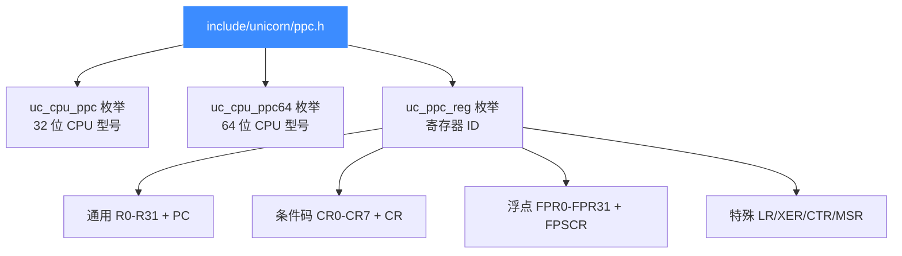
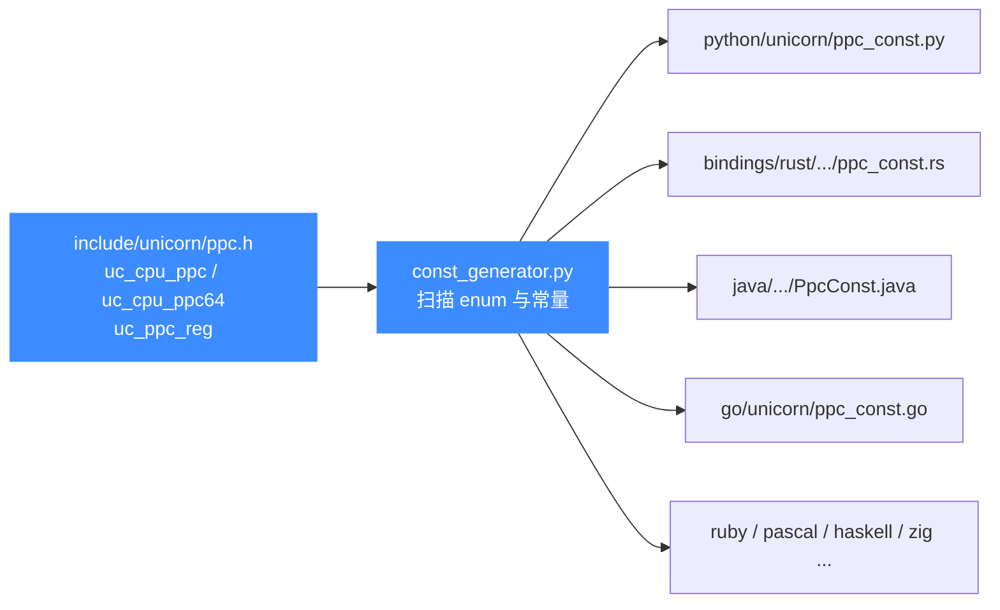

# ppc.h — PowerPC 头文件常量参考

本页讲 [`include/unicorn/ppc.h`](https://github.com/android-security-engineer/unicorn-skills/blob/master/include/unicorn/ppc.h)：它是 PowerPC 架构在 Unicorn 中所有公开常量的**真源（source of truth）**，定义了 32 位与 64 位两套 CPU 型号枚举、寄存器 ID 枚举。所有语言绑定（Python/Rust/Go/Java/…）的 PPC 常量都由 `const_generator.py` 从这个头文件自动生成，不要手改绑定里的 `*_const.*`。

## 📌 概述

`ppc.h` 是被 `unicorn.h` 聚合进来的架构头之一。它本身只声明三类对绑定量化的内容：

1. **32 位 CPU 型号枚举 `uc_cpu_ppc`** —— 列出全部可模拟的 32 位 PowerPC 核（40x/4xx/6xx/7xxx/E200/E500/MPC8xxx 系列），配合 `uc_ctl_set_cpu_model` 使用。
2. **64 位 CPU 型号枚举 `uc_cpu_ppc64`** —— 列出 64 位 PowerPC 核（POWER5/7/8/9/10、970 系列、e5500/e6500）。
3. **寄存器 ID 枚举 `uc_ppc_reg`** —— 给 `uc_reg_read` / `uc_reg_write` 用的寄存器编号，覆盖通用寄存器 R0–R31、CR0–CR7 条件码字段、FPR0–FPR31 浮点寄存器，以及 PC/LR/XER/CTR/MSR/FPSCR/CR 等特殊寄存器。

```c
#include <unicorn/unicorn.h>
/* ppc.h 会被 unicorn.h 自动聚合,无需单独 include */
```

::: tip 📌 这就是 source of truth
改了 `ppc.h` 里的枚举值或新增常量后，必须跑 `bindings/const_generator.py` 重新生成各绑定常量，否则 Python/Rust/Go 等会与 C 头漂移。详见 [常量生成器](/bindings/const-generator)。
:::

## 🧱 文件结构



## 🔧 32 位 CPU 型号枚举 uc_cpu_ppc

`ppc.h` 用一个连续递增的 `enum` 列出全部 32 位 PowerPC 核。取值传给 [uc_ctl](/api/ctl) 的 `UC_CTL_CPU_MODEL`（便捷宏 `uc_ctl_set_cpu_model`）。完整型号语义见 [PowerPC CPU 型号](/arch/ppc/cpu-models)。

| 常量 | 值 | 说明 |
|------|----|------|
| `UC_CPU_PPC32_401` | 0 | PowerPC 401 |
| `UC_CPU_PPC32_401A1` | 1 | 401A1 |
| `UC_CPU_PPC32_401B2` | 2 | 401B2 |
| `UC_CPU_PPC32_401C2` | 3 | 401C2 |
| `UC_CPU_PPC32_401D2` | 4 | 401D2 |
| `UC_CPU_PPC32_401E2` | 5 | 401E2 |
| `UC_CPU_PPC32_401F2` | 6 | 401F2 |
| `UC_CPU_PPC32_401G2` | 7 | 401G2 |
| `UC_CPU_PPC32_IOP480` | 8 | IOP480 |
| `UC_CPU_PPC32_COBRA` | 9 | Cobra |
| `UC_CPU_PPC32_403GA` | 10 | 403GA |
| `UC_CPU_PPC32_403GB` | 11 | 403GB |
| `UC_CPU_PPC32_403GC` | 12 | 403GC |
| `UC_CPU_PPC32_403GCX` | 13 | 403GCX |
| `UC_CPU_PPC32_405D2` | 14 | 405D2 |
| `UC_CPU_PPC32_405D4` | 15 | 405D4 |
| `UC_CPU_PPC32_440EPA` | 40 | 440EP A |
| `UC_CPU_PPC32_460EXB` | 43 | 460EX B |
| `UC_CPU_PPC32_G2` | 44 | G2 (MPC603 系) |
| `UC_CPU_PPC32_MPC603` | 49 | MPC603 |
| `UC_CPU_PPC32_MPC5200_V10` | 56 | MPC5200 v1.0 |
| `UC_CPU_PPC32_E200Z5` | 61 | e200z5 |
| `UC_CPU_PPC32_E200Z6` | 62 | e200z6 |
| `UC_CPU_PPC32_E500_V10` | 84 | e500 v1.0 |
| `UC_CPU_PPC32_E500MC` | 91 | e500mc |
| `UC_CPU_PPC32_MPC8548_V10` | 120 | MPC8548 v1.0 |
| `UC_CPU_PPC32_E600` | 139 | e600 |
| `UC_CPU_PPC32_601_V0` | 142 | PPC 601 v0 |
| `UC_CPU_PPC32_603` | 145 | PPC 603 |
| `UC_CPU_PPC32_604` | 158 | PPC 604 |
| `UC_CPU_PPC32_740_V1_0` | 162 | PPC 740 v1.0 |
| `UC_CPU_PPC32_750_V1_0` | 163 | PPC 750 v1.0（G3） |
| `UC_CPU_PPC32_7400_V1_0` | 198 | PPC 7400 v1.0（G4） |
| `UC_CPU_PPC32_7450_V1_0` | 219 | PPC 7450 v1.0 |
| `UC_CPU_PPC32_7447A_V1_0` | 232 | PPC 7447A v1.0 |
| `UC_CPU_PPC32_ENDING` | — | 枚举上界哨兵 |

::: details 上表只列代表性型号
`uc_cpu_ppc` 全长近 240 项，覆盖 40x/4xx 嵌入式、5xx/52xx、6xx/7xxx 桌面与 Mac 系列、e200/e500/e600 嵌入式、MPC8xxx Quicc 系列。完整列表以源码为准，多数型号按版本号细分（如 `750FX_V1_0`/`V2_0`/`V2_1`…）。详见 [PowerPC CPU 型号](/arch/ppc/cpu-models)。
:::

## 🔧 64 位 CPU 型号枚举 uc_cpu_ppc64

64 位 PowerPC 核单独成枚举，用于 [`UC_ARCH_PPC`](https://github.com/android-security-engineer/unicorn-skills/blob/master/include/unicorn/unicorn.h#L103) + `UC_MODE_PPC64` 组合下选核。

| 常量 | 值 | 说明 |
|------|----|------|
| `UC_CPU_PPC64_E5500` | 0 | e5500 |
| `UC_CPU_PPC64_E6500` | 1 | e6500 |
| `UC_CPU_PPC64_970_V2_2` | 2 | PPC 970 v2.2（Apple G5） |
| `UC_CPU_PPC64_970FX_V1_0` | 3 | 970FX v1.0 |
| `UC_CPU_PPC64_970FX_V3_1` | 7 | 970FX v3.1 |
| `UC_CPU_PPC64_970MP_V1_0` | 8 | 970MP v1.0 |
| `UC_CPU_PPC64_POWER5_V2_1` | 10 | POWER5 v2.1 |
| `UC_CPU_PPC64_POWER7_V2_3` | 11 | POWER7 v2.3 |
| `UC_CPU_PPC64_POWER8E_V2_1` | 13 | POWER8E v2.1 |
| `UC_CPU_PPC64_POWER8_V2_0` | 14 | POWER8 v2.0 |
| `UC_CPU_PPC64_POWER8NVL_V1_0` | 15 | POWER8NVL v1.0 |
| `UC_CPU_PPC64_POWER9_V1_0` | 16 | POWER9 v1.0 |
| `UC_CPU_PPC64_POWER9_V2_0` | 17 | POWER9 v2.0 |
| `UC_CPU_PPC64_POWER10_V1_0` | 18 | POWER10 v1.0 |
| `UC_CPU_PPC64_ENDING` | — | 枚举上界哨兵 |

::: warning ⚠️ 64 位支持现状
`unicorn.h` 中 `UC_MODE_PPC64` 注释标注 "currently unsupported"。当前 Unicorn 的 PPC 后端以 32 位为主，64 位核型号已枚举但运行时支持有限。使用前请确认目标版本的实现状态，详见 [PowerPC 模式与字节序](/arch/ppc/modes)。
:::

## 📖 寄存器 ID 枚举 uc_ppc_reg

这是 `ppc.h` 的主体。下面列出全部寄存器类别。配合 `uc_reg_read` / `uc_reg_write` 使用，详见 [PowerPC 寄存器](/arch/ppc/registers)。

### 通用寄存器与 PC

| 常量 | 含义 |
|------|------|
| `UC_PPC_REG_INVALID` | 占位，无效值（= 0） |
| `UC_PPC_REG_PC` | 程序计数器 |
| `UC_PPC_REG_0` … `UC_PPC_REG_31` | 通用寄存器 R0–R31（32 个） |

::: tip 📌 R1 即栈指针
PowerPC ABI 中 `R1` 约定为栈指针（SP），`R13` 在 SVR4/eabi 中约定为 SDATA 基址，`R3`–`R12` 为参数/临时寄存器。但 `ppc.h` 不提供 `SP` 别名，访问栈指针请直接用 `UC_PPC_REG_1`。
:::

### 条件码字段 CR0–CR7

| 常量 | 含义 |
|------|------|
| `UC_PPC_REG_CR0` | 条件寄存器第 0 字段（LT/GT/EQ/SO） |
| `UC_PPC_REG_CR1` | 条件寄存器第 1 字段 |
| `UC_PPC_REG_CR2` | 条件寄存器第 2 字段 |
| `UC_PPC_REG_CR3` | 条件寄存器第 3 字段 |
| `UC_PPC_REG_CR4` | 条件寄存器第 4 字段 |
| `UC_PPC_REG_CR5` | 条件寄存器第 5 字段 |
| `UC_PPC_REG_CR6` | 条件寄存器第 6 字段 |
| `UC_PPC_REG_CR7` | 条件寄存器第 7 字段 |
| `UC_PPC_REG_CR` | 32 位条件寄存器整体（CR0–CR7 拼接） |

### 浮点寄存器 FPR0–FPR31

| 常量 | 含义 |
|------|------|
| `UC_PPC_REG_FPR0` … `UC_PPC_REG_FPR31` | 浮点寄存器 FPR0–FPR31（64 位，共 32 个） |
| `UC_PPC_REG_FPSCR` | 浮点状态与控制寄存器 |

### 特殊寄存器

| 常量 | 含义 |
|------|------|
| `UC_PPC_REG_LR` | 链接寄存器（返回地址） |
| `UC_PPC_REG_XER` | 定点异常寄存器（SO/OV/CA + 字节计数） |
| `UC_PPC_REG_CTR` | 计数寄存器（循环计数 / 分支目标） |
| `UC_PPC_REG_MSR` | 机器状态寄存器（特权级 / 中断使能 / 地址模式） |
| `UC_PPC_REG_ENDING` | 枚举上界哨兵 |

::: warning ⚠️ 无向量/SPR 编号枚举
`ppc.h` 不暴露 VSX/Altivec 的 VSR0–VSR31，也不暴露 `SPR0`–`SPR1023` 之类的按编号寻址 SPR 机制。访问未列出的 SPR（如 DEC、TBL/TBU、PVR）目前没有公开常量路径，需通过具体 CPU 型号的内部状态间接处理。
:::

## ⚠️ PowerPC 特有的 UC_MODE_* 模式位

模式位本身定义在 [`include/unicorn/unicorn.h`](https://github.com/android-security-engineer/unicorn-skills/blob/master/include/unicorn/unicorn.h) 的 `uc_mode` 枚举里，并非 `ppc.h`，但它们是 PPC 架构专属、与 `ppc.h` 的 CPU 型号枚举配套使用，故一并列出。组合方式见 [PowerPC 模式与字节序](/arch/ppc/modes)。

| 值 | 常量 | 说明 |
|----|------|------|
| `1<<2` | `UC_MODE_PPC32` | 32 位 PowerPC 模式 |
| `1<<3` | `UC_MODE_PPC64` | 64 位 PowerPC 模式（currently unsupported） |

::: details UC_MODE_BIG_ENDIAN 的归属
PowerPC 默认大端。Unicorn v2 中 `UC_MODE_BIG_ENDIAN`（`1<<30`）定义在 `unicorn.h` 的 `uc_mode` 枚举里，对所有架构通用，并非 PPC 专属常量，因此未列入上表。需要大端模拟时与 `UC_MODE_PPC32` 按位或即可。
:::

## 💻 用法：选核并读写寄存器

```c
#include <unicorn/unicorn.h>
#include <stdio.h>

int main(void) {
    uc_engine *uc;
    /* 32 位大端 PowerPC,默认核 (可后续用 uc_ctl_set_cpu_model 切换) */
    uc_err err = uc_open(UC_ARCH_PPC, UC_MODE_PPC32 | UC_MODE_BIG_ENDIAN, &uc);
    if (err != UC_ERR_OK) {
        printf("uc_open: %s\n", uc_strerror(err));
        return 1;
    }

    /* 写通用寄存器 R3 (ABI 中第一参数寄存器) */
    uint32_t r3 = 0x1234ABCD;
    uc_reg_write(uc, UC_PPC_REG_3, &r3);

    /* 读链接寄存器 (返回地址所在) */
    uint32_t lr = 0;
    uc_reg_read(uc, UC_PPC_REG_LR, &lr);
    printf("LR = 0x%x\n", lr);

    /* 读程序计数器 */
    uint32_t pc = 0;
    uc_reg_read(uc, UC_PPC_REG_PC, &pc);
    printf("PC = 0x%x\n", pc);

    uc_close(uc);
    return 0;
}
```

按 CPU 型号选核的典型用法：

```c
/* 选用 MPC8548 (e500v2 核) */
uc_ctl_set_cpu_model(uc, UC_CPU_PPC32_MPC8548_V10);
/* 选用经典 G3 750 */
uc_ctl_set_cpu_model(uc, UC_CPU_PPC32_750_V1_0);
```

## 📖 关于指令 ID

与 x86、arm 不同，**`ppc.h` 不提供 `UC_PPC_INS_*` 指令 ID 枚举**。PowerPC 的指令识别在 Unicorn 中通过 [UC_HOOK_CODE](/hooks/code) / [UC_HOOK_INSN_INVALID](/hooks/insn-invalid) 等代码 Hook 回调地址与原始字节完成，而非 Capstone 风格的指令枚举。如需指令级反汇编，请配合 Capstone 使用。

## 🔧 头文件如何被绑定生成器消费



::: tip 📌 改了头文件要重新生成
`ppc.h` 是绑定常量的唯一来源。新增或重命名寄存器、CPU 型号后，必须运行 `python bindings/const_generator.py` 刷新各语言的 `ppc_const.*`，否则 Python/Rust/Go 等会与 C 头漂移、出现常量缺失或编号错位。详见 [常量生成器](/bindings/const-generator)。
:::

::: details 生成器如何处理 enum 常量
`const_generator.py` 通过正则解析头文件中的 `typedef enum` 块，按枚举值递增规则为每个 `UC_PPC_*` / `UC_CPU_PPC*` 推导出整数值并写入各绑定的常量表。因此新增枚举项时**追加到对应 enum 末尾**（`_ENDING` 之前）即可被自动捕获，无需手动维护各语言文件。
:::

## 📂 相关源码

| 文件 | 角色 |
|------|------|
| [`include/unicorn/ppc.h`](https://github.com/android-security-engineer/unicorn-skills/blob/master/include/unicorn/ppc.h#L341) | `UC_PPC_REG_*` 寄存器枚举与 `uc_cpu_*` CPU 型号定义 |
| [`qemu/target/ppc/unicorn.c`](https://github.com/android-security-engineer/unicorn-skills/blob/master/qemu/target/ppc/unicorn.c) | 后端：`reg_read`/`reg_write`/`uc_init` 等函数指针实现 |
| [`qemu/target/ppc/translate.c`](https://github.com/android-security-engineer/unicorn-skills/blob/master/qemu/target/ppc/translate.c) | 前端：机器码翻译（TCG） |
| [`samples/sample_ppc.c`](https://github.com/android-security-engineer/unicorn-skills/blob/master/samples/sample_ppc.c) | 该架构的 C 示例程序 |
| [`include/unicorn/unicorn.h`](https://github.com/android-security-engineer/unicorn-skills/blob/master/include/unicorn/unicorn.h#L103) | `UC_ARCH_PPC` 架构常量与 `UC_MODE_*` 公共模式定义 |

## 相关页面

- [PowerPC 架构概览](/arch/ppc/)
- [PowerPC 寄存器](/arch/ppc/registers)
- [PowerPC CPU 型号](/arch/ppc/cpu-models)
- [常量生成器 const_generator.py](/bindings/const-generator)
- [unicorn.h — 公共 C API 头文件](/headers/unicorn-h)
