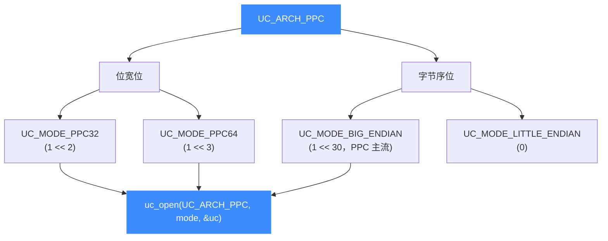

# PowerPC 架构概览

本页介绍 Unicorn 对 PowerPC 架构（[`UC_ARCH_PPC`](https://github.com/android-security-engineer/unicorn-skills/blob/master/include/unicorn/unicorn.h#L103)）的支持：`UC_MODE_PPC32` / `UC_MODE_PPC64` 两种位宽、以大端为主的字节序，以及它在嵌入式控制器、老游戏机、老 Mac 逆向中的典型用途。读完你能正确地用 `uc_open` 打开一个 PPC 引擎，并知道后续该看哪几页。

## 🧩 为什么会遇到 PowerPC

PowerPC（简称 PPC）是 IBM/Motorola/Apple 联盟推出的经典 RISC 架构，指令定长 4 字节、寄存器规整。虽然桌面市场早已被 x86 取代，但它至今活跃在几个逆向工程绕不开的角落：

- **嵌入式与汽车电子**：大量 MPC5xx / MPC8xx / e200 / e500 系列控制器仍在量产；
- **游戏主机**：GameCube、Wii、Xbox 360、PlayStation 3 的核心都是 PPC；
- **老 Macintosh**：2006 年前的 Mac 使用 G3/G4/G5（750/7400/970）处理器。

分析这些固件或二进制时，你面对的往往是 **大端 PPC32**。Unicorn 让你无需真机就能把代码片段跑起来，配合 [Hook 体系](/features/hooks) 观察寄存器与内存变化。

## ⚡ 架构与模式

Unicorn 用 mode 位组合表达 PPC 的位宽与字节序，二者**按位或**：



| 组合 | mode 表达式 | 典型目标 |
|------|-------------|----------|
| PPC32 大端 | `UC_MODE_PPC32 \| UC_MODE_BIG_ENDIAN` | 嵌入式控制器、GameCube/Wii、老 Mac（32 位） |
| PPC64 大端 | `UC_MODE_PPC64 \| UC_MODE_BIG_ENDIAN` | POWER 服务器、Xbox 360、PS3、G5 Mac |

::: warning PPC 几乎总是大端
历史上的 PPC 系统绝大多数运行在大端模式。示例与测试代码里都显式带上 `UC_MODE_BIG_ENDIAN`。若忘记加，机器码的字节顺序会被错误解释，指令无法正确译码。详见 [字节序](/features/endianness)。
:::

## 🔧 最小示例

```c
#include <unicorn/unicorn.h>

uc_engine *uc;
// 打开一个大端 PPC32 引擎（最常见的目标）
uc_err err = uc_open(UC_ARCH_PPC, UC_MODE_PPC32 | UC_MODE_BIG_ENDIAN, &uc);
if (err != UC_ERR_OK) {
    printf("uc_open 失败: %s\n", uc_strerror(err));
    return -1;
}
// ... 映射内存、写机器码、设寄存器、uc_emu_start ...
uc_close(uc);
```

## 📚 本章导航

| 页面 | 内容 |
|------|------|
| [寄存器参考](/arch/ppc/registers) | GPR r0-r31、FPR f0-f31、PC、LR/CTR/XER/CR/MSR 及 `UC_PPC_REG_*` 常量 |
| [模式与字节序](/arch/ppc/modes) | `UC_MODE_PPC32/PPC64`、大端为主的取舍 |
| [指令与特性](/arch/ppc/instructions) | 定长 32 位指令、`sc` 系统调用 + `UC_HOOK_INTR`、单步 |
| [CPU 型号](/arch/ppc/cpu-models) | `UC_CPU_PPC32_*/PPC64_*` 列表与 `uc_ctl_set_cpu_model` |
| [实战示例](/arch/ppc/example) | 完整可运行的 `add r26, r6, r3` 仿真走读 |

## 📂 相关源码

| 文件 | 角色 |
|------|------|
| [`include/unicorn/ppc.h`](https://github.com/android-security-engineer/unicorn-skills/blob/master/include/unicorn/ppc.h#L341) | `UC_PPC_REG_*` 寄存器枚举与 `uc_cpu_*` CPU 型号定义 |
| [`qemu/target/ppc/unicorn.c`](https://github.com/android-security-engineer/unicorn-skills/blob/master/qemu/target/ppc/unicorn.c) | 后端：`reg_read`/`reg_write`/`uc_init` 等函数指针实现 |
| [`qemu/target/ppc/translate.c`](https://github.com/android-security-engineer/unicorn-skills/blob/master/qemu/target/ppc/translate.c) | 前端：机器码翻译（TCG） |
| [`samples/sample_ppc.c`](https://github.com/android-security-engineer/unicorn-skills/blob/master/samples/sample_ppc.c) | 该架构的 C 示例程序 |
| [`include/unicorn/unicorn.h`](https://github.com/android-security-engineer/unicorn-skills/blob/master/include/unicorn/unicorn.h#L103) | `UC_ARCH_PPC` 架构常量与 `UC_MODE_*` 公共模式定义 |

## 相关页面

- [sample_ppc.c 走读](/samples/sample-ppc)
- [字节序（Endianness）](/features/endianness)
- [PPC 寄存器参考](/arch/ppc/registers)
- [PPC 指令与特性](/arch/ppc/instructions)
