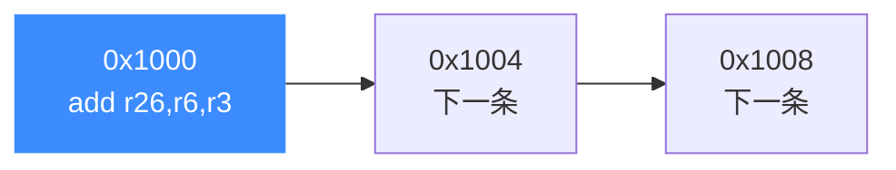
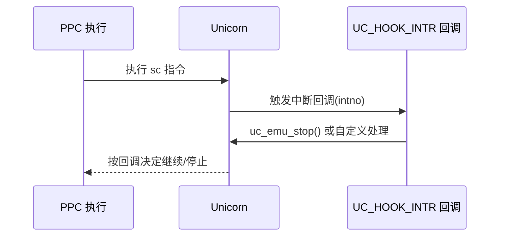

# PowerPC 指令与特性

本页讲清在 Unicorn 上仿真 PPC 代码时最需要理解的几个特性：定长 32 位指令、`sc` 系统调用如何配合 [UC_HOOK_INTR](/hooks/intr) 捕获、以及用 [UC_HOOK_CODE](/hooks/code) 做单步与指令追踪。示例均来自 `test_ppc.c` 与 `sample_ppc.c`。

## ⚡ 定长 32 位指令

PowerPC 是规整 RISC：**每条指令恰好 4 字节**，地址天然按 4 对齐。这让单步、反汇编、地址计算都非常直接——`uc_emu_start` 的结束地址就是"起始 + 指令数 × 4"。



例如经典的一条加法指令，机器码正好 4 字节：

```c
char code[] = "\x7f\x46\x1a\x14"; // add r26, r6, r3  （大端，4 字节）

// 只跑这一条指令：结束地址 = 起始 + 4
uc_emu_start(uc, code_start, code_start + sizeof(code) - 1, 0, 0);
```

## 🪝 sc 系统调用与中断 Hook

PPC 用 `sc`（system call）指令触发系统调用异常。在 Unicorn 里，这类异常通过 [UC_HOOK_INTR](/hooks/intr) 回调暴露给你——回调里可以模拟内核行为，或直接停机。



下面是 `test_ppc32_sc` 的完整逻辑：机器码是单条 `sc`，注册 `UC_HOOK_INTR` 在回调里停机，运行后 PC 恰好停在 `sc` 之后（+4）：

```c
static void test_ppc32_sc_cb(uc_engine *uc, uint32_t intno, void *data)
{
    uc_emu_stop(uc);   // 捕获到 sc 引发的中断，停止仿真
}

// ... uc_common_setup 用大端 PPC32 打开并写入 code ...
char code[] = "\x44\x00\x00\x02"; // sc
uint32_t r_pc;
uc_hook h;

uc_hook_add(uc, &h, UC_HOOK_INTR, test_ppc32_sc_cb, NULL, 1, 0);
uc_emu_start(uc, code_start, code_start + sizeof(code) - 1, 0, 0);

uc_reg_read(uc, UC_PPC_REG_PC, &r_pc);
// r_pc == code_start + 4
```

::: tip 中断号 intno
回调第二个参数 `intno` 携带异常/中断编号，可据此区分 `sc`、程序异常、对齐异常等不同来源，进而分发到不同处理逻辑。
:::

## 🔍 单步与指令追踪

用 [UC_HOOK_CODE](/hooks/code) 可在**每条指令执行前**回调，天然适合单步、断点和指令级追踪。因为 PPC 指令定长，回调里的 `size` 恒为 4。

```c
static void hook_code(uc_engine *uc, uint64_t address, uint32_t size,
                      void *user_data)
{
    printf(">>> 执行指令 @0x%" PRIx64 ", size = 0x%x\n", address, size);
}

// 仅在 [ADDRESS, ADDRESS] 触发（示例里 hook 单条指令）
uc_hook_add(uc, &trace, UC_HOOK_CODE, hook_code, NULL, ADDRESS, ADDRESS);
```

::: warning CODE Hook 会降速
每条指令都回调会打断 JIT 的连续执行、显著降低仿真速度。仅在确需指令级精度时使用，并尽量用 `begin`/`end` 限定地址区间。粗粒度需求优先用 `UC_HOOK_BLOCK`。
:::

## 🧮 SPR 与浮点

- **SPR（特殊用途寄存器）**：`mfspr` 可读取 DEC、时基（TBU）等；测试 `test_ppc32_spr_time` 演示了 `mfspr r3, DEC` 与 `mfspr r3, TBUr` 能正常仿真。
- **浮点**：执行浮点指令（如 `fadd`）前需在 `MSR` 打开 FP 使能位，参见 [寄存器参考](/arch/ppc/registers) 中的 `test_ppc32_fadd` 说明。

## 📂 相关源码

| 文件 | 角色 |
|------|------|
| [`include/unicorn/ppc.h`](https://github.com/android-security-engineer/unicorn-skills/blob/master/include/unicorn/ppc.h#L341) | `UC_PPC_REG_*` 寄存器枚举与 `uc_cpu_*` CPU 型号定义 |
| [`qemu/target/ppc/unicorn.c`](https://github.com/android-security-engineer/unicorn-skills/blob/master/qemu/target/ppc/unicorn.c) | 后端：`reg_read`/`reg_write`/`uc_init` 等函数指针实现 |
| [`qemu/target/ppc/translate.c`](https://github.com/android-security-engineer/unicorn-skills/blob/master/qemu/target/ppc/translate.c) | 前端：机器码翻译（TCG） |
| [`samples/sample_ppc.c`](https://github.com/android-security-engineer/unicorn-skills/blob/master/samples/sample_ppc.c) | 该架构的 C 示例程序 |
| [`include/unicorn/unicorn.h`](https://github.com/android-security-engineer/unicorn-skills/blob/master/include/unicorn/unicorn.h#L103) | `UC_ARCH_PPC` 架构常量与 `UC_MODE_*` 公共模式定义 |

## 相关页面

- [UC_HOOK_CODE — 指令级 Hook](/hooks/code)
- [UC_HOOK_INTR — 中断/异常 Hook](/hooks/intr)
- [PPC 寄存器参考](/arch/ppc/registers)
- [PPC 实战示例](/arch/ppc/example)
