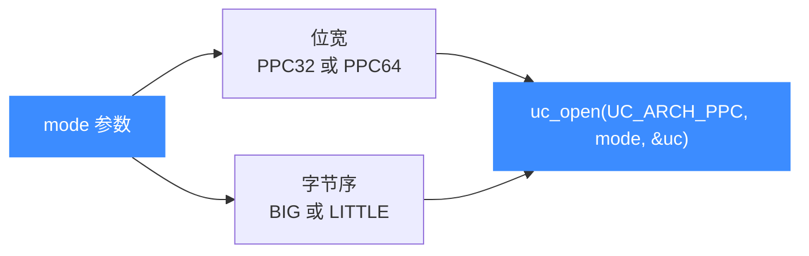

# PowerPC 模式与字节序

本页讲清打开 PPC 引擎时 mode 参数的构成：位宽位 `UC_MODE_PPC32` / `UC_MODE_PPC64`，以及字节序位——PPC 世界以**大端为主**。读完你能为任意 PPC 目标写出正确的 `uc_open` 调用，并避免最常见的字节序陷阱。

## ⚡ mode 由两部分按位或组成



## 📌 位宽位

| mode | 含义 | 说明 |
|------|------|------|
| `UC_MODE_PPC32` | 32 位 PowerPC | 等价于通用的 `UC_MODE_32`，最常见 |
| `UC_MODE_PPC64` | 64 位 PowerPC | 等价于通用的 `UC_MODE_64`，用于 POWER/G5/主机 |

::: tip PPC32 == UC_MODE_32
`UC_MODE_PPC32` 与 `UC_MODE_64` 这类常量在底层是共用的位定义。示例 `sample_ppc.c` 用 `UC_MODE_PPC32`，测试 `test_ppc.c` 用 `UC_MODE_32`，二者等价——都是 `1 << 2`。
:::

## 🔀 字节序位

| mode | 值 | 用于 PPC |
|------|----|----------|
| `UC_MODE_BIG_ENDIAN` | `1 << 30` | **绝大多数 PPC 目标** |
| `UC_MODE_LITTLE_ENDIAN` | `0`（默认） | 少数小端 PPC 配置 |

PowerPC 历史上几乎总是大端运行。Unicorn 的 PPC 示例与全部单元测试都显式带 `UC_MODE_BIG_ENDIAN`：

```c
// 官方示例的打开方式（大端 PPC32）
uc_open(UC_ARCH_PPC, UC_MODE_PPC32 | UC_MODE_BIG_ENDIAN, &uc);
```

```c
// 单元测试的打开方式，等价写法
uc_open(UC_ARCH_PPC, UC_MODE_32 | UC_MODE_BIG_ENDIAN, &uc);
```

::: warning 忘记大端 = 指令译码错乱
PPC 指令是 4 字节定长。若把大端机器码当小端解释，4 个字节顺序整体翻转，译出的指令完全错误，仿真会得到 `UC_ERR_INSN_INVALID` 或诡异结果。写机器码字节串时务必与所选字节序一致。字节序机制详见 [字节序](/features/endianness)。
:::

## 🧩 常见组合速查

| 目标 | mode 表达式 |
|------|-------------|
| 嵌入式 MPC5xx/8xx、GameCube/Wii、老 32 位 Mac | `UC_MODE_PPC32 \| UC_MODE_BIG_ENDIAN` |
| POWER 服务器、Xbox 360、PS3、G5 Mac | `UC_MODE_PPC64 \| UC_MODE_BIG_ENDIAN` |

## 🔧 校验打开是否成功

```c
#include <unicorn/unicorn.h>

uc_engine *uc;
uc_err err = uc_open(UC_ARCH_PPC, UC_MODE_PPC64 | UC_MODE_BIG_ENDIAN, &uc);
if (err != UC_ERR_OK) {
    // 例如构建未编译进 PPC 支持会得到 UC_ERR_ARCH
    printf("打开失败: %s\n", uc_strerror(err));
    return -1;
}
uc_close(uc);
```

::: tip 位宽与字节序运行期可查
引擎打开后可用 `uc_ctl_get_mode`（见 [uc_ctl](/api/ctl)）回读当前 mode，确认位宽与字节序符合预期。
:::

## 📂 相关源码

| 文件 | 角色 |
|------|------|
| [`include/unicorn/ppc.h`](https://github.com/android-security-engineer/unicorn-skills/blob/master/include/unicorn/ppc.h#L341) | `UC_PPC_REG_*` 寄存器枚举与 `uc_cpu_*` CPU 型号定义 |
| [`qemu/target/ppc/unicorn.c`](https://github.com/android-security-engineer/unicorn-skills/blob/master/qemu/target/ppc/unicorn.c) | 后端：`reg_read`/`reg_write`/`uc_init` 等函数指针实现 |
| [`qemu/target/ppc/translate.c`](https://github.com/android-security-engineer/unicorn-skills/blob/master/qemu/target/ppc/translate.c) | 前端：机器码翻译（TCG） |
| [`samples/sample_ppc.c`](https://github.com/android-security-engineer/unicorn-skills/blob/master/samples/sample_ppc.c) | 该架构的 C 示例程序 |
| [`include/unicorn/unicorn.h`](https://github.com/android-security-engineer/unicorn-skills/blob/master/include/unicorn/unicorn.h#L103) | `UC_ARCH_PPC` 架构常量与 `UC_MODE_*` 公共模式定义 |

## 相关页面

- [字节序（Endianness）](/features/endianness)
- [PPC 架构概览](/arch/ppc/)
- [PPC CPU 型号](/arch/ppc/cpu-models)
- [uc_open — 创建引擎](/api/open)
