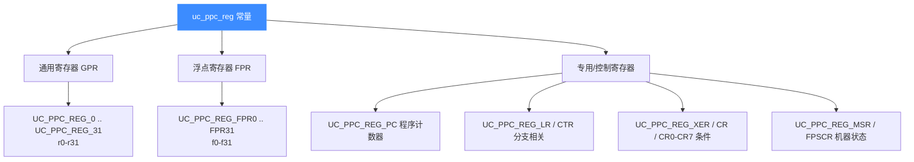

# PowerPC 寄存器参考

本页列出 Unicorn PPC 后端可读写的全部寄存器及其 `UC_PPC_REG_*` 常量：32 个通用寄存器、32 个浮点寄存器，以及 PC、LR、CTR、XER、CR、MSR 等专用寄存器。读完你能用 [uc_reg_read](/api/reg-read) / [uc_reg_write](/api/reg-write) 正确地访问 PPC 上下文。所有常量均来自 [`include/unicorn/ppc.h`](https://github.com/android-security-engineer/unicorn-skills/blob/master/include/unicorn/ppc.h)。

## 🧠 寄存器全景

PowerPC 是规整的 RISC 架构：一组等宽通用寄存器 + 一组浮点寄存器 + 少量控制/状态寄存器。



## 📌 通用寄存器（GPR）

r0–r31，PPC32 下为 32 位，PPC64 下为 64 位。注意常量命名是 `UC_PPC_REG_0` 而非 `UC_PPC_REG_R0`——直接是数字后缀。

| 寄存器 | 常量 | 说明 |
|--------|------|------|
| r0 | `UC_PPC_REG_0` | 通用；部分指令里 `r0` 被当作字面量 0 |
| r1 | `UC_PPC_REG_1` | 约定用作栈指针（SP） |
| r2 | `UC_PPC_REG_2` | 约定用作 TOC/小数据指针 |
| r3–r10 | `UC_PPC_REG_3` … `UC_PPC_REG_10` | 约定用作函数参数/返回值 |
| r11–r31 | `UC_PPC_REG_11` … `UC_PPC_REG_31` | 通用 |

::: tip 命名约定
r1 作栈指针、r3 作首个参数/返回值等是 **ABI 约定**，Unicorn 不强制。硬件层面 r0–r31 一律等价，你可任意读写。
:::

## 🔢 浮点寄存器（FPR）

f0–f31，均为 64 位（IEEE-754 双精度）。使用浮点指令前通常需在 `MSR` 中打开 FP 使能位。

| 寄存器 | 常量 |
|--------|------|
| f0–f31 | `UC_PPC_REG_FPR0` … `UC_PPC_REG_FPR31` |

## 🎯 专用与控制寄存器

| 寄存器 | 常量 | 用途 |
|--------|------|------|
| PC | `UC_PPC_REG_PC` | 程序计数器（下一条指令地址） |
| LR | `UC_PPC_REG_LR` | 链接寄存器，保存 `bl` 的返回地址 |
| CTR | `UC_PPC_REG_CTR` | 计数寄存器，用于循环计数和间接分支 |
| XER | `UC_PPC_REG_XER` | 定点异常寄存器（进位、溢出等） |
| CR | `UC_PPC_REG_CR` | 条件寄存器整体（32 位，含 8 个字段） |
| CR0–CR7 | `UC_PPC_REG_CR0` … `UC_PPC_REG_CR7` | 条件寄存器的 8 个 4 位字段 |
| MSR | `UC_PPC_REG_MSR` | 机器状态寄存器（字节序、FP 使能、特权级等） |
| FPSCR | `UC_PPC_REG_FPSCR` | 浮点状态与控制寄存器 |

::: warning MSR 与浮点
执行浮点指令前需要在 `MSR` 里置位使能。测试代码 `test_ppc32_fadd` 就先读出 `MSR`、置 `1 << 13` 位再写回，之后浮点加法才生效。
:::

## 🔧 读写示例

下面演示写入通用寄存器、运行一条加法、再读回结果（来自 `test_ppc.c` 的 `test_ppc32_add`）：

```c
int reg;

reg = 42;
uc_reg_write(uc, UC_PPC_REG_3, &reg);   // r3 = 42
reg = 1337;
uc_reg_write(uc, UC_PPC_REG_6, &reg);   // r6 = 1337

// 执行 "add r26, r6, r3"
uc_emu_start(uc, code_start, code_start + 4, 0, 0);

uc_reg_read(uc, UC_PPC_REG_26, &reg);   // 读回 r26
// reg == 1379
```

条件寄存器整体可以一次读写，值原样保留（来自 `test_ppc32_cr`）：

```c
uint32_t r_cr = 0x12345678;
uc_reg_write(uc, UC_PPC_REG_CR, &r_cr);
r_cr = 0;
uc_reg_read(uc, UC_PPC_REG_CR, &r_cr);
// r_cr == 0x12345678
```

::: tip 缓冲区宽度
`uc_reg_read`/`uc_reg_write` 通过 `void*` 传值。GPR 在 PPC32 下用 `int`（32 位）即可，PPC64 下应使用 64 位缓冲区；FPR 一律用 64 位（如 `uint64_t`）。宽度不匹配会读到截断或越界数据。
:::

## 📂 相关源码

| 文件 | 角色 |
|------|------|
| [`include/unicorn/ppc.h`](https://github.com/android-security-engineer/unicorn-skills/blob/master/include/unicorn/ppc.h#L341) | `UC_PPC_REG_*` 寄存器枚举与 `uc_cpu_*` CPU 型号定义 |
| [`qemu/target/ppc/unicorn.c`](https://github.com/android-security-engineer/unicorn-skills/blob/master/qemu/target/ppc/unicorn.c) | 后端：`reg_read`/`reg_write`/`uc_init` 等函数指针实现 |
| [`qemu/target/ppc/translate.c`](https://github.com/android-security-engineer/unicorn-skills/blob/master/qemu/target/ppc/translate.c) | 前端：机器码翻译（TCG） |
| [`samples/sample_ppc.c`](https://github.com/android-security-engineer/unicorn-skills/blob/master/samples/sample_ppc.c) | 该架构的 C 示例程序 |
| [`include/unicorn/unicorn.h`](https://github.com/android-security-engineer/unicorn-skills/blob/master/include/unicorn/unicorn.h#L103) | `UC_ARCH_PPC` 架构常量与 `UC_MODE_*` 公共模式定义 |

## 相关页面

- [uc_reg_read — 读寄存器](/api/reg-read)
- [uc_reg_write — 写寄存器](/api/reg-write)
- [PPC 架构概览](/arch/ppc/)
- [PPC 指令与特性](/arch/ppc/instructions)
