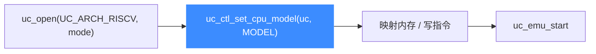

# RISC-V CPU 型号

本页列出 Unicorn 为 RISC-V 提供的全部 CPU 型号常量（取自 [`include/unicorn/riscv.h`](https://github.com/android-security-engineer/unicorn-skills/blob/master/include/unicorn/riscv.h) 的 `uc_cpu_riscv32` 与 `uc_cpu_riscv64` 枚举），并说明如何用 `uc_ctl_set_cpu_model` 在 `uc_open` 之后、`uc_emu_start` 之前切换型号。读完你能为教学或固件仿真选到贴近目标硬件的核。

## 🧩 型号如何影响仿真

不同型号对应不同的默认扩展集与实现细节。选对型号，就等于选对了可用指令集与 CSR 行为。



::: warning ⚠️ 设置时机
`uc_ctl_set_cpu_model` 必须在开始仿真之前调用（引擎尚未构建 CPU 状态时）。型号常量要与打开模式匹配：RISCV32 模式用 `UC_CPU_RISCV32_*`，RISCV64 模式用 `UC_CPU_RISCV64_*`。
:::

## 📌 RISCV32 型号（uc_cpu_riscv32）

| 常量 | 说明 |
| --- | --- |
| `UC_CPU_RISCV32_ANY` | 默认/通用（值为 0） |
| `UC_CPU_RISCV32_BASE32` | 32 位基础核 |
| `UC_CPU_RISCV32_SIFIVE_E31` | SiFive E31，面向 MCU 的嵌入式核 |
| `UC_CPU_RISCV32_SIFIVE_U34` | SiFive U34，应用级 32 位核 |

（枚举以 `UC_CPU_RISCV32_ENDING` 结尾，仅作边界标记，不是可用型号。）

## 📌 RISCV64 型号（uc_cpu_riscv64）

| 常量 | 说明 |
| --- | --- |
| `UC_CPU_RISCV64_ANY` | 默认/通用（值为 0） |
| `UC_CPU_RISCV64_BASE64` | 64 位基础核 |
| `UC_CPU_RISCV64_SIFIVE_E51` | SiFive E51，64 位嵌入式核 |
| `UC_CPU_RISCV64_SIFIVE_U54` | SiFive U54，可跑 Linux 的应用级核 |

（枚举以 `UC_CPU_RISCV64_ENDING` 结尾。）

## 🔧 设置型号示例

```c
uc_engine *uc;
uc_open(UC_ARCH_RISCV, UC_MODE_RISCV64, &uc);

// 选择 SiFive U54 应用级核
int model = UC_CPU_RISCV64_SIFIVE_U54;
uc_err err = uc_ctl_set_cpu_model(uc, model);
if (err) {
    printf("设置 CPU 型号失败: %s\n", uc_strerror(err));
}

// ... 随后映射内存并 uc_emu_start ...
uc_close(uc);
```

::: tip 📌 不确定选哪个？
教学与通用逆向直接用 `UC_CPU_RISCV64_ANY` 即可，它提供较完整的扩展集。只有当你需要复现特定 SiFive 芯片的行为时，才指定具体型号。
:::

## 🧠 扩展开关与型号的关系

型号决定"默认带哪些扩展"，但某些扩展的**运行时开关**仍需在寄存器里显式打开。最典型的是浮点：无论型号如何，浮点指令都要求先置起 `UC_RISCV_REG_MSTATUS` 的 `fs` 位，否则浮点单元关闭。`test_riscv64_fp_move_from_int` 正是先写 `mstatus` 再执行 `fmv.d.x`：

```c
uint64_t r_mstatus = 0x6000; // 置起 mstatus.fs
uc_reg_write(uc, UC_RISCV_REG_MSTATUS, &r_mstatus);
// 之后 fmv.d.x 才会真正生效
```

## 📂 相关源码

| 文件 | 角色 |
|------|------|
| [`include/unicorn/riscv.h`](https://github.com/android-security-engineer/unicorn-skills/blob/master/include/unicorn/riscv.h#L40) | `UC_RISCV_REG_*` 寄存器枚举与 `uc_cpu_*` CPU 型号定义 |
| [`qemu/target/riscv/unicorn.c`](https://github.com/android-security-engineer/unicorn-skills/blob/master/qemu/target/riscv/unicorn.c) | 后端：`reg_read`/`reg_write`/`uc_init` 等函数指针实现 |
| [`qemu/target/riscv/translate.c`](https://github.com/android-security-engineer/unicorn-skills/blob/master/qemu/target/riscv/translate.c) | 前端：机器码翻译（TCG） |
| [`samples/sample_riscv.c`](https://github.com/android-security-engineer/unicorn-skills/blob/master/samples/sample_riscv.c) | 该架构的 C 示例程序 |
| [`include/unicorn/unicorn.h`](https://github.com/android-security-engineer/unicorn-skills/blob/master/include/unicorn/unicorn.h#L106) | `UC_ARCH_RISCV` 架构常量与 `UC_MODE_*` 公共模式定义 |

## 相关页面

- [uc_ctl_set_cpu_model](/ctl/set-cpu-model)
- [CPU 型号总览](/features/cpu-models)
- [RISC-V 架构概览](/arch/riscv/)
- [RISC-V 寄存器参考](/arch/riscv/registers)
