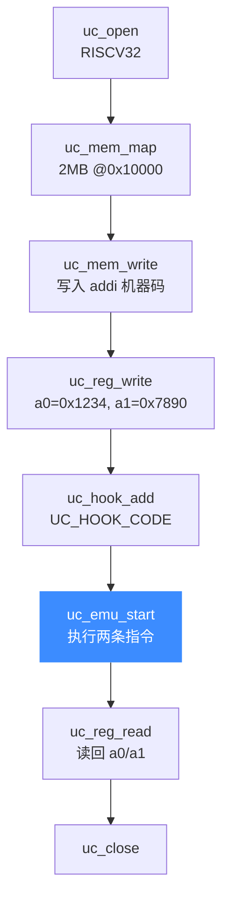

# RISC-V 实战示例

本页把 `sample_riscv.c` 的核心子测试拼成一个可运行的最小仿真：初始化引擎 → 映射内存 → 写入两条 `addi` → 加 Hook → 执行 → 读回寄存器，并逐段讲解与给出预期输出。跟着走一遍，你就掌握了 RISC-V 仿真的完整骨架。

## 🎯 目标程序

我们仿真两条 RV32I 指令（与 `sample_riscv.c` 中 `RISCV_CODE` 完全一致）：

```text
addi a0, zero, 1      # a0 = 0 + 1 = 1
addi a1, a1, 0x20     # a1 = a1 + 0x20
```

机器码为 `13 05 10 00 93 85 05 02`。初始设 `a1 = 0x7890`，执行后 `a1 = 0x7890 + 0x20 = 0x78b0`，`a0 = 1`。

## 🧩 完整代码

```c
#include <unicorn/unicorn.h>
#include <stdio.h>

#define ADDRESS 0x10000
#define RISCV_CODE "\x13\x05\x10\x00\x93\x85\x05\x02"

// 每条指令执行前触发
static void hook_code(uc_engine *uc, uint64_t address, uint32_t size,
                      void *user_data)
{
    printf(">>> 执行指令 @0x%" PRIx64 ", 长度 = 0x%x\n", address, size);
}

int main(void)
{
    uc_engine *uc;
    uc_hook trace;
    uc_err err;
    uint32_t a0 = 0x1234, a1 = 0x7890;

    // 1) 打开 RISCV32 引擎
    err = uc_open(UC_ARCH_RISCV, UC_MODE_RISCV32, &uc);
    if (err) {
        printf("uc_open 失败: %s\n", uc_strerror(err));
        return -1;
    }

    // 2) 映射 2MB 内存并写入机器码
    uc_mem_map(uc, ADDRESS, 2 * 1024 * 1024, UC_PROT_ALL);
    uc_mem_write(uc, ADDRESS, RISCV_CODE, sizeof(RISCV_CODE) - 1);

    // 3) 初始化寄存器
    uc_reg_write(uc, UC_RISCV_REG_A0, &a0);
    uc_reg_write(uc, UC_RISCV_REG_A1, &a1);

    // 4) 挂一个指令级 Hook
    uc_hook_add(uc, &trace, UC_HOOK_CODE, hook_code, NULL, 1, 0);

    // 5) 执行：从 ADDRESS 跑到代码末尾
    err = uc_emu_start(uc, ADDRESS, ADDRESS + sizeof(RISCV_CODE) - 1, 0, 0);
    if (err) {
        printf("uc_emu_start 失败: %s\n", uc_strerror(err));
    }

    // 6) 读回结果
    uc_reg_read(uc, UC_RISCV_REG_A0, &a0);
    uc_reg_read(uc, UC_RISCV_REG_A1, &a1);
    printf(">>> A0 = 0x%x\n", a0);
    printf(">>> A1 = 0x%x\n", a1);

    uc_close(uc);
    return 0;
}
```

## 🔧 逐段讲解



- **步骤 1**：架构 [`UC_ARCH_RISCV`](https://github.com/android-security-engineer/unicorn-skills/blob/master/include/unicorn/unicorn.h#L106) + 模式 `UC_MODE_RISCV32`，缓冲区用 `uint32_t`。
- **步骤 2**：`uc_emu_start` 前必须映射好可执行内存，`UC_PROT_ALL` 允许读写执行。
- **步骤 5**：末参数 `(timeout=0, count=0)` 表示无超时、执行到给定结束地址为止。想单步就把 `count` 设为 1（见 `test_riscv_step`）。

## 📤 预期输出

```text
>>> 执行指令 @0x10000, 长度 = 0x4
>>> 执行指令 @0x10004, 长度 = 0x4
>>> A0 = 0x1
>>> A1 = 0x78b0
```

`a0` 变为 1，`a1` 由 `0x7890` 增加 `0x20` 得 `0x78b0`，与预期完全一致。

::: tip 📌 继续探索
把 `count` 参数改成 1 可观察单步；换成 `UC_MODE_RISCV64` 并用 64 位存储指令即可复现 `test_riscv_sd64`；加一个 `UC_HOOK_MEM_UNMAPPED` 回调即可实现缺页自愈（见 [指令与特性](/arch/riscv/instructions)）。
:::

::: warning ⚠️ 结束地址是"下一条不执行"的地址
`uc_emu_start(uc, begin, until, ...)` 的 `until` 是**停止边界**——执行到达该地址即停，不执行它。这里传 `ADDRESS + 8` 正好覆盖两条 4 字节指令。
:::

## 📂 相关源码

| 文件 | 角色 |
|------|------|
| [`include/unicorn/riscv.h`](https://github.com/android-security-engineer/unicorn-skills/blob/master/include/unicorn/riscv.h#L40) | `UC_RISCV_REG_*` 寄存器枚举与 `uc_cpu_*` CPU 型号定义 |
| [`qemu/target/riscv/unicorn.c`](https://github.com/android-security-engineer/unicorn-skills/blob/master/qemu/target/riscv/unicorn.c) | 后端：`reg_read`/`reg_write`/`uc_init` 等函数指针实现 |
| [`qemu/target/riscv/translate.c`](https://github.com/android-security-engineer/unicorn-skills/blob/master/qemu/target/riscv/translate.c) | 前端：机器码翻译（TCG） |
| [`samples/sample_riscv.c`](https://github.com/android-security-engineer/unicorn-skills/blob/master/samples/sample_riscv.c) | 该架构的 C 示例程序 |
| [`include/unicorn/unicorn.h`](https://github.com/android-security-engineer/unicorn-skills/blob/master/include/unicorn/unicorn.h#L106) | `UC_ARCH_RISCV` 架构常量与 `UC_MODE_*` 公共模式定义 |

## 相关页面

- [sample_riscv.c 走读](/samples/sample-riscv)
- [RISC-V 指令与特性](/arch/riscv/instructions)
- [RISC-V 架构概览](/arch/riscv/)
- [uc_emu_start](/api/emu-start)
