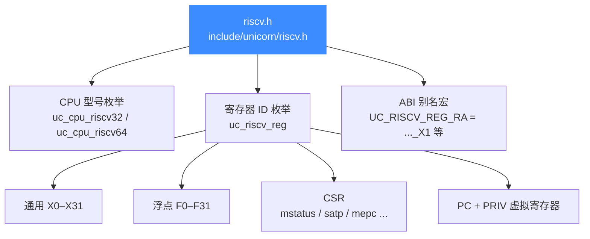
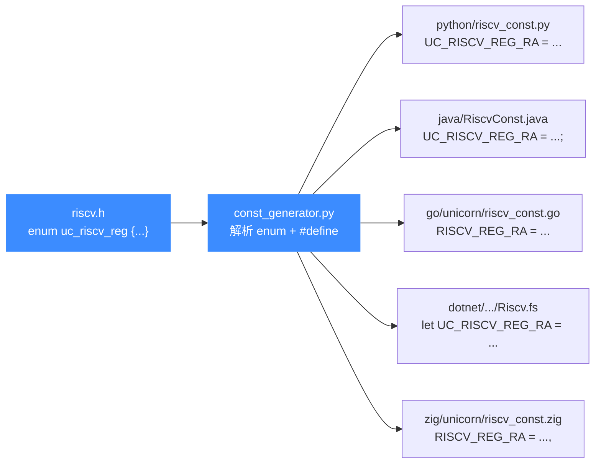

# riscv.h — RISC-V 头文件常量

本页逐节拆解 [`include/unicorn/riscv.h`](https://github.com/android-security-engineer/unicorn-skills/blob/master/include/unicorn/riscv.h)：它定义了 RISC-V 架构全部公开常量，包括两个 CPU 型号枚举、一份覆盖通用/浮点/CSR 的寄存器 ID 枚举，以及为 ABI 别名准备的等价宏。这些常量是各语言绑定常量的**唯一真源**——读完你能知道头里有哪些类、各自在绑定生成中扮演什么角色。

## 📌 概述

`riscv.h` 是 RISC-V 架构的**公开常量头**，被 `unicorn.h` 聚合后暴露给所有使用者。它本身不声明任何函数，只产出三类枚举与一组别名宏：



::: tip 📌 没有 INS 枚举
与 `x86.h`、`arm.h` 不同，`riscv.h` **没有** `UC_RISCV_INS_*` 指令 ID 枚举——RISC-V 不靠指令 ID 触发 `UC_HOOK_INSN`，而是用 `UC_HOOK_CODE` + 地址区间，或 `UC_HOOK_TCG_OPCODE` 在更底层插桩。因此本页不列指令表。
:::

::: warning ⚠️ 模式位不在本头文件
`UC_MODE_RISCV32` / `UC_MODE_RISCV64` 定义在 [`unicorn.h`](/headers/unicorn-h) 的 `uc_mode` 枚举里（值 `1<<2` / `1<<3`），不在 `riscv.h` 中。`riscv.h` 只管"型号 + 寄存器"。
:::

## 🧩 CPU 型号枚举

头文件为 32 位与 64 位各定义一个型号枚举，供 `uc_ctl_set_cpu_model` 使用。两枚举互不通用——必须与 `uc_open` 的模式匹配。

| 枚举类型 | 取值（`uc_cpu_riscv32`） | 取值（`uc_cpu_riscv64`） |
| --- | --- | --- |
| 默认/通用 | `UC_CPU_RISCV32_ANY` (=0) | `UC_CPU_RISCV64_ANY` (=0) |
| 基础核 | `UC_CPU_RISCV32_BASE32` | `UC_CPU_RISCV64_BASE64` |
| SiFive 嵌入式 | `UC_CPU_RISCV32_SIFIVE_E31` | `UC_CPU_RISCV64_SIFIVE_E51` |
| SiFive 应用级 | `UC_CPU_RISCV32_SIFIVE_U34` | `UC_CPU_RISCV64_SIFIVE_U54` |
| 边界哨兵 | `UC_CPU_RISCV32_ENDING` | `UC_CPU_RISCV64_ENDING` |

`*_ENDING` 仅作边界标记，不是可用型号。型号选择如何影响扩展集与 CSR 行为，详见 [CPU 型号](/arch/riscv/cpu-models)。

## 📖 寄存器 ID 枚举（uc_riscv_reg）

这是本头文件最核心的产出。`uc_riscv_reg` 是一个连续自增枚举，`uc_reg_read` / `uc_reg_write` / `uc_context_reg_*` 都以它为索引。下面按声明顺序列出代表性条目。

### 通用寄存器 X0–X31

| 常量 | ABI 别名 | 含义 |
| --- | --- | --- |
| `UC_RISCV_REG_INVALID` | — | 哨兵值（=0），不可用 |
| `UC_RISCV_REG_X0` | `UC_RISCV_REG_ZERO` | 恒为 0，写入被丢弃 |
| `UC_RISCV_REG_X1` | `UC_RISCV_REG_RA` | 返回地址 |
| `UC_RISCV_REG_X2` | `UC_RISCV_REG_SP` | 栈指针 |
| `UC_RISCV_REG_X3` | `UC_RISCV_REG_GP` | 全局指针 |
| `UC_RISCV_REG_X4` | `UC_RISCV_REG_TP` | 线程指针 |
| `UC_RISCV_REG_X5`–`X7` | `UC_RISCV_REG_T0`–`T2` | 临时寄存器 |
| `UC_RISCV_REG_X8` | `UC_RISCV_REG_S0` / `UC_RISCV_REG_FP` | 保存寄存器 / 帧指针（同一物理寄存器） |
| `UC_RISCV_REG_X9` | `UC_RISCV_REG_S1` | 保存寄存器 |
| `UC_RISCV_REG_X10`–`X11` | `UC_RISCV_REG_A0`–`A1` | 参数 / 返回值 |
| `UC_RISCV_REG_X12`–`X17` | `UC_RISCV_REG_A2`–`A7` | 参数寄存器 |
| `UC_RISCV_REG_X18`–`X27` | `UC_RISCV_REG_S2`–`S11` | 保存寄存器 |
| `UC_RISCV_REG_X28`–`X31` | `UC_RISCV_REG_T3`–`T6` | 临时寄存器 |

### CSR（控制状态寄存器，节选）

`riscv.h` 覆盖用户/监督/机器三级 CSR，下面是最常用的一批；完整列表见 [寄存器参考](/arch/riscv/registers)。

| 常量 | 含义 |
| --- | --- |
| `UC_RISCV_REG_MSTATUS` | 机器态状态字（含 `fs` 浮点使能位） |
| `UC_RISCV_REG_MISA` | 机器态 ISA 与扩展描述 |
| `UC_RISCV_REG_MTVEC` | 机器态陷入向量基址 |
| `UC_RISCV_REG_MEPC` | 机器态异常返回地址 |
| `UC_RISCV_REG_MCAUSE` | 机器态陷入原因 |
| `UC_RISCV_REG_MIP` / `UC_RISCV_REG_MIE` | 机器态中断挂起 / 使能 |
| `UC_RISCV_REG_MHARTID` | 硬件线程 ID |
| `UC_RISCV_REG_SATP` / `UC_RISCV_REG_SPTBR` | 页表基址（`SPTBR` 为旧名） |
| `UC_RISCV_REG_SSTATUS` / `UC_RISCV_REG_SEPC` | 监督态状态字 / 异常返回地址 |
| `UC_RISCV_REG_FCSR` | 浮点控制状态（含 `frm` 舍入模式） |

### 浮点寄存器 F0–F31 与 PC/PRIV

| 常量 | 含义 |
| --- | --- |
| `UC_RISCV_REG_F0`–`F31` | 浮点寄存器（别名 `FT0`–`FT11`、`FS0`–`FS11`、`FA0`–`FA7`） |
| `UC_RISCV_REG_PC` | 程序计数器 |
| `UC_RISCV_REG_PRIV` | 虚拟寄存器：当前特权级（3=M, 1=S, 0=U） |
| `UC_RISCV_REG_ENDING` | 枚举边界哨兵，不是可用寄存器 |

::: details 别名宏的等价关系
头文件在 `UC_RISCV_REG_ENDING` 之后用 `#define` 风格的赋值（实为枚举内赋初值）把别名指向同一个底层值，例如：

```c
UC_RISCV_REG_RA   = UC_RISCV_REG_X1,   // "ra"
UC_RISCV_REG_SP   = UC_RISCV_REG_X2,   // "sp"
UC_RISCV_REG_FP   = UC_RISCV_REG_X8,   // "fp"  (与 S0 同寄存器)
UC_RISCV_REG_A0   = UC_RISCV_REG_X10,  // "a0"
UC_RISCV_REG_FT0  = UC_RISCV_REG_F0,   // "ft0"
```

读写别名与读写原常量效果完全相同——它们在枚举里就是同一个整数。
:::

## 💻 用法示例

下面片段演示如何用本头文件的常量读写 RISC-V 寄存器。常量名直接来自 `riscv.h`：

```c
#include <unicorn/unicorn.h>
#include <inttypes.h>
#include <stdio.h>

uc_engine *uc;
uc_open(UC_ARCH_RISCV, UC_MODE_RISCV64, &uc);

// 1) 用 ABI 别名写返回地址与栈指针
uint64_t ra = 0x80000000ULL;
uint64_t sp = 0x80100000ULL;
uc_reg_write(uc, UC_RISCV_REG_RA, &ra);
uc_reg_write(uc, UC_RISCV_REG_SP, &sp);

// 2) 启用浮点：置起 mstatus.fs
uint64_t mstatus = 0x6000;
uc_reg_write(uc, UC_RISCV_REG_MSTATUS, &mstatus);

// 3) 单步后读回 PC
uc_emu_start(uc, 0x80000000ULL, 0x80000008ULL, 0, 1);
uint64_t pc = 0;
uc_reg_read(uc, UC_RISCV_REG_PC, &pc);
printf("PC = 0x%" PRIx64 "\n", pc);

uc_close(uc);
```

::: tip 📌 缓冲区宽度
RISCV32 用 `uint32_t`、RISCV64 用 `uint64_t` 接收通用/CSR 寄存器；浮点寄存器 `F0`–`F31` 在两种模式下都按 64 位对待。详见 [模式与特权级](/arch/riscv/modes)。
:::

## 🔧 头文件如何被绑定消费

`riscv.h` 既是 C 程序的 include 目标，也是 `const_generator.py` 的输入源。生成器逐行扫描本头文件，把 `uc_cpu_riscv32` / `uc_cpu_riscv64` / `uc_riscv_reg` 枚举里的每个成员连同其别名宏，按各语言模板产出到 `*_const.*` 文件。



::: tip 📌 改了头文件要重跑生成器
本头文件是各语言 RISC-V 常量的**唯一真源**。一旦增删或重命名 `uc_riscv_reg` / `uc_cpu_riscv*` 的成员，必须重新运行：

```bash
cd bindings
python3 const_generator.py all    # 重新生成全部语言的 *_const.* 文件
```

绝不要手改 `python/unicorn/riscv_const.py`、`java/.../RiscvConst.java` 等自动生成文件——下次跑生成器会被覆盖。生成器工作机制见 [const_generator.py](/bindings/const-generator)。
:::

## ⚠️ 注意事项

- **`UC_RISCV_REG_INVALID` 与 `*_ENDING`** 是哨兵，不是可用寄存器/型号；传给 `uc_reg_read` 或 `uc_ctl_set_cpu_model` 会得到 `UC_ERR_ARG`。
- **`UC_RISCV_REG_PRIV` 是虚拟寄存器**，没有对应硬件 CSR，但可读可写以强制切换 M/S/U 特权级（见 [模式与特权级](/arch/riscv/modes)）。
- **`UC_RISCV_REG_SPTBR` 与 `UC_RISCV_REG_SATP`** 指向同一底层 CSR，`SPTBR` 是旧名，新代码请用 `SATP`。
- **别名与原常量同值**：写 `UC_RISCV_REG_RA` 等价于写 `UC_RISCV_REG_X1`，二者不可同时视作两个独立寄存器。
- **无指令 ID 枚举**：需要按指令类型插桩时改用 `UC_HOOK_CODE` 配地址范围，或 `UC_HOOK_TCG_OPCODE`。

## 📖 参考

- 头文件源码：[[`include/unicorn/riscv.h`](https://github.com/android-security-engineer/unicorn-skills/blob/master/include/unicorn/riscv.h)](https://github.com/android-security-engineer/unicorn-skills/blob/master/include/unicorn/riscv.h)
- 公共入口头：[unicorn.h](/headers/unicorn-h)
- 绑定常量生成：[const_generator.py](/bindings/const-generator)

## 📂 相关源码

| 文件 | 角色 |
|------|------|
| [`include/unicorn/riscv.h`](https://github.com/android-security-engineer/unicorn-skills/blob/master/include/unicorn/riscv.h#L40) | `UC_RISCV_REG_*` 寄存器枚举与 `uc_cpu_*` CPU 型号定义 |
| [`qemu/target/riscv/unicorn.c`](https://github.com/android-security-engineer/unicorn-skills/blob/master/qemu/target/riscv/unicorn.c) | 后端：`reg_read`/`reg_write`/`uc_init` 等函数指针实现 |
| [`qemu/target/riscv/translate.c`](https://github.com/android-security-engineer/unicorn-skills/blob/master/qemu/target/riscv/translate.c) | 前端：机器码翻译（TCG） |
| [`samples/sample_riscv.c`](https://github.com/android-security-engineer/unicorn-skills/blob/master/samples/sample_riscv.c) | 该架构的 C 示例程序 |
| [`include/unicorn/unicorn.h`](https://github.com/android-security-engineer/unicorn-skills/blob/master/include/unicorn/unicorn.h#L106) | `UC_ARCH_RISCV` 架构常量与 `UC_MODE_*` 公共模式定义 |

## 相关页面

- [RISC-V 架构概览](/arch/riscv/)
- [RISC-V 寄存器参考](/arch/riscv/registers)
- [RISC-V CPU 型号](/arch/riscv/cpu-models)
- [const_generator.py 常量生成器](/bindings/const-generator)
- [unicorn.h 公共 C API 头文件](/headers/unicorn-h)
