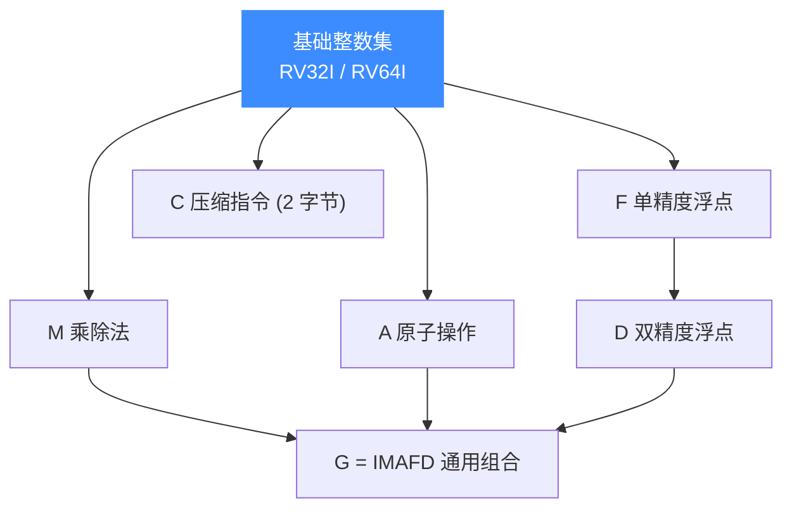
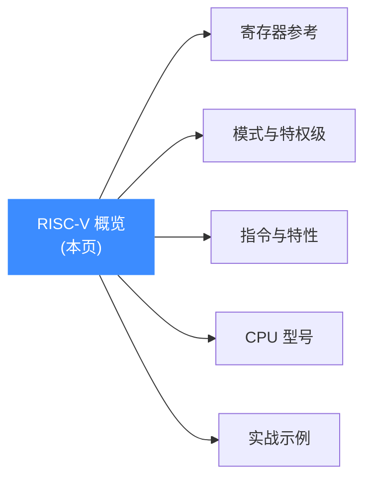

# RISC-V 架构

RISC-V 是一套开放、免授权费的精简指令集（ISA）。本页讲清 Unicorn 中如何用 [`UC_ARCH_RISCV`](https://github.com/android-security-engineer/unicorn-skills/blob/master/include/unicorn/unicorn.h#L106) 打开 RISC-V 引擎、32 位与 64 位模式的区别，以及模块化扩展的组织方式；读完你能选对模式并知道后续该看哪一页。

## 🚀 一句话认识 RISC-V

与 x86、ARM 不同，RISC-V 的基础指令集非常小（RV32I 仅约 40 条指令），其余能力都以**可选扩展**的形式叠加。这种"基础 + 模块化扩展"的设计让它既能跑在极小的嵌入式核上，也能撑起完整的操作系统。在 Unicorn 里，你只需两个常量就能启动一个 RISC-V CPU：

```c
#include <unicorn/unicorn.h>

uc_engine *uc;
// 打开一个 RISCV32 引擎
uc_err err = uc_open(UC_ARCH_RISCV, UC_MODE_RISCV32, &uc);
if (err) {
    printf("uc_open 失败: %s\n", uc_strerror(err));
    return;
}
// ... 映射内存、写指令、uc_emu_start ...
uc_close(uc);
```

::: tip 📌 架构常量
架构选择 `UC_ARCH_RISCV`，模式在 `UC_MODE_RISCV32` 与 `UC_MODE_RISCV64` 之间二选一。二者决定寄存器宽度（XLEN = 32 或 64）与地址空间大小。
:::

## 🧩 模块化扩展

RISC-V 的名字本身就是"基础 + 扩展字母"的拼写，例如 `RV64GC` = RV64I + M + A + F + D + C（`G` 是 IMAFD 的简称）：



| 字母 | 含义 | 在 Unicorn 中的体现 |
| --- | --- | --- |
| I | 基础整数指令 | 默认可用（`addi`、`sd`、`jr` 等） |
| M | 整数乘除 | `mul`、`div` 等 |
| A | 原子内存操作 | `amoadd`、`lr/sc` |
| F / D | 单/双精度浮点 | `f0`–`f31` 寄存器、`fmv.d`（需启用 `mstatus.fs`） |
| C | 压缩指令 | 2 字节指令如 `c.ret`，影响单步步长 |

::: warning ⚠️ 浮点需先启用
如测试 `test_riscv64_fp_move_from_int` 所示，浮点指令需要先把 `UC_RISCV_REG_MSTATUS` 的 `fs` 位置起，否则浮点单元处于关闭状态，指令会触发异常。
:::

## 🎯 典型用途

- 🧠 **教学与研究**：ISA 开放、指令规整，是学习 CPU 与编译器的理想目标；Unicorn 让你无需真实硬件即可单步观察寄存器变化。
- 🔧 **嵌入式仿真**：SiFive E31/E51 等型号面向 MCU 场景，可在无板卡时验证固件逻辑（见 [CPU 型号](/arch/riscv/cpu-models)）。
- 🪝 **动态分析**：结合 [Hook 体系](/features/hooks) 追踪指令流、拦截 `ecall`、自动补齐缺页内存。

## 📚 本架构其余页面



- [寄存器参考](/arch/riscv/registers)：x0–x31、PC、f0–f31、CSR 与 ABI 别名。
- [模式与特权级](/arch/riscv/modes)：RISCV32 vs RISCV64、M/S/U 特权级。
- [指令与特性](/arch/riscv/instructions)：压缩指令、`ecall`、缺页自愈。
- [CPU 型号](/arch/riscv/cpu-models)：`UC_CPU_RISCV32_*` / `UC_CPU_RISCV64_*`。
- [实战示例](/arch/riscv/example)：完整可运行仿真逐段讲解。

## 📂 相关源码

| 文件 | 角色 |
|------|------|
| [`include/unicorn/riscv.h`](https://github.com/android-security-engineer/unicorn-skills/blob/master/include/unicorn/riscv.h#L40) | `UC_RISCV_REG_*` 寄存器枚举与 `uc_cpu_*` CPU 型号定义 |
| [`qemu/target/riscv/unicorn.c`](https://github.com/android-security-engineer/unicorn-skills/blob/master/qemu/target/riscv/unicorn.c) | 后端：`reg_read`/`reg_write`/`uc_init` 等函数指针实现 |
| [`qemu/target/riscv/translate.c`](https://github.com/android-security-engineer/unicorn-skills/blob/master/qemu/target/riscv/translate.c) | 前端：机器码翻译（TCG） |
| [`samples/sample_riscv.c`](https://github.com/android-security-engineer/unicorn-skills/blob/master/samples/sample_riscv.c) | 该架构的 C 示例程序 |
| [`include/unicorn/unicorn.h`](https://github.com/android-security-engineer/unicorn-skills/blob/master/include/unicorn/unicorn.h#L106) | `UC_ARCH_RISCV` 架构常量与 `UC_MODE_*` 公共模式定义 |

## 相关页面

- [sample_riscv.c 走读](/samples/sample-riscv)
- [支持的架构](/features/architectures)
- [uc_open](/api/open)
- [Hook 体系](/features/hooks)
