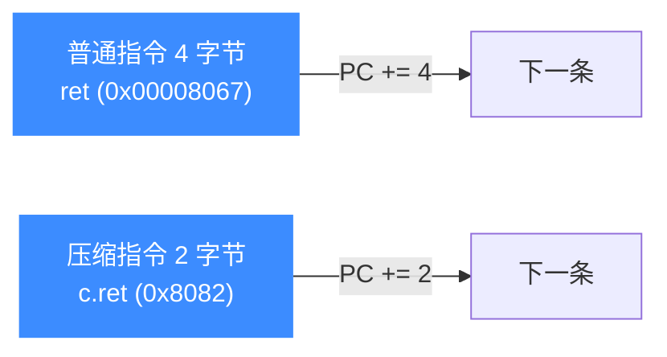
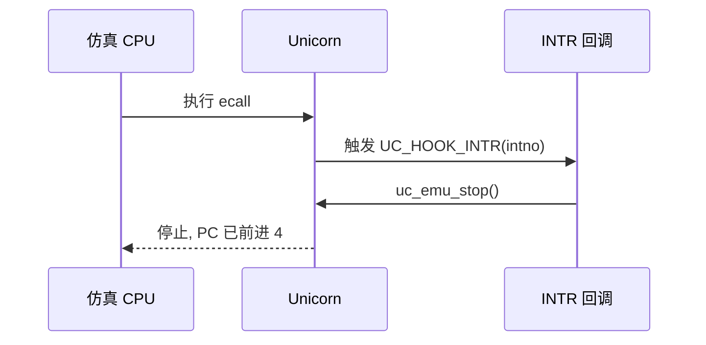

# RISC-V 指令与特性

本页聚焦三个在 Unicorn 中做 RISC-V 仿真时最容易踩坑、也最实用的点：压缩指令（C 扩展，2 字节）对单步步长的影响、环境调用 `ecall` 与 `UC_HOOK_INTR` 的配合、以及缺页时用 Hook 自动补内存的"自愈"技巧。示例均取自 `sample_riscv.c` 与 `test_riscv.c`。

## 🧩 压缩指令（C 扩展）

标准 RISC-V 指令是 4 字节，但 C 扩展引入了一批 2 字节的压缩指令（如 `c.ret`）。这意味着**指令长度不是定长的**，单步时 PC 前进的字节数取决于当前指令：



`test_riscv_func_return` 把两者放在一起验证：`ret` 在 `0x10000` 占 4 字节，`c.ret` 在 `0x10004` 只占 2 字节，二者都能正确跳回 `ra`：

```c
// 10000: 00008067  ret     (4 字节)
// 10004: 8082      c.ret   (2 字节)
#define CODE "\x67\x80\x00\x00\x82\x80\x01\x00\x01\x00"

uint64_t ra = 0x10006;
uc_reg_write(uc, UC_RISCV_REG_RA, &ra);
// 执行 ret：从 0x10000 起
uc_emu_start(uc, 0x10000, -1, 0, 1);
// 执行 c.ret：从 0x10004 起
uc_emu_start(uc, 0x10004, -1, 0, 1);
// 两次执行后 PC 都应等于 ra
```

::: warning ⚠️ 别假设步长恒为 4
在含 C 扩展的代码里做单步或按地址下断，务必以实际指令长度推进。想固定"执行 N 条指令"，用 `uc_emu_start` 的最后一个计数参数（如 `..., 0, 1` 表示执行 1 条），而不是手算地址。
:::

## 🪝 环境调用 ecall 与 UC_HOOK_INTR

`ecall` 触发一次环境调用异常，在 Unicorn 中表现为一次中断事件，由 `UC_HOOK_INTR` 捕获。`test_riscv64_ecall` 里回调直接停机：

```c
static void ecall_cb(uc_engine *uc, uint32_t intno, void *data)
{
    uc_emu_stop(uc); // 收到 ecall，停止仿真
}

char code[] = "\x73\x00\x00\x00"; // ecall
uc_hook h;
uc_hook_add(uc, &h, UC_HOOK_INTR, ecall_cb, NULL, 1, 0);
uc_emu_start(uc, code_start, code_start + sizeof(code) - 1, 0, 0);

// ecall 执行后 PC 前进 4 字节
uint64_t pc;
uc_reg_read(uc, UC_RISCV_REG_PC, &pc);
// pc == code_start + 4
```



::: tip 📌 用 ecall 模拟系统调用
在真实分析中，你可以在 INTR 回调里读 `a7`（系统调用号）和 `a0`–`a6`（参数），自行实现系统调用语义，然后继续仿真——这是用 Unicorn 做用户态模拟的常见套路。
:::

## 🧠 缺页自愈：按需分配内存

`sample_riscv.c` 的 `test_recover_from_illegal` 展示了一个强力技巧：注册 `UC_HOOK_MEM_UNMAPPED`，当访问未映射内存时在回调里现场 `uc_mem_map`，返回 `true` 让仿真继续：

```c
static bool hook_memalloc(uc_engine *uc, uc_mem_type type, uint64_t address,
                          int size, int64_t value, void *user_data)
{
    uint64_t aligned = address & 0xFFFFFFFFFFFFF000ULL;
    int aligned_size = ((int)(size / 0x1000) + 1) * 0x1000;
    uc_mem_map(uc, aligned, aligned_size, UC_PROT_ALL);
    return true; // 已补上内存，从缺页中恢复
}

uc_hook mem_alloc;
uc_hook_add(uc, &mem_alloc, UC_HOOK_MEM_UNMAPPED, hook_memalloc, NULL, 1, 0);
```

::: danger ❌ 非法指令无法这样恢复
自愈只对**未映射内存访问**有效。若跳到未初始化区域执行到非法编码，`uc_emu_start` 会返回 `UC_ERR_INSN_INVALID`——这是代码本身的问题，补内存救不了。`test_recover_from_illegal` 里先在错误地址 `0x1000` 得到该错误，再从正确地址 `ADDRESS` 重跑才成功。
:::

## 📂 相关源码

| 文件 | 角色 |
|------|------|
| [`include/unicorn/riscv.h`](https://github.com/android-security-engineer/unicorn-skills/blob/master/include/unicorn/riscv.h#L40) | `UC_RISCV_REG_*` 寄存器枚举与 `uc_cpu_*` CPU 型号定义 |
| [`qemu/target/riscv/unicorn.c`](https://github.com/android-security-engineer/unicorn-skills/blob/master/qemu/target/riscv/unicorn.c) | 后端：`reg_read`/`reg_write`/`uc_init` 等函数指针实现 |
| [`qemu/target/riscv/translate.c`](https://github.com/android-security-engineer/unicorn-skills/blob/master/qemu/target/riscv/translate.c) | 前端：机器码翻译（TCG） |
| [`samples/sample_riscv.c`](https://github.com/android-security-engineer/unicorn-skills/blob/master/samples/sample_riscv.c) | 该架构的 C 示例程序 |
| [`include/unicorn/unicorn.h`](https://github.com/android-security-engineer/unicorn-skills/blob/master/include/unicorn/unicorn.h#L106) | `UC_ARCH_RISCV` 架构常量与 `UC_MODE_*` 公共模式定义 |

## 相关页面

- [UC_HOOK_INTR — 中断/异常 Hook](/hooks/intr)
- [UC_HOOK_MEM_READ_UNMAPPED](/hooks/mem-read-unmapped)
- [RISC-V 实战示例](/arch/riscv/example)
- [RISC-V 架构概览](/arch/riscv/)
