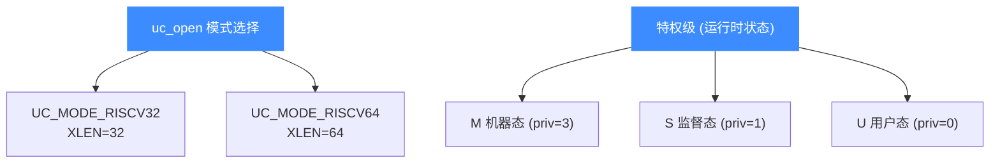

# RISC-V 模式与特权级

本页讲清两件相关但不同的事：Unicorn 的 `UC_MODE_RISCV32` 与 `UC_MODE_RISCV64`（决定寄存器与地址宽度），以及 RISC-V 体系本身的机器/监督/用户三个**特权级**（M/S/U）。读完你能选对打开模式，并理解 `test_riscv_priv` 里为何要在特权级间切换。

## 🧩 两个正交的概念



- **模式**在 `uc_open` 时确定，仿真期间不变。
- **特权级**是运行时状态，随 `mret`、异常、或写 `UC_RISCV_REG_PRIV` 而改变。

## 📌 RISCV32 vs RISCV64

| 维度 | UC_MODE_RISCV32 | UC_MODE_RISCV64 |
| --- | --- | --- |
| XLEN（整数寄存器宽度） | 32 位 | 64 位 |
| 地址空间 | 4 GB | 可达 64 位 |
| 典型基础集 | RV32I | RV64I |
| 寄存器缓冲区 | 常用 `uint32_t` | 常用 `uint64_t` |
| `sd`（64 位存储）等指令 | 不适用 | 可用（见 `test_riscv_sd64`） |

打开方式仅一字之差：

```c
// 32 位
uc_open(UC_ARCH_RISCV, UC_MODE_RISCV32, &uc);

// 64 位
uc_open(UC_ARCH_RISCV, UC_MODE_RISCV64, &uc);
```

::: warning ⚠️ 缓冲区宽度要匹配
RISCV32 下读寄存器请用 `uint32_t`，RISCV64 下用 `uint64_t`。测试文件中两套 `test_riscv32_*` / `test_riscv64_*` 的唯一区别往往就是缓冲区类型。浮点寄存器 `F0`–`F31` 例外，始终是 64 位。
:::

## 🧠 M / S / U 特权级

RISC-V 定义三个特权级，权限从高到低：

| 特权级 | PRIV 值 | 说明 | 典型能力 |
| --- | --- | --- | --- |
| Machine（M） | 3 | 最高权限，复位后默认所处级别 | 访问所有 CSR、配置 MMU/中断 |
| Supervisor（S） | 1 | 操作系统内核级 | 管理页表（`satp`）、`sscratch` |
| User（U） | 0 | 应用程序级 | 受限，越权访问触发异常 |

Unicorn 通过虚拟寄存器 `UC_RISCV_REG_PRIV` 暴露当前特权级。下面来自 `test_riscv_priv`：复位后确认在 M 态，经 `mret` 进入 U 态，U 态写监督态 CSR 会失败，强制切到 S 态后又能成功：

```c
uint64_t priv_value = ~0;

// 复位后处于 M 态
uc_reg_read(uc, UC_RISCV_REG_PRIV, &priv_value);
// priv_value == 3

// ... 执行到 mret 后 ...
uc_reg_read(uc, UC_RISCV_REG_PRIV, &priv_value);
// priv_value == 0  (U 态)

// U 态写 sscratch 触发异常；强制切到 S 态即可成功
priv_value = 1; // S 态
uc_reg_write(uc, UC_RISCV_REG_PRIV, &priv_value);
uc_emu_start(uc, main_address, main_end_address, 0, 0);
```

::: danger ❌ 越权即异常
在 U 态执行 `csrw sscratch, t0` 这类监督态特权指令，`uc_emu_start` 会返回 `UC_ERR_EXCEPTION`。这正是特权级隔离在起作用，而非引擎出错。
:::

## 🔧 特权级与 MMU

要让 S 态的地址翻译生效，需要配合 `UC_RISCV_REG_SATP`（旧名 `SPTBR`）设置页表基址，并用 `uc_ctl_tlb_mode(uc, UC_TLB_CPU)` 切到 CPU TLB 模式。`test_riscv_mmu` 完整演示了从 M 态设置页表、`mret` 进入低特权级、再触发地址翻译的流程。

## 📂 相关源码

| 文件 | 角色 |
|------|------|
| [`include/unicorn/riscv.h`](https://github.com/android-security-engineer/unicorn-skills/blob/master/include/unicorn/riscv.h#L40) | `UC_RISCV_REG_*` 寄存器枚举与 `uc_cpu_*` CPU 型号定义 |
| [`qemu/target/riscv/unicorn.c`](https://github.com/android-security-engineer/unicorn-skills/blob/master/qemu/target/riscv/unicorn.c) | 后端：`reg_read`/`reg_write`/`uc_init` 等函数指针实现 |
| [`qemu/target/riscv/translate.c`](https://github.com/android-security-engineer/unicorn-skills/blob/master/qemu/target/riscv/translate.c) | 前端：机器码翻译（TCG） |
| [`samples/sample_riscv.c`](https://github.com/android-security-engineer/unicorn-skills/blob/master/samples/sample_riscv.c) | 该架构的 C 示例程序 |
| [`include/unicorn/unicorn.h`](https://github.com/android-security-engineer/unicorn-skills/blob/master/include/unicorn/unicorn.h#L106) | `UC_ARCH_RISCV` 架构常量与 `UC_MODE_*` 公共模式定义 |

## 相关页面

- [MMU 与地址翻译](/features/mmu)
- [RISC-V 寄存器参考](/arch/riscv/registers)
- [RISC-V 架构概览](/arch/riscv/)
- [uc_open](/api/open)
