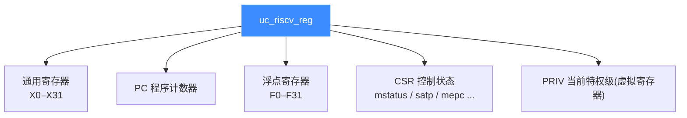

# RISC-V 寄存器参考

本页列出 Unicorn 中所有可读写的 RISC-V 寄存器常量：32 个通用寄存器 `x0`–`x31`、程序计数器 `PC`、32 个浮点寄存器 `f0`–`f31`，以及一批控制状态寄存器（CSR）。所有常量名与 ABI 别名均取自 [`include/unicorn/riscv.h`](https://github.com/android-security-engineer/unicorn-skills/blob/master/include/unicorn/riscv.h)，读完你能在 `uc_reg_read` / `uc_reg_write` 中用对名字。

## 🧩 寄存器分组



## 📌 通用寄存器与 ABI 别名

RISC-V 硬件上是 `x0`–`x31`，汇编里习惯用 ABI 别名。`riscv.h` 为每个别名都定义了等价常量，读写效果完全相同。

| UC 常量 | 别名常量 | ABI 名 | 约定用途 |
| --- | --- | --- | --- |
| `UC_RISCV_REG_X0` | `UC_RISCV_REG_ZERO` | zero | 恒为 0，写入无效 |
| `UC_RISCV_REG_X1` | `UC_RISCV_REG_RA` | ra | 返回地址 |
| `UC_RISCV_REG_X2` | `UC_RISCV_REG_SP` | sp | 栈指针 |
| `UC_RISCV_REG_X3` | `UC_RISCV_REG_GP` | gp | 全局指针 |
| `UC_RISCV_REG_X4` | `UC_RISCV_REG_TP` | tp | 线程指针 |
| `UC_RISCV_REG_X5`–`X7` | `UC_RISCV_REG_T0`–`T2` | t0–t2 | 临时寄存器 |
| `UC_RISCV_REG_X8` | `UC_RISCV_REG_S0` / `UC_RISCV_REG_FP` | s0/fp | 保存寄存器 / 帧指针 |
| `UC_RISCV_REG_X9` | `UC_RISCV_REG_S1` | s1 | 保存寄存器 |
| `UC_RISCV_REG_X10`–`X17` | `UC_RISCV_REG_A0`–`A7` | a0–a7 | 参数 / 返回值 |
| `UC_RISCV_REG_X18`–`X27` | `UC_RISCV_REG_S2`–`S11` | s2–s11 | 保存寄存器 |
| `UC_RISCV_REG_X28`–`X31` | `UC_RISCV_REG_T3`–`T6` | t3–t6 | 临时寄存器 |

::: tip 📌 X8 有两个别名
`UC_RISCV_REG_S0` 与 `UC_RISCV_REG_FP` 都指向 `X8`——它们是同一个物理寄存器，用哪个取决于编译约定。
:::

## 📤 PC 程序计数器

`UC_RISCV_REG_PC` 保存下一条要执行的指令地址。单步（`uc_emu_start` 计数参数为 1）后读回 PC 是最常见的调试手段：

```c
uint64_t pc = 0;
uc_reg_read(uc, UC_RISCV_REG_PC, &pc);
printf("PC = 0x%" PRIx64 "\n", pc);
```

## 🔢 浮点寄存器

`F0`–`F31` 是浮点扩展（F/D）寄存器，同样带一整套 ABI 别名（`FT0`–`FT11`、`FS0`–`FS11`、`FA0`–`FA7`）。下面是 `test_riscv64_fp_move` 中 `fmv.d f3, f1` 的读写片段：

```c
uint64_t r_f1 = 0x123456781a2b3c4dULL;
uint64_t r_f3 = 0x56780246aaaabbbbULL;
uc_reg_write(uc, UC_RISCV_REG_F1, &r_f1);
uc_reg_write(uc, UC_RISCV_REG_F3, &r_f3);
uc_emu_start(uc, code_start, -1, 0, 1);
uc_reg_read(uc, UC_RISCV_REG_F3, &r_f3); // 现在等于 f1 的值
```

| 别名段 | 对应寄存器 | 含义 |
| --- | --- | --- |
| `FT0`–`FT7` | F0–F7 | 浮点临时 |
| `FS0`–`FS1` | F8–F9 | 浮点保存 |
| `FA0`–`FA7` | F10–F17 | 浮点参数/返回值 |
| `FS2`–`FS11` | F18–F27 | 浮点保存 |
| `FT8`–`FT11` | F28–F31 | 浮点临时 |

::: warning ⚠️ 浮点寄存器是 64 位
即便在 RISCV32 模式下，`F0`–`F31` 也承载双精度（D 扩展）数据，因此读写时用 `uint64_t` 缓冲区。此外须先启用 `mstatus.fs`，否则浮点指令不生效。
:::

## 🧠 控制状态寄存器（CSR）

`riscv.h` 定义了大量 CSR，覆盖用户/监督/机器三级：

| 常量 | 用途 |
| --- | --- |
| `UC_RISCV_REG_MSTATUS` | 机器态状态字（含 `fs` 浮点使能位） |
| `UC_RISCV_REG_MEPC` | 机器态异常返回地址 |
| `UC_RISCV_REG_MTVEC` | 机器态陷入向量 |
| `UC_RISCV_REG_MCAUSE` | 机器态陷入原因 |
| `UC_RISCV_REG_SATP` / `UC_RISCV_REG_SPTBR` | 页表基址（MMU） |
| `UC_RISCV_REG_SSCRATCH` | 监督态临时存储 |
| `UC_RISCV_REG_MHARTID` | 硬件线程 ID |
| `UC_RISCV_REG_PRIV` | 虚拟寄存器：当前特权级（3=M,1=S,0=U） |

::: tip 📌 PRIV 是虚拟寄存器
`UC_RISCV_REG_PRIV` 并非真实硬件寄存器，而是 Unicorn 暴露的"当前特权级"视图。`test_riscv_priv` 直接读写它来强制切换 M/S/U 模式，详见 [模式与特权级](/arch/riscv/modes)。
:::

## 📂 相关源码

| 文件 | 角色 |
|------|------|
| [`include/unicorn/riscv.h`](https://github.com/android-security-engineer/unicorn-skills/blob/master/include/unicorn/riscv.h#L40) | `UC_RISCV_REG_*` 寄存器枚举与 `uc_cpu_*` CPU 型号定义 |
| [`qemu/target/riscv/unicorn.c`](https://github.com/android-security-engineer/unicorn-skills/blob/master/qemu/target/riscv/unicorn.c) | 后端：`reg_read`/`reg_write`/`uc_init` 等函数指针实现 |
| [`qemu/target/riscv/translate.c`](https://github.com/android-security-engineer/unicorn-skills/blob/master/qemu/target/riscv/translate.c) | 前端：机器码翻译（TCG） |
| [`samples/sample_riscv.c`](https://github.com/android-security-engineer/unicorn-skills/blob/master/samples/sample_riscv.c) | 该架构的 C 示例程序 |
| [`include/unicorn/unicorn.h`](https://github.com/android-security-engineer/unicorn-skills/blob/master/include/unicorn/unicorn.h#L106) | `UC_ARCH_RISCV` 架构常量与 `UC_MODE_*` 公共模式定义 |

## 相关页面

- [uc_reg_read](/api/reg-read)
- [uc_reg_write](/api/reg-write)
- [RISC-V 架构概览](/arch/riscv/)
- [RISC-V 模式与特权级](/arch/riscv/modes)
