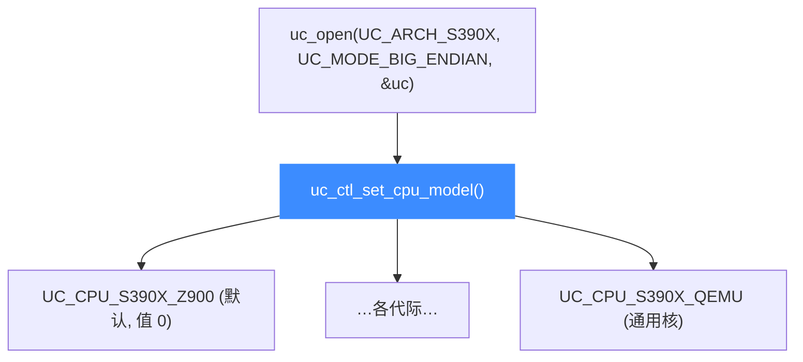

# S390X CPU 型号

本页讲清 Unicorn 支持的 S390X CPU 型号：`UC_CPU_S390X_*` 的真实取值（从 z900 一路到第 15 代 z15，外加通用的 qemu 核），以及如何用 [uc_ctl_set_cpu_model](/ctl/set-cpu-model) 切换型号。所有常量取自 [`include/unicorn/s390x.h`](https://github.com/android-security-engineer/unicorn-skills/blob/master/include/unicorn/s390x.h) 的 `enum uc_cpu_s390x`，读完你能为一段 S390X 代码选对处理器代际。

## 🧠 型号从哪来

Unicorn 的 S390X 后端沿用 QEMU 的 CPU 定义，覆盖 IBM System z 从 2000 年的 z900 到近代 z15 的各代机型。型号决定可用的指令集设施（facility）——较老的核不认识新代际引入的指令。



## 📋 型号列表

常量全部来自 `enum uc_cpu_s390x`，默认值为枚举 0 的 `UC_CPU_S390X_Z900`。按 IBM 机型代际归纳如下（同代际的 `_2`/`_3` 等为该型号的次级修订版本）：

| 常量 | 代际 / 说明 |
| --- | --- |
| `UC_CPU_S390X_Z900` / `_Z900_2` / `_Z900_3` | z900，第 1 代 64 位 System z（默认） |
| `UC_CPU_S390X_Z800` | z800 |
| `UC_CPU_S390X_Z990` / `_Z990_2` … `_Z990_5` | z990 系列 |
| `UC_CPU_S390X_Z890` / `_Z890_2` / `_Z890_3` | z890 系列 |
| `UC_CPU_S390X_Z9EC` / `_Z9EC_2` / `_Z9EC_3` | System z9 EC |
| `UC_CPU_S390X_Z9BC` / `_Z9BC_2` | System z9 BC |
| `UC_CPU_S390X_Z10EC` / `_Z10EC_2` / `_Z10EC_3` | System z10 EC |
| `UC_CPU_S390X_Z10BC` / `_Z10BC_2` | System z10 BC |
| `UC_CPU_S390X_Z196` / `_Z196_2` | zEnterprise 196 |
| `UC_CPU_S390X_Z114` | zEnterprise 114 |
| `UC_CPU_S390X_ZEC12` / `_ZEC12_2` | zEC12 |
| `UC_CPU_S390X_ZBC12` | zBC12 |
| `UC_CPU_S390X_Z13` / `_Z13_2` / `_Z13S` | z13 / z13s，第 13 代 |
| `UC_CPU_S390X_Z14` / `_Z14_2` / `_Z14ZR1` | z14 / z14 ZR1，第 14 代 |
| `UC_CPU_S390X_GEN15A` / `_GEN15B` | 第 15 代（z15 A/B 机型） |
| `UC_CPU_S390X_QEMU` | QEMU 通用虚拟核 |
| `UC_CPU_S390X_MAX` | 指向可用设施最全的核 |

::: warning ENDING 不是型号
`UC_CPU_S390X_ENDING` 仅是列表结束标记，不可传入。`UC_CPU_S390X_MAX` 是"最大能力"别名而非结束标记，可以使用。不要臆造头文件里没有的常量。
:::

## 🔧 切换型号

型号在 `uc_open()` 之后、`uc_emu_start()` 之前设置：

```c
#include <unicorn/unicorn.h>

uc_engine *uc;

// 打开大端 S390X 引擎
uc_open(UC_ARCH_S390X, UC_MODE_BIG_ENDIAN, &uc);

// 选用近代 z14 核
uc_err err = uc_ctl_set_cpu_model(uc, UC_CPU_S390X_Z14);
if (err != UC_ERR_OK) {
    printf("设置 CPU 型号失败: %s\n", uc_strerror(err));
}
```

::: tip 型号决定可用指令
新代际引入的指令设施在老型号上不可用。跑现代 z/Architecture 指令时选 `UC_CPU_S390X_GEN15A` 或 `UC_CPU_S390X_MAX`；只做 `lr` 这类基础指令时默认的 `UC_CPU_S390X_Z900` 就够。`UC_CPU_S390X_QEMU` 是稳妥的通用选择。
:::

## 📂 相关源码

| 文件 | 角色 |
|------|------|
| [`include/unicorn/s390x.h`](https://github.com/android-security-engineer/unicorn-skills/blob/master/include/unicorn/s390x.h#L61) | `UC_S390X_REG_*` 寄存器枚举与 `uc_cpu_*` CPU 型号定义 |
| [`qemu/target/s390x/unicorn.c`](https://github.com/android-security-engineer/unicorn-skills/blob/master/qemu/target/s390x/unicorn.c) | 后端：`reg_read`/`reg_write`/`uc_init` 等函数指针实现 |
| [`qemu/target/s390x/translate.c`](https://github.com/android-security-engineer/unicorn-skills/blob/master/qemu/target/s390x/translate.c) | 前端：机器码翻译（TCG） |
| [`samples/sample_s390x.c`](https://github.com/android-security-engineer/unicorn-skills/blob/master/samples/sample_s390x.c) | 该架构的 C 示例程序 |
| [`include/unicorn/unicorn.h`](https://github.com/android-security-engineer/unicorn-skills/blob/master/include/unicorn/unicorn.h#L107) | `UC_ARCH_S390X` 架构常量与 `UC_MODE_*` 公共模式定义 |

## 相关页面

- [uc_ctl_set_cpu_model](/ctl/set-cpu-model) — 设置 CPU 型号的控制接口
- [CPU 型号特性总览](/features/cpu-models) — 跨架构的型号与特性说明
- [S390X 架构概览](/arch/s390x/) — S390X 入门
- [S390X 实战示例](/arch/s390x/example) — 完整仿真走读
