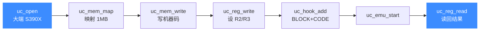

# S390X 实战示例

本页把官方 `sample_s390x.c` 拆开逐段讲解：从打开引擎、映射内存、写入 `lr %r2, %r3` 机器码、挂 BLOCK/CODE Hook，到启动仿真、读回寄存器。读完你能独立写出一个完整可运行的 S390X 仿真程序，并预判它的输出。

## 🎯 目标

仿真一条 z/Architecture 指令 `lr %r2, %r3`——把通用寄存器 R3 的值拷贝进 R2。这是最小但完整的 S390X 仿真闭环。



## 📥 完整代码

```c
#include <unicorn/unicorn.h>
#include <string.h>

// 待仿真机器码：lr %r2, %r3（2 字节，大端）
#define S390X_CODE "\x18\x23"

// 仿真起始地址
#define ADDRESS 0x10000

static void hook_block(uc_engine *uc, uint64_t address, uint32_t size,
                       void *user_data)
{
    printf(">>> Tracing basic block at 0x%" PRIx64 ", block size = 0x%x\n",
           address, size);
}

static void hook_code(uc_engine *uc, uint64_t address, uint32_t size,
                      void *user_data)
{
    printf(">>> Tracing instruction at 0x%" PRIx64
           ", instruction size = 0x%x\n",
           address, size);
}

static void test_s390x(void)
{
    uc_engine *uc;
    uc_hook trace1, trace2;
    uc_err err;

    uint64_t r2 = 2, r3 = 3;

    printf("Emulate S390X code\n");

    // 1. 初始化：S390X 架构 + 大端
    err = uc_open(UC_ARCH_S390X, UC_MODE_BIG_ENDIAN, &uc);
    if (err) {
        printf("Failed on uc_open() with error returned: %u (%s)\n", err,
               uc_strerror(err));
        return;
    }

    // 2. 映射 1MB 内存
    uc_mem_map(uc, ADDRESS, 1024 * 1024, UC_PROT_ALL);

    // 3. 写入机器码
    uc_mem_write(uc, ADDRESS, S390X_CODE, sizeof(S390X_CODE) - 1);

    // 4. 初始化寄存器：R2=2, R3=3
    uc_reg_write(uc, UC_S390X_REG_R2, &r2);
    uc_reg_write(uc, UC_S390X_REG_R3, &r3);

    // 5. 挂 Hook：追踪基本块与每条指令
    uc_hook_add(uc, &trace1, UC_HOOK_BLOCK, hook_block, NULL, 1, 0);
    uc_hook_add(uc, &trace2, UC_HOOK_CODE, hook_code, NULL, 1, 0);

    // 6. 启动仿真：跑完这段代码
    err = uc_emu_start(uc, ADDRESS, ADDRESS + sizeof(S390X_CODE) - 1, 0, 0);
    if (err) {
        printf("Failed on uc_emu_start() with error returned: %u (%s)\n", err,
               uc_strerror(err));
    }

    // 7. 读回寄存器
    printf(">>> Emulation done. Below is the CPU context\n");
    uc_reg_read(uc, UC_S390X_REG_R2, &r2);
    uc_reg_read(uc, UC_S390X_REG_R3, &r3);
    printf(">>> R2 = 0x%" PRIx64 "\t\t>>> R3 = 0x%" PRIx64 "\n", r2, r3);

    uc_close(uc);
}

int main(int argc, char **argv, char **envp)
{
    test_s390x();
    return 0;
}
```

## 🔧 逐段讲解

- **① uc_open**：架构固定为 [`UC_ARCH_S390X`](https://github.com/android-security-engineer/unicorn-skills/blob/master/include/unicorn/unicorn.h#L107)，mode 固定为 `UC_MODE_BIG_ENDIAN`（S390X 恒大端）。
- **② uc_mem_map**：在 `0x10000` 映射 1MB，权限 `UC_PROT_ALL`（可读可写可执行）。地址必须页对齐。
- **③ uc_mem_write**：把两字节机器码写进去；`sizeof(S390X_CODE) - 1` 去掉字符串结尾的 `\0`。
- **④ uc_reg_write**：先给 R2 写 2、R3 写 3，方便看出拷贝效果。
- **⑤ uc_hook_add**：`begin=1, end=0`（begin>end）表示全地址空间生效，见 [UC_HOOK_CODE](/hooks/code)。
- **⑥ uc_emu_start**：从 `ADDRESS` 执行到 `ADDRESS + 代码长度`；后两个 `0` 表示不限时长、不限指令数。
- **⑦ uc_reg_read**：读回 R2——`lr` 已把 R3 的值拷进来，R2 变成 3。

::: tip lr 的语义
`lr %r2, %r3` 即 "Load Register"，把 R3 完整拷贝到 R2。执行前 R2=2、R3=3，执行后 R2=3、R3=3。
:::

## 📤 预期输出

```
Emulate S390X code
>>> Tracing basic block at 0x10000, block size = 0x2
>>> Tracing instruction at 0x10000, instruction size = 0x2
>>> Emulation done. Below is the CPU context
>>> R2 = 0x3		>>> R3 = 0x3
```

R2 从 `0x2` 变为 `0x3`，证明 `lr` 拷贝成功；BLOCK 与 CODE Hook 各报告一次，指令 `size = 0x2` 正是这条 2 字节变长指令的长度。

::: warning 地址与长度要匹配
`uc_emu_start` 的终止地址若算错（比如漏掉 `- 1` 或多算字节），可能执行到未写入的内存而触发 `UC_ERR_INSN_INVALID`。始终用 `sizeof(CODE) - 1` 表示真实机器码长度。
:::

## 📂 相关源码

| 文件 | 角色 |
|------|------|
| [`include/unicorn/s390x.h`](https://github.com/android-security-engineer/unicorn-skills/blob/master/include/unicorn/s390x.h#L61) | `UC_S390X_REG_*` 寄存器枚举与 `uc_cpu_*` CPU 型号定义 |
| [`qemu/target/s390x/unicorn.c`](https://github.com/android-security-engineer/unicorn-skills/blob/master/qemu/target/s390x/unicorn.c) | 后端：`reg_read`/`reg_write`/`uc_init` 等函数指针实现 |
| [`qemu/target/s390x/translate.c`](https://github.com/android-security-engineer/unicorn-skills/blob/master/qemu/target/s390x/translate.c) | 前端：机器码翻译（TCG） |
| [`samples/sample_s390x.c`](https://github.com/android-security-engineer/unicorn-skills/blob/master/samples/sample_s390x.c) | 该架构的 C 示例程序 |
| [`include/unicorn/unicorn.h`](https://github.com/android-security-engineer/unicorn-skills/blob/master/include/unicorn/unicorn.h#L107) | `UC_ARCH_S390X` 架构常量与 `UC_MODE_*` 公共模式定义 |

## 相关页面

- [sample_s390x.c 走读](/samples/sample-s390x) — 官方样例说明
- [S390X 架构概览](/arch/s390x/) — 返回本章目录
- [S390X 寄存器参考](/arch/s390x/registers) — R2/R3/PC 等寄存器
- [S390X 指令与特性](/arch/s390x/instructions) — 变长指令与 Hook
