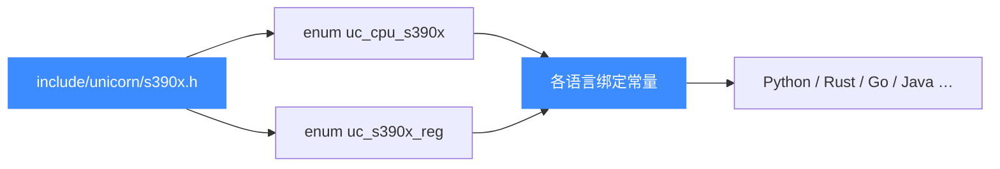
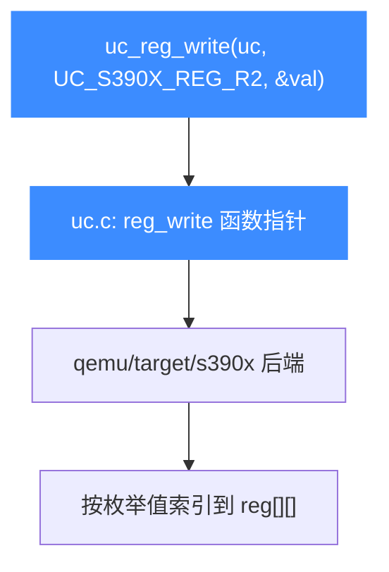
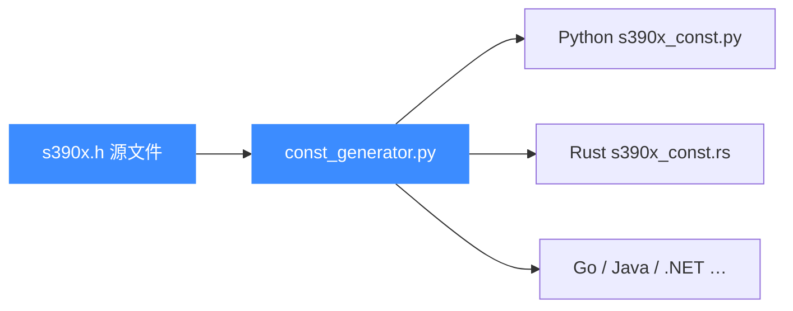

# S390X 头文件常量参考

本页是 [`include/unicorn/s390x.h`](https://github.com/android-security-engineer/unicorn-skills/blob/master/include/unicorn/s390x.h) 的常量参考：它定义了 S390X（z/Architecture）的 CPU 型号枚举 `uc_cpu_s390x` 与寄存器 ID 枚举 `uc_s390x_reg`，是所有语言绑定里 S390X 常量的**唯一来源（source of truth）**。读完你能知道这个头文件里有什么、改了它会影响哪些绑定，以及为什么这里没有 `UC_MODE_*` 和 `UC_S390X_INS_*`。

## 📌 概述

[`include/unicorn/s390x.h`](https://github.com/android-security-engineer/unicorn-skills/blob/master/include/unicorn/s390x.h) 是一个纯 C 头文件，对外暴露两类枚举：

- **CPU 型号** `uc_cpu_s390x` —— 从 z900 到 z15、外加 `qemu` 通用核，共 39 个型号，详见 [CPU 型号](/arch/s390x/cpu-models)。
- **寄存器 ID** `uc_s390x_reg` —— 通用、浮点、访问、控制寄存器及 PC/PSWM，详见 [寄存器参考](/arch/s390x/registers)。

它**不**定义 `UC_MODE_*` 模式位，也**不**定义 `UC_S390X_INS_*` 指令 ID 枚举。前者是跨架构的全局常量，住在 [unicorn.h](/headers/unicorn-h)；后者在 S390X 上不存在——Unicorn 的 S390X 后端不暴露指令 ID 列表（不像 x86/arm 那样有 disassembler 风格的 `UC_<arch>_INS_*`）。因此本页只讲上面两个枚举。



## 💻 用法

在 C 代码里直接 `#include <unicorn/unicorn.h>` 即可（它会间接拉入 `s390x.h`）。下方片段展示用本头文件的常量打开引擎并读写寄存器：

```c
#include <unicorn/unicorn.h>

uc_engine *uc;
// S390X 恒为大端，mode 取自 unicorn.h 的全局 UC_MODE_BIG_ENDIAN
uc_err err = uc_open(UC_ARCH_S390X, UC_MODE_BIG_ENDIAN, &uc);
if (err != UC_ERR_OK) {
    printf("uc_open 失败: %s\n", uc_strerror(err));
    return -1;
}

// 用本头文件的寄存器 ID 写 R2、读 PC
uint64_t r2 = 0x1000;
uc_reg_write(uc, UC_S390X_REG_R2, &r2);
uint64_t pc = 0;
uc_reg_read(uc, UC_S390X_REG_PC, &pc);

uc_close(uc);
```

切换 CPU 型号时同样用到本头文件的 `uc_cpu_s390x`：

```c
#include <unicorn/unicorn.h>
#include <unicorn/unicorn.h> // uc_ctl 原型

// 切到通用 qemu 核
uc_ctl_set_cpu_model(uc, UC_CPU_S390X_QEMU);
```

## 📖 寄存器 ID 枚举（uc_s390x_reg）

`enum uc_s390x_reg` 给每个可读写寄存器一个稳定编号，供 `uc_reg_read` / `uc_reg_write` 使用。下表列出最常用的一批（完整列表与分组解释见 [寄存器参考](/arch/s390x/registers)）：

| 常量 | 含义 |
| --- | --- |
| `UC_S390X_REG_INVALID` | 占位，值为 0，不可用 |
| `UC_S390X_REG_R0` … `UC_S390X_REG_R15` | 16 个 64 位通用寄存器（GPR） |
| `UC_S390X_REG_F0` … `UC_S390X_REG_F15` | 16 个浮点寄存器（FPR） |
| `UC_S390X_REG_F16` … `UC_S390X_REG_F31` | vr16-vr31 的**低半部**（伪寄存器，非真实寄存器） |
| `UC_S390X_REG_A0` … `UC_S390X_REG_A15` | 16 个访问寄存器（AR），用于地址空间切换 |
| `UC_S390X_REG_PC` | 程序计数器（指令地址） |
| `UC_S390X_REG_PSWM` | PSW 掩码（程序状态字掩码） |
| `UC_S390X_REG_F0_HI` … `UC_S390X_REG_F31_HI` | vr16-vr31 的**高半部**（伪寄存器） |
| `UC_S390X_REG_FPC` | 浮点控制寄存器 |
| `UC_S390X_REG_CR0` … `UC_S390X_REG_CR15` | 16 个控制寄存器（CR），管内存与中断 |
| `UC_S390X_REG_ENDING` | 枚举上界标记，用于校验 |

::: warning F16-F31 / F*_HI 是伪寄存器
头文件注释明确写着 `F16-F31` 是 `vr16-vr31` 的低半部、`F*_HI` 是高半部——它们用来配合向量寄存器（VR）的 128 位读写。做标量浮点仿真只需 F0-F15；碰向量指令时再用这些伪寄存器拼出完整 128 位。
:::

## 📖 CPU 型号枚举（uc_cpu_s390x）

`enum uc_cpu_s390x` 列出支持的 IBM System z 处理器代际，默认值为 0（`UC_CPU_S390X_Z900`）。下表节选代表性型号，完整列表见 [CPU 型号](/arch/s390x/cpu-models)：

| 常量 | 代际 / 说明 |
| --- | --- |
| `UC_CPU_S390X_Z900` | z900，第 1 代 64 位 System z（默认，值 0） |
| `UC_CPU_S390X_Z990` | z990 系列 |
| `UC_CPU_S390X_Z9EC` | System z9 EC |
| `UC_CPU_S390X_Z10EC` | System z10 EC |
| `UC_CPU_S390X_Z196` | z196（zEnterprise 196） |
| `UC_CPU_S390X_ZEC12` | EC12 |
| `UC_CPU_S390X_Z13` | z13 |
| `UC_CPU_S390X_Z14` | z14 |
| `UC_CPU_S390X_GEN15A` / `_GEN15B` | 第 15 代（z15） |
| `UC_CPU_S390X_QEMU` | 通用 qemu 核，设施最全 |
| `UC_CPU_S390X_MAX` | 启用全部设施的最大模型 |
| `UC_CPU_S390X_ENDING` | 枚举上界标记 |

## ⚠️ 关于 MODE 与 INS 枚举

如果你是从 x86 或 arm 头文件过来的，会发现 S390X 头文件少了两组东西：

| 期望看到 | 实际情况 | 原因 |
| --- | --- | --- |
| `UC_MODE_S390X_*` 模式位 | 不在本头文件 | S390X 只有一种合法 mode（64 位大端），用的是 [unicorn.h](/headers/unicorn-h) 里的全局 `UC_MODE_BIG_ENDIAN`，见 [模式与字节序](/arch/s390x/modes) |
| `UC_S390X_INS_*` 指令 ID | 不存在 | S390X 后端不暴露指令 ID 枚举；Unicorn 对 S390X 不提供 disassembler 风格的指令清单。要观察具体指令用 [Hook 体系](/features/hooks) 在代码执行时拦截 |

::: details 为什么 S390X 没有 INS 枚举
`UC_<arch>_INS_*` 这类指令 ID 来自 Capstone 风格的反汇编器枚举。Unicorn 在 x86、arm 等架构上沿用了它，但 S390X 后端（vendored QEMU 的 `qemu/target/s390x`）只做执行、不做指令枚举暴露，因此头文件里没有对应枚举。需要指令级行为时，靠 hook 代码块或单步即可。
:::

## 🔧 实现

头文件本身只是一个 `typedef enum` 集合，没有任何函数声明——它只给常量编号。真正的寄存器读写实现在 `uc.c` 里通过 `uc_struct` 的 `reg_read` / `reg_write` 函数指针派发到 `qemu/target/s390x` 的后端代码。`uc_s390x_reg` 的数值顺序必须与后端的寄存器数组下标对齐，所以**不要手改枚举顺序**：



## 📖 头文件被绑定生成器消费

`bindings/const_generator.py` 会读这个头文件，把 `uc_cpu_s390x` 与 `uc_s390x_reg` 的每个常量翻译成各语言对应文件（Python 的 `s390x_const.py`、Rust 的 `s390x_const.rs`、Go 的 `s390x_const.go` 等）。消费流程：



::: tip 改了头文件必须重新生成绑定
这些常量是**所有绑定的来源（source of truth）**。如果你在 [`include/unicorn/s390x.h`](https://github.com/android-security-engineer/unicorn-skills/blob/master/include/unicorn/s390x.h) 里增删或重排了枚举值，必须跑一次 `bindings/const_generator.py` 重新生成各语言的 `*_const.*` 文件，否则绑定里的常量编号会与 C 端错位。详见 [常量生成器](/bindings/const-generator)。
:::

```bash
# 在仓库根目录执行，重新生成全部绑定的常量文件
python bindings/const_generator.py
```

## 📂 相关源码

| 文件 | 角色 |
|------|------|
| [`include/unicorn/s390x.h`](https://github.com/android-security-engineer/unicorn-skills/blob/master/include/unicorn/s390x.h#L61) | `UC_S390X_REG_*` 寄存器枚举与 `uc_cpu_*` CPU 型号定义 |
| [`qemu/target/s390x/unicorn.c`](https://github.com/android-security-engineer/unicorn-skills/blob/master/qemu/target/s390x/unicorn.c) | 后端：`reg_read`/`reg_write`/`uc_init` 等函数指针实现 |
| [`qemu/target/s390x/translate.c`](https://github.com/android-security-engineer/unicorn-skills/blob/master/qemu/target/s390x/translate.c) | 前端：机器码翻译（TCG） |
| [`samples/sample_s390x.c`](https://github.com/android-security-engineer/unicorn-skills/blob/master/samples/sample_s390x.c) | 该架构的 C 示例程序 |
| [`include/unicorn/unicorn.h`](https://github.com/android-security-engineer/unicorn-skills/blob/master/include/unicorn/unicorn.h#L107) | `UC_ARCH_S390X` 架构常量与 `UC_MODE_*` 公共模式定义 |

## 相关页面

- [S390X 架构概览](/arch/s390x/)
- [S390X 寄存器参考](/arch/s390x/registers)
- [S390X CPU 型号](/arch/s390x/cpu-models)
- [常量生成器](/bindings/const-generator)
- [unicorn.h 全局头文件](/headers/unicorn-h)
