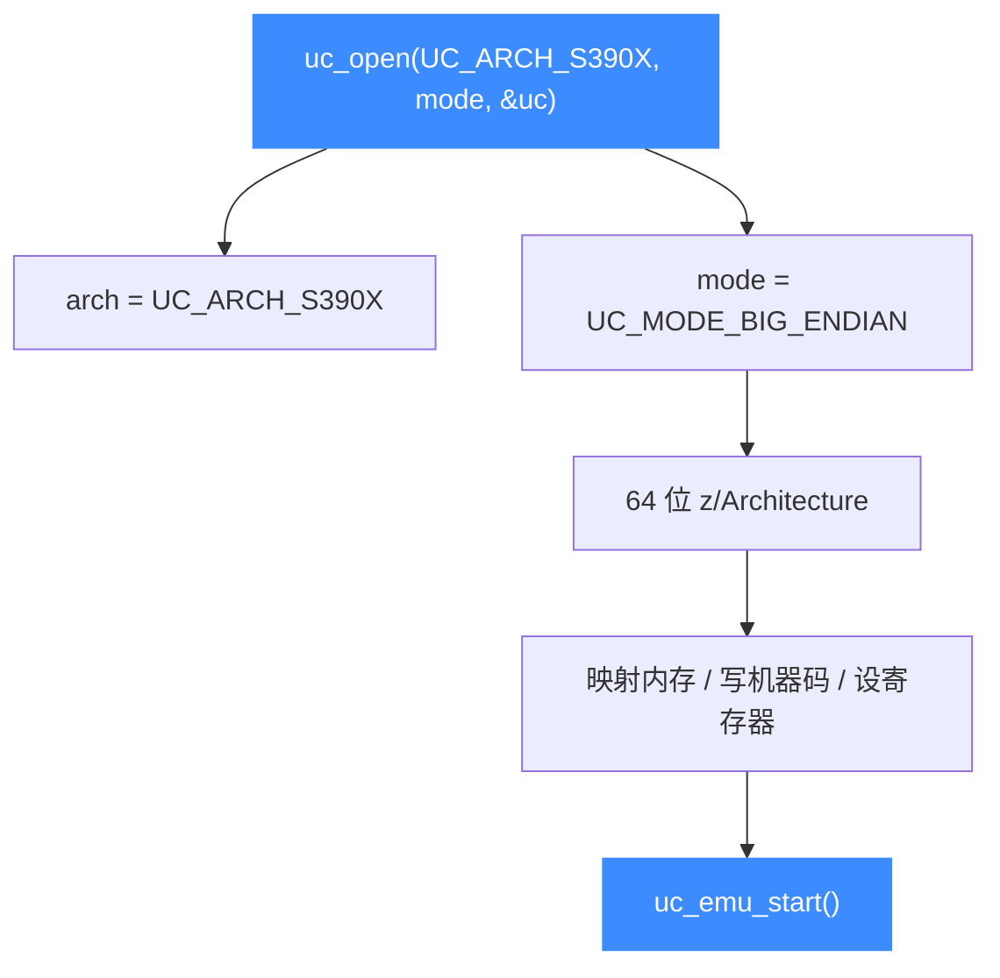

# S390X 架构概览

本页介绍 Unicorn 对 IBM System z 大型机架构（[`UC_ARCH_S390X`](https://github.com/android-security-engineer/unicorn-skills/blob/master/include/unicorn/unicorn.h#L107)，即 z/Architecture）的支持：64 位、纯大端、变长指令，以及它在大型机安全研究与遗留代码分析中的用途。读完你能用 `uc_open` 打开一个 S390X 引擎，并知道后续该看哪几页。

## 🧩 S390X 是什么

S390X 是 IBM System z（曾用名 S/390、zSeries）大型机的 64 位指令集架构，官方称 **z/Architecture**。它统治着银行、保险、航空订票等对可靠性要求极高的核心业务系统，运行 z/OS、z/VM 以及大端 Linux on Z。做这类大型机二进制的逆向、漏洞研究或指令行为验证时，很难搞到真机，Unicorn 让你无需 System z 硬件就能把 S390X 代码片段跑起来，配合 [Hook 体系](/features/hooks) 观察寄存器与内存。

S390X 有三个与常见 x86/ARM 不同的鲜明特征：**架构固定大端**、**指令变长**（2/4/6 字节）、以及用 **PSW（程序状态字）** 统一表达执行状态。这几点在本章后续页面逐一展开。

## ⚡ 打开一个 S390X 引擎

S390X 只有一种字节序——大端，因此 mode 固定为 `UC_MODE_BIG_ENDIAN`：



::: warning S390X 恒为大端
不同于 ARM/MIPS 可选字节序，z/Architecture **只有大端**。打开时必须带 `UC_MODE_BIG_ENDIAN`，否则语义不符。字节序细节见 [字节序](/features/endianness)。
:::

## 🔧 最小示例

```c
#include <unicorn/unicorn.h>

uc_engine *uc;
// 打开一个 64 位大端的 S390X 引擎
uc_err err = uc_open(UC_ARCH_S390X, UC_MODE_BIG_ENDIAN, &uc);
if (err != UC_ERR_OK) {
    printf("uc_open 失败: %s\n", uc_strerror(err));
    return -1;
}
// ... 映射内存、写机器码、设寄存器、uc_emu_start ...
uc_close(uc);
```

## 🎯 典型用途

- **大型机安全研究**：分析 z/OS 上的模块、加载器、系统调用行为。
- **遗留代码验证**：银行核心系统里大量 COBOL/汇编代码编译为 S390X，可片段化验证。
- **指令语义实验**：无需真机即可观察 `lr`、`svc` 等指令对寄存器与 PSW 的影响。
- **跨架构工具测试**：为反汇编器、模糊测试框架提供可控的大端执行环境。

## 📚 本章导航

| 页面 | 内容 |
|------|------|
| [寄存器参考](/arch/s390x/registers) | R0-R15、PC、F0-F15、A0-A15、PSW 及 `UC_S390X_REG_*` 常量 |
| [模式与字节序](/arch/s390x/modes) | 64 位、固定大端、`UC_MODE_BIG_ENDIAN` |
| [指令与特性](/arch/s390x/instructions) | 变长指令、`svc` 系统调用、单步 Hook |
| [CPU 型号](/arch/s390x/cpu-models) | `UC_CPU_S390X_*`（z900…z15、qemu）与 `uc_ctl_set_cpu_model` |
| [实战示例](/arch/s390x/example) | 完整可运行的 `lr` 仿真走读 |

## 📂 相关源码

| 文件 | 角色 |
|------|------|
| [`include/unicorn/s390x.h`](https://github.com/android-security-engineer/unicorn-skills/blob/master/include/unicorn/s390x.h#L61) | `UC_S390X_REG_*` 寄存器枚举与 `uc_cpu_*` CPU 型号定义 |
| [`qemu/target/s390x/unicorn.c`](https://github.com/android-security-engineer/unicorn-skills/blob/master/qemu/target/s390x/unicorn.c) | 后端：`reg_read`/`reg_write`/`uc_init` 等函数指针实现 |
| [`qemu/target/s390x/translate.c`](https://github.com/android-security-engineer/unicorn-skills/blob/master/qemu/target/s390x/translate.c) | 前端：机器码翻译（TCG） |
| [`samples/sample_s390x.c`](https://github.com/android-security-engineer/unicorn-skills/blob/master/samples/sample_s390x.c) | 该架构的 C 示例程序 |
| [`include/unicorn/unicorn.h`](https://github.com/android-security-engineer/unicorn-skills/blob/master/include/unicorn/unicorn.h#L107) | `UC_ARCH_S390X` 架构常量与 `UC_MODE_*` 公共模式定义 |

## 相关页面

- [sample_s390x.c 走读](/samples/sample-s390x)
- [字节序（Endianness）](/features/endianness)
- [S390X 寄存器参考](/arch/s390x/registers)
- [S390X CPU 型号](/arch/s390x/cpu-models)
