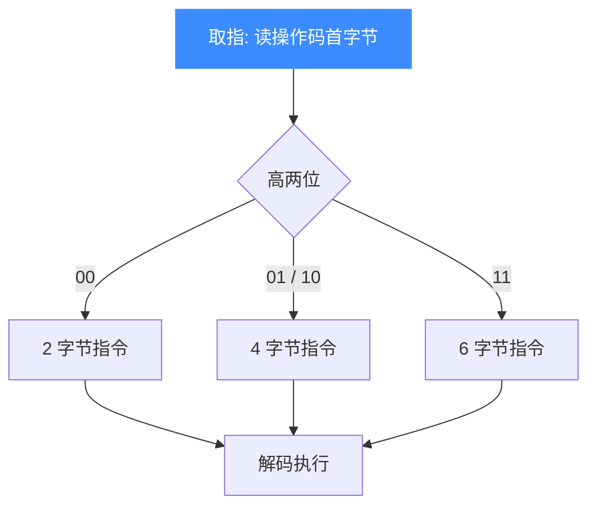
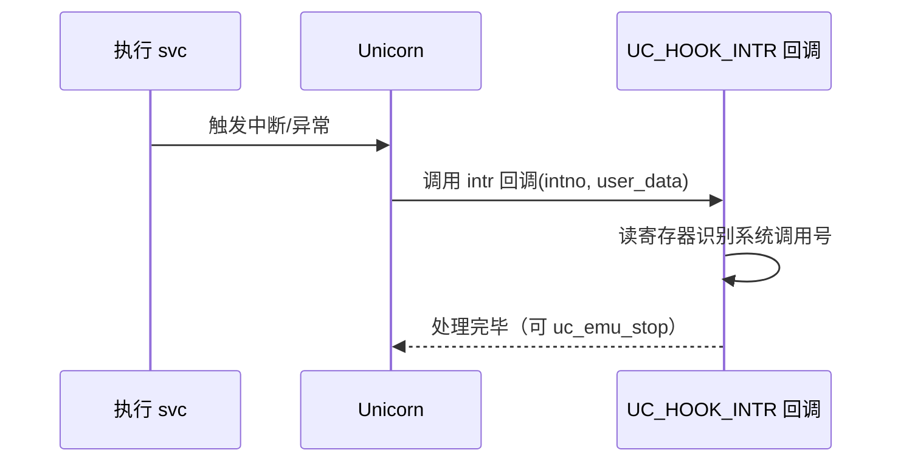

# S390X 指令与特性

本页讲清 Unicorn 仿真 S390X 代码时几个绕不开的特性：变长指令编码、`svc` 系统调用如何配合 [UC_HOOK_INTR](/hooks/intr) 处理、以及用 [UC_HOOK_CODE](/hooks/code) 做指令级单步追踪（以 `lr` 寄存器拷贝为例）。读完你能读懂 S390X 机器码的长度规律并挂上正确的 Hook。

## 🧩 变长指令编码

z/Architecture 指令不是定长的，长度为 **2、4 或 6 字节**，由操作码首字节的高两位决定。这与 x86 的复杂变长不同，规则相对规整。



| 指令示例 | 机器码 | 长度 |
| --- | --- | --- |
| `lr %r2, %r3`（寄存器拷贝） | `\x18\x23` | 2 字节 |
| `svc`（系统调用） | `\x0a` + 调用号 | 2 字节 |

::: tip 单步时 size 会变
`UC_HOOK_CODE` 回调的 `size` 参数就是当前指令的实际字节数，S390X 上它会随指令类型在 2/4/6 间变化，据此可精确推进反汇编游标。
:::

## 🪝 svc 系统调用与 UC_HOOK_INTR

S390X 通过 `svc`（Supervisor Call）指令陷入内核发起系统调用。在 Unicorn 里，`svc` 触发一次中断/异常事件，需用 `UC_HOOK_INTR` 捕获并自定义处理。



```c
#include <unicorn/unicorn.h>

// svc 触发的中断回调
static void hook_intr(uc_engine *uc, uint32_t intno, void *user_data)
{
    printf(">>> 中断触发, intno = %u\n", intno);
    // 读通用寄存器识别系统调用号 / 参数，做自定义处理
}

// 注册：全地址空间生效
uc_hook h_intr;
uc_hook_add(uc, &h_intr, UC_HOOK_INTR, hook_intr, NULL, 1, 0);
```

::: warning intno 语义依实现而定
`UC_HOOK_INTR` 回调只给出中断号 `intno`，具体系统调用号通常在通用寄存器里，需要你按目标 ABI 自行解析。它不会替你完成任何真实的 z/OS/Linux 系统调用语义。
:::

## 🔧 用 UC_HOOK_CODE 单步（以 lr 为例）

`UC_HOOK_CODE` 在每条指令执行**前**触发，是做单步、断点、指令追踪的核心。下面追踪一条 `lr %r2, %r3`（把 R3 拷贝进 R2）：

```c
#include <unicorn/unicorn.h>

#define CODE "\x18\x23" // lr %r2, %r3
#define ADDRESS 0x10000

static void hook_code(uc_engine *uc, uint64_t address, uint32_t size,
                      void *user_data)
{
    printf(">>> 指令 @0x%" PRIx64 ", size = 0x%x\n", address, size);
}

// ... uc_open(UC_ARCH_S390X, UC_MODE_BIG_ENDIAN, &uc) 之后 ...
uc_hook trace;
uc_hook_add(uc, &trace, UC_HOOK_CODE, hook_code, NULL, 1, 0);
uc_emu_start(uc, ADDRESS, ADDRESS + sizeof(CODE) - 1, 0, 0);
```

对这条 2 字节的 `lr`，回调会打印 `size = 0x2`，执行后 R2 等于 R3 的值、PC 前进到指令末尾。

::: tip 停止仿真
CODE/BLOCK 回调的返回值无意义，要在某条指令处停下请在回调里调用 `uc_emu_stop(uc)`。断点就是这样实现的。
:::

## 📂 相关源码

| 文件 | 角色 |
|------|------|
| [`include/unicorn/s390x.h`](https://github.com/android-security-engineer/unicorn-skills/blob/master/include/unicorn/s390x.h#L61) | `UC_S390X_REG_*` 寄存器枚举与 `uc_cpu_*` CPU 型号定义 |
| [`qemu/target/s390x/unicorn.c`](https://github.com/android-security-engineer/unicorn-skills/blob/master/qemu/target/s390x/unicorn.c) | 后端：`reg_read`/`reg_write`/`uc_init` 等函数指针实现 |
| [`qemu/target/s390x/translate.c`](https://github.com/android-security-engineer/unicorn-skills/blob/master/qemu/target/s390x/translate.c) | 前端：机器码翻译（TCG） |
| [`samples/sample_s390x.c`](https://github.com/android-security-engineer/unicorn-skills/blob/master/samples/sample_s390x.c) | 该架构的 C 示例程序 |
| [`include/unicorn/unicorn.h`](https://github.com/android-security-engineer/unicorn-skills/blob/master/include/unicorn/unicorn.h#L107) | `UC_ARCH_S390X` 架构常量与 `UC_MODE_*` 公共模式定义 |

## 相关页面

- [UC_HOOK_CODE — 指令级 Hook](/hooks/code) — 单步与断点
- [UC_HOOK_INTR — 中断/异常 Hook](/hooks/intr) — svc 系统调用处理
- [S390X 寄存器参考](/arch/s390x/registers) — 指令操作的寄存器
- [S390X 实战示例](/arch/s390x/example) — 完整的 lr 仿真走读
