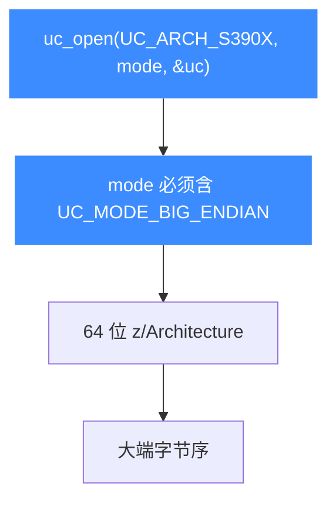
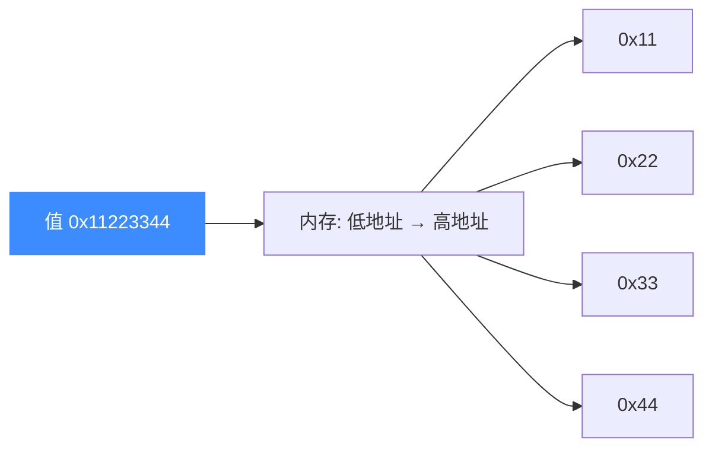

# S390X 模式与字节序

本页讲清 Unicorn 打开 S390X 引擎时的 mode 选择：z/Architecture 是纯 64 位、固定大端架构，因此 mode 固定为 `UC_MODE_BIG_ENDIAN`。读完你能理解为什么这里没有位宽和字节序的组合空间，以及大端对读写内存/机器码的影响。

## 🧩 只有一种组合

不同于 [ARM](/arch/arm/) 或 [MIPS](/arch/mips/) 那种 32/64 位 × 大小端的多重组合，S390X 在 Unicorn 里**只有一种合法 mode**：64 位 + 大端。



## 📋 mode 取值

| mode | 含义 | S390X 是否适用 |
| --- | --- | --- |
| `UC_MODE_BIG_ENDIAN` | 大端字节序 | ✅ 必须 |
| `UC_MODE_LITTLE_ENDIAN` | 小端（值为 0） | ❌ 不适用 |
| `UC_MODE_32` / 位宽位 | 32 位模式 | ❌ z/Architecture 恒 64 位 |

::: warning 必须显式带大端标志
`UC_MODE_LITTLE_ENDIAN = 0`，如果只写 `0` 或漏掉字节序标志，语义就不是 S390X 期望的大端。官方 sample 与单元测试都统一写 `UC_MODE_BIG_ENDIAN`。
:::

## 🔧 打开引擎

```c
#include <unicorn/unicorn.h>

uc_engine *uc;
// z/Architecture 唯一合法 mode：大端
uc_err err = uc_open(UC_ARCH_S390X, UC_MODE_BIG_ENDIAN, &uc);
if (err != UC_ERR_OK) {
    printf("uc_open 失败: %s\n", uc_strerror(err));
    return -1;
}
```

## 🧠 大端意味着什么

大端（big-endian）指多字节数据的**高位字节存在低地址**。这直接影响你往内存里写的机器码和数据的字节顺序。



::: tip 机器码字节顺序
S390X 的 `lr %r2, %r3` 机器码是 `\x18\x23`——两字节按大端顺序写入即可，Unicorn 会按大端解码。而 `uc_reg_read/write` 传的是**主机端的 `uint64_t`**，无需你手动做字节序转换，引擎内部处理好架构侧的大端表示。
:::

## 📂 相关源码

| 文件 | 角色 |
|------|------|
| [`include/unicorn/s390x.h`](https://github.com/android-security-engineer/unicorn-skills/blob/master/include/unicorn/s390x.h#L61) | `UC_S390X_REG_*` 寄存器枚举与 `uc_cpu_*` CPU 型号定义 |
| [`qemu/target/s390x/unicorn.c`](https://github.com/android-security-engineer/unicorn-skills/blob/master/qemu/target/s390x/unicorn.c) | 后端：`reg_read`/`reg_write`/`uc_init` 等函数指针实现 |
| [`qemu/target/s390x/translate.c`](https://github.com/android-security-engineer/unicorn-skills/blob/master/qemu/target/s390x/translate.c) | 前端：机器码翻译（TCG） |
| [`samples/sample_s390x.c`](https://github.com/android-security-engineer/unicorn-skills/blob/master/samples/sample_s390x.c) | 该架构的 C 示例程序 |
| [`include/unicorn/unicorn.h`](https://github.com/android-security-engineer/unicorn-skills/blob/master/include/unicorn/unicorn.h#L107) | `UC_ARCH_S390X` 架构常量与 `UC_MODE_*` 公共模式定义 |

## 相关页面

- [字节序（Endianness）](/features/endianness) — 大小端的统一说明
- [S390X 架构概览](/arch/s390x/) — S390X 入门
- [S390X 指令与特性](/arch/s390x/instructions) — 变长指令与机器码
- [S390X 实战示例](/arch/s390x/example) — 大端仿真完整走读
