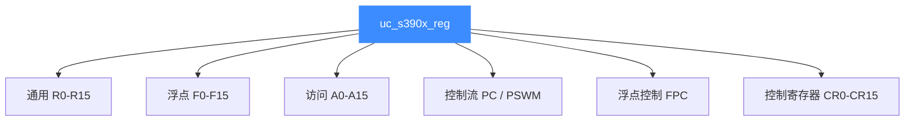

# S390X 寄存器参考

本页列出 Unicorn 中 S390X（z/Architecture）可读写的寄存器：16 个通用寄存器 R0-R15、程序计数器 PC、16 个浮点寄存器 F0-F15、16 个访问寄存器 A0-A15、程序状态字掩码 PSWM，以及浮点/控制寄存器。所有常量均取自 [`include/unicorn/s390x.h`](https://github.com/android-security-engineer/unicorn-skills/blob/master/include/unicorn/s390x.h) 的 `enum uc_s390x_reg`，读完你能用 [uc_reg_read](/api/reg-read) / `uc_reg_write` 准确读写目标寄存器。

## 🧠 寄存器分组



## 📋 通用寄存器（GPR）

z/Architecture 有 16 个 64 位通用寄存器，是最常用的一组。`lr` 等指令在它们之间搬运数据。

| 常量 | 说明 |
| --- | --- |
| `UC_S390X_REG_R0` … `UC_S390X_REG_R15` | 16 个 64 位通用寄存器 |

::: tip 调用约定里的角色
在 Linux on Z 的 ABI 中，R2-R6 用于传参、R2 兼作返回值，R14 存返回地址，R15 是栈指针。Unicorn 只提供寄存器本身，约定由你编写的代码决定。
:::

## 📋 浮点寄存器（FPR）

| 常量 | 说明 |
| --- | --- |
| `UC_S390X_REG_F0` … `UC_S390X_REG_F15` | 16 个浮点寄存器 |

::: warning F16-F31 并非真实寄存器
头文件里紧接着还有 `UC_S390X_REG_F16` … `UC_S390X_REG_F31`，注释标明它们是 **vr16-vr31 的低半部**；另有 `UC_S390X_REG_F0_HI` … `UC_S390X_REG_F31_HI` 是向量寄存器高半部的伪寄存器。做标量浮点时只用 F0-F15 即可。
:::

## 📋 访问寄存器（AR）

访问寄存器配合通用寄存器实现 z/Architecture 的**访问寄存器寻址模式**（跨地址空间访问）。

| 常量 | 说明 |
| --- | --- |
| `UC_S390X_REG_A0` … `UC_S390X_REG_A15` | 16 个 32 位访问寄存器 |

## 📋 控制流与状态

| 常量 | 说明 |
| --- | --- |
| `UC_S390X_REG_PC` | 程序计数器（指向下一条指令） |
| `UC_S390X_REG_PSWM` | 程序状态字（PSW）掩码部分，含条件码、程序掩码等状态位 |

::: tip PC 与 PSW 的关系
在真实 z/Architecture 中，指令地址其实是 PSW 的一部分。Unicorn 把便于观察的指令地址单独暴露为 `UC_S390X_REG_PC`，把 PSW 的掩码/状态位放在 `UC_S390X_REG_PSWM`。校验单步执行时常读 PC 判断是否前进。
:::

## 📋 浮点控制与控制寄存器

| 常量 | 说明 |
| --- | --- |
| `UC_S390X_REG_FPC` | 浮点控制寄存器（舍入模式、异常掩码） |
| `UC_S390X_REG_CR0` … `UC_S390X_REG_CR15` | 16 个控制寄存器（系统级配置） |

## 🔧 读写寄存器示例

```c
#include <unicorn/unicorn.h>

uint64_t r3 = 0x114514;
uint64_t r2 = 0, pc = 0;

// 写入 R3
uc_reg_write(uc, UC_S390X_REG_R3, &r3);

// 执行 "lr %r2, %r3"（把 R3 拷贝到 R2）后读回
uc_reg_read(uc, UC_S390X_REG_R2, &r2);
uc_reg_read(uc, UC_S390X_REG_PC, &pc);

printf("R2 = 0x%" PRIx64 ", PC = 0x%" PRIx64 "\n", r2, pc);
```

::: warning ENDING 不是寄存器
`UC_S390X_REG_INVALID`（值 0）与 `UC_S390X_REG_ENDING` 只是枚举边界标记，不能作为寄存器传入 `uc_reg_read/write`。
:::

## 📂 相关源码

| 文件 | 角色 |
|------|------|
| [`include/unicorn/s390x.h`](https://github.com/android-security-engineer/unicorn-skills/blob/master/include/unicorn/s390x.h#L61) | `UC_S390X_REG_*` 寄存器枚举与 `uc_cpu_*` CPU 型号定义 |
| [`qemu/target/s390x/unicorn.c`](https://github.com/android-security-engineer/unicorn-skills/blob/master/qemu/target/s390x/unicorn.c) | 后端：`reg_read`/`reg_write`/`uc_init` 等函数指针实现 |
| [`qemu/target/s390x/translate.c`](https://github.com/android-security-engineer/unicorn-skills/blob/master/qemu/target/s390x/translate.c) | 前端：机器码翻译（TCG） |
| [`samples/sample_s390x.c`](https://github.com/android-security-engineer/unicorn-skills/blob/master/samples/sample_s390x.c) | 该架构的 C 示例程序 |
| [`include/unicorn/unicorn.h`](https://github.com/android-security-engineer/unicorn-skills/blob/master/include/unicorn/unicorn.h#L107) | `UC_ARCH_S390X` 架构常量与 `UC_MODE_*` 公共模式定义 |

## 相关页面

- [uc_reg_read](/api/reg-read) — 读取寄存器值
- [S390X 架构概览](/arch/s390x/) — S390X 入门
- [S390X 指令与特性](/arch/s390x/instructions) — 指令如何改变寄存器
- [S390X 实战示例](/arch/s390x/example) — 完整寄存器读写走读
