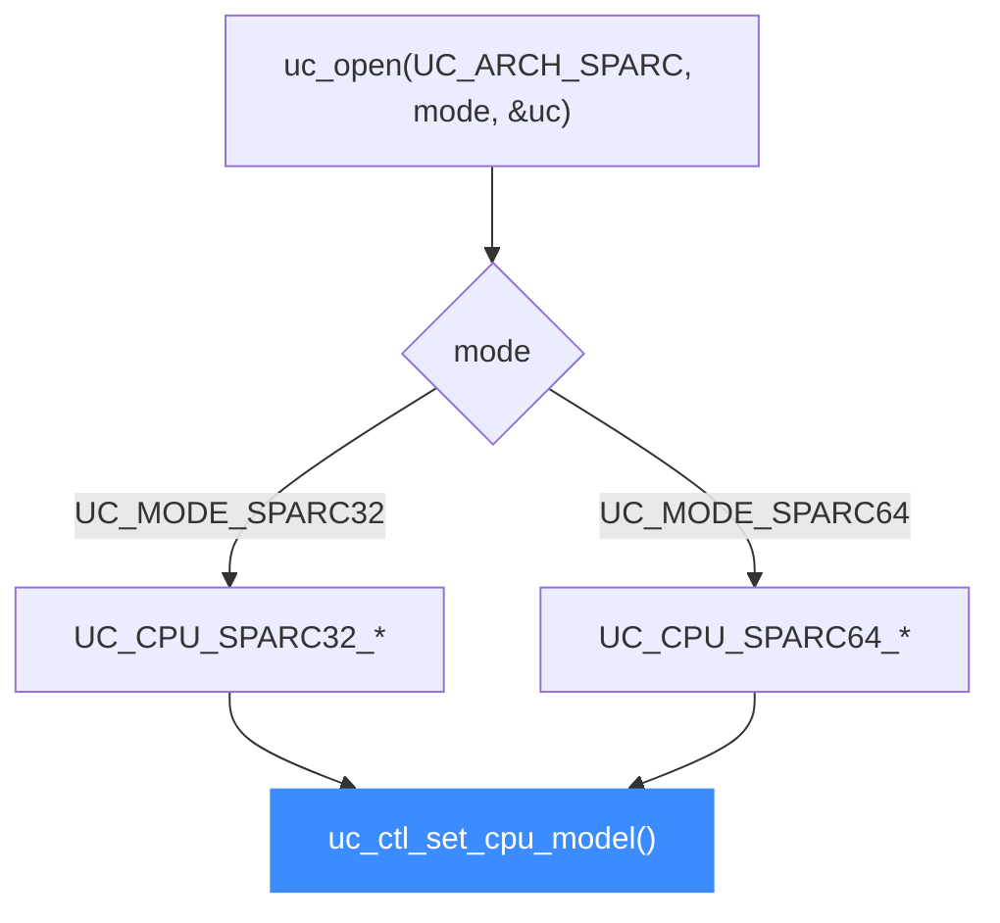

# SPARC CPU 型号

本页列出 Unicorn 支持的 SPARC CPU 型号：`UC_CPU_SPARC32_*` 与 `UC_CPU_SPARC64_*` 的真实取值，以及用 [uc_ctl_set_cpu_model](/ctl/set-cpu-model) 切换处理器核。所有常量取自 [`include/unicorn/sparc.h`](https://github.com/android-security-engineer/unicorn-skills/blob/master/include/unicorn/sparc.h)（`enum uc_cpu_sparc32` / `enum uc_cpu_sparc64`）。读完你能为一段 SPARC 代码选对 CPU。

## 🧠 型号从哪来

Unicorn 的 SPARC 后端沿用 QEMU 的 CPU 定义，按位宽分成两个枚举：32 位的 `uc_cpu_sparc32` 与 64 位的 `uc_cpu_sparc64`。选型号前先确定你用的是 `UC_MODE_SPARC32` 还是 `UC_MODE_SPARC64`，两组常量不能混用。



## 📋 SPARC32 型号

来自 `enum uc_cpu_sparc32`，默认值为枚举 0 的 `UC_CPU_SPARC32_FUJITSU_MB86904`：

| 常量 | 说明 |
| --- | --- |
| `UC_CPU_SPARC32_FUJITSU_MB86904` | 富士通 MB86904（默认） |
| `UC_CPU_SPARC32_FUJITSU_MB86907` | 富士通 MB86907 |
| `UC_CPU_SPARC32_TI_MICROSPARC_I` | TI microSPARC I |
| `UC_CPU_SPARC32_TI_MICROSPARC_II` | TI microSPARC II |
| `UC_CPU_SPARC32_TI_MICROSPARC_IIEP` | TI microSPARC IIep |
| `UC_CPU_SPARC32_TI_SUPERSPARC_40` | TI SuperSPARC 40MHz |
| `UC_CPU_SPARC32_TI_SUPERSPARC_50` | TI SuperSPARC 50MHz |
| `UC_CPU_SPARC32_TI_SUPERSPARC_51` | TI SuperSPARC 51MHz |
| `UC_CPU_SPARC32_TI_SUPERSPARC_60` | TI SuperSPARC 60MHz |
| `UC_CPU_SPARC32_TI_SUPERSPARC_61` | TI SuperSPARC 61MHz |
| `UC_CPU_SPARC32_TI_SUPERSPARC_II` | TI SuperSPARC II |
| `UC_CPU_SPARC32_LEON2` | LEON2（欧空局抗辐射核） |
| `UC_CPU_SPARC32_LEON3` | LEON3（航天嵌入式核） |

## 📋 SPARC64 型号

来自 `enum uc_cpu_sparc64`，默认值为 `UC_CPU_SPARC64_FUJITSU`：

| 常量 | 说明 |
| --- | --- |
| `UC_CPU_SPARC64_FUJITSU` | 富士通 SPARC64（默认） |
| `UC_CPU_SPARC64_FUJITSU_III` | 富士通 SPARC64 III |
| `UC_CPU_SPARC64_FUJITSU_IV` | 富士通 SPARC64 IV |
| `UC_CPU_SPARC64_FUJITSU_V` | 富士通 SPARC64 V |
| `UC_CPU_SPARC64_TI_ULTRASPARC_I` | TI UltraSPARC I |
| `UC_CPU_SPARC64_TI_ULTRASPARC_II` | TI UltraSPARC II |
| `UC_CPU_SPARC64_TI_ULTRASPARC_III` | TI UltraSPARC III |
| `UC_CPU_SPARC64_TI_ULTRASPARC_IIE` | TI UltraSPARC IIe |
| `UC_CPU_SPARC64_SUN_ULTRASPARC_III` | Sun UltraSPARC III |
| `UC_CPU_SPARC64_SUN_ULTRASPARC_III_CU` | Sun UltraSPARC III Cu |
| `UC_CPU_SPARC64_SUN_ULTRASPARC_IIII` | Sun UltraSPARC IIIi |
| `UC_CPU_SPARC64_SUN_ULTRASPARC_IV` | Sun UltraSPARC IV |
| `UC_CPU_SPARC64_SUN_ULTRASPARC_IV_PLUS` | Sun UltraSPARC IV+ |
| `UC_CPU_SPARC64_SUN_ULTRASPARC_IIII_PLUS` | Sun UltraSPARC IIIi+ |
| `UC_CPU_SPARC64_SUN_ULTRASPARC_T1` | Sun UltraSPARC T1（Niagara） |
| `UC_CPU_SPARC64_SUN_ULTRASPARC_T2` | Sun UltraSPARC T2 |
| `UC_CPU_SPARC64_NEC_ULTRASPARC_I` | NEC UltraSPARC I |

::: warning ENDING 不是型号
`UC_CPU_SPARC32_ENDING` / `UC_CPU_SPARC64_ENDING` 仅是列表结束标记，不可传入。不要臆造头文件里没有的常量。
:::

## 🔧 切换型号

型号在 `uc_open()` 之后、`uc_emu_start()` 之前设置：

```c
#include <unicorn/unicorn.h>

uc_engine *uc;

// 大端 SPARC32
uc_open(UC_ARCH_SPARC, UC_MODE_SPARC32 | UC_MODE_BIG_ENDIAN, &uc);

// 选用 LEON3 核（常见于航天/嵌入式 SPARC）
uc_err err = uc_ctl_set_cpu_model(uc, UC_CPU_SPARC32_LEON3);
if (err != UC_ERR_OK) {
    printf("设置 CPU 型号失败: %s\n", uc_strerror(err));
}
```

::: tip 位宽决定可选型号
`UC_MODE_SPARC32` 只能配 `UC_CPU_SPARC32_*`，`UC_MODE_SPARC64` 只能配 `UC_CPU_SPARC64_*`。分析 UltraSPARC 上的 64 位 Solaris 程序时选 `UC_CPU_SPARC64_SUN_ULTRASPARC_*`；跑通基础整数指令用默认核即可。
:::

## 📂 相关源码

| 文件 | 角色 |
|------|------|
| [`include/unicorn/sparc.h`](https://github.com/android-security-engineer/unicorn-skills/blob/master/include/unicorn/sparc.h#L66) | `UC_SPARC_REG_*` 寄存器枚举与 `uc_cpu_*` CPU 型号定义 |
| [`qemu/target/sparc/unicorn.c`](https://github.com/android-security-engineer/unicorn-skills/blob/master/qemu/target/sparc/unicorn.c) | 后端：`reg_read`/`reg_write`/`uc_init` 等函数指针实现 |
| [`qemu/target/sparc/unicorn64.c`](https://github.com/android-security-engineer/unicorn-skills/blob/master/qemu/target/sparc/unicorn64.c) | SPARC64 后端补充 |
| [`qemu/target/sparc/translate.c`](https://github.com/android-security-engineer/unicorn-skills/blob/master/qemu/target/sparc/translate.c) | 前端：机器码翻译（TCG） |
| [`samples/sample_sparc.c`](https://github.com/android-security-engineer/unicorn-skills/blob/master/samples/sample_sparc.c) | 该架构的 C 示例程序 |
| [`include/unicorn/unicorn.h`](https://github.com/android-security-engineer/unicorn-skills/blob/master/include/unicorn/unicorn.h#L104) | `UC_ARCH_SPARC` 架构常量与 `UC_MODE_*` 公共模式定义 |

## 相关页面

- [uc_ctl_set_cpu_model](/ctl/set-cpu-model) — 设置 CPU 型号的控制接口
- [CPU 型号特性总览](/features/cpu-models) — 跨架构的型号与特性说明
- [SPARC 架构概览](/arch/sparc/) — 位宽、字节序与窗口
- [SPARC 模式与字节序](/arch/sparc/modes) — 位宽与大端选择
