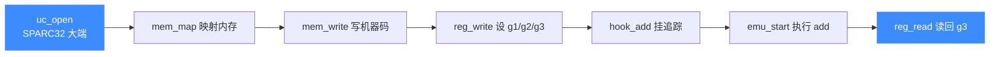

# SPARC 实战示例

本页把官方示例 `sample_sparc.c` 完整走一遍：仿真一条 `add %g1, %g2, %g3` 指令，把 `0x1230 + 0x6789` 的结果写进 `g3`。逐段讲解从 `uc_open` 到读回结果的全过程，并给出预期输出。读完你能独立跑通一个最小 SPARC 仿真。

## 🎯 目标一览



要仿真的机器码是 `\x86\x00\x40\x02`，即大端下的 `add %g1, %g2, %g3`：把 `g1` 与 `g2` 相加，结果存入 `g3`。

## 🧩 第 1 段：打开引擎并映射内存

```c
#include <unicorn/unicorn.h>
#include <string.h>

#define SPARC_CODE "\x86\x00\x40\x02" // add %g1, %g2, %g3;
#define ADDRESS 0x10000

uc_engine *uc;
uc_err err;

// 大端 SPARC32
err = uc_open(UC_ARCH_SPARC, UC_MODE_SPARC32 | UC_MODE_BIG_ENDIAN, &uc);
if (err) {
    printf("uc_open 失败: %u (%s)\n", err, uc_strerror(err));
    return;
}

// 映射 2MB 内存
uc_mem_map(uc, ADDRESS, 2 * 1024 * 1024, UC_PROT_ALL);
```

注意打开引擎时**显式带上 `UC_MODE_BIG_ENDIAN`**——SPARC 走大端，否则 `\x86\x00\x40\x02` 会被错误解码。

## 🧩 第 2 段：写机器码、设寄存器

```c
int g1 = 0x1230; // G1 寄存器
int g2 = 0x6789; // G2 寄存器
int g3 = 0x5555; // G3 寄存器（会被覆盖）

// 写入待仿真的机器码
uc_mem_write(uc, ADDRESS, SPARC_CODE, sizeof(SPARC_CODE) - 1);

// 初始化寄存器
uc_reg_write(uc, UC_SPARC_REG_G1, &g1);
uc_reg_write(uc, UC_SPARC_REG_G2, &g2);
uc_reg_write(uc, UC_SPARC_REG_G3, &g3);
```

`g3` 初值 `0x5555` 只是占位，`add` 执行后会被 `g1 + g2` 覆盖。寄存器常量含义见 [寄存器参考](/arch/sparc/registers)。

## 🧩 第 3 段：挂 Hook 追踪

```c
static void hook_block(uc_engine *uc, uint64_t address, uint32_t size,
                       void *user_data)
{
    printf(">>> Tracing basic block at 0x%" PRIx64 ", block size = 0x%x\n",
           address, size);
}

static void hook_code(uc_engine *uc, uint64_t address, uint32_t size,
                      void *user_data)
{
    printf(">>> Tracing instruction at 0x%" PRIx64
           ", instruction size = 0x%x\n", address, size);
}

uc_hook trace1, trace2;
// 追踪所有基本块
uc_hook_add(uc, &trace1, UC_HOOK_BLOCK, hook_block, NULL, 1, 0);
// 追踪所有指令
uc_hook_add(uc, &trace2, UC_HOOK_CODE, hook_code, NULL, 1, 0);
```

`begin > end`（这里 `1 > 0`）表示对整个地址空间生效。Hook 机制见 [UC_HOOK_CODE](/hooks/code)。

## 🧩 第 4 段：执行并读回结果

```c
// 从 ADDRESS 执行到代码末尾
err = uc_emu_start(uc, ADDRESS, ADDRESS + sizeof(SPARC_CODE) - 1, 0, 0);
if (err) {
    printf("uc_emu_start 失败: %u (%s)\n", err, uc_strerror(err));
}

printf(">>> Emulation done. Below is the CPU context\n");

uc_reg_read(uc, UC_SPARC_REG_G3, &g3);
printf(">>> G3 = 0x%x\n", g3);

uc_close(uc);
```

## ✅ 预期输出

`g3 = g1 + g2 = 0x1230 + 0x6789 = 0x79B9`：

```text
Emulate SPARC code
>>> Tracing basic block at 0x10000, block size = 0x4
>>> Tracing instruction at 0x10000, instruction size = 0x4
>>> Emulation done. Below is the CPU context
>>> G3 = 0x79b9
```

::: tip 自己算一遍
`0x1230 + 0x6789`：`0x1230 = 4656`，`0x6789 = 26505`，和为 `31161 = 0x79B9`。仿真结果与手算一致，说明 `add` 正确执行。
:::

::: warning 换成非法指令会报错
示例注释里给了一条非法编码 `\xbb\x70\x00\x00`。把它换进去，`uc_emu_start` 会返回非 `UC_ERR_OK` 的错误码，`hook_code` 也不会打印结果指令。这正是验证错误处理路径的好办法。
:::

## 📂 相关源码

| 文件 | 角色 |
|------|------|
| [`include/unicorn/sparc.h`](https://github.com/android-security-engineer/unicorn-skills/blob/master/include/unicorn/sparc.h#L66) | `UC_SPARC_REG_*` 寄存器枚举与 `uc_cpu_*` CPU 型号定义 |
| [`qemu/target/sparc/unicorn.c`](https://github.com/android-security-engineer/unicorn-skills/blob/master/qemu/target/sparc/unicorn.c) | 后端：`reg_read`/`reg_write`/`uc_init` 等函数指针实现 |
| [`qemu/target/sparc/unicorn64.c`](https://github.com/android-security-engineer/unicorn-skills/blob/master/qemu/target/sparc/unicorn64.c) | SPARC64 后端补充 |
| [`qemu/target/sparc/translate.c`](https://github.com/android-security-engineer/unicorn-skills/blob/master/qemu/target/sparc/translate.c) | 前端：机器码翻译（TCG） |
| [`samples/sample_sparc.c`](https://github.com/android-security-engineer/unicorn-skills/blob/master/samples/sample_sparc.c) | 该架构的 C 示例程序 |
| [`include/unicorn/unicorn.h`](https://github.com/android-security-engineer/unicorn-skills/blob/master/include/unicorn/unicorn.h#L104) | `UC_ARCH_SPARC` 架构常量与 `UC_MODE_*` 公共模式定义 |

## 相关页面

- [sample_sparc.c 走读](/samples/sample-sparc) — 官方示例源码解析
- [SPARC 架构概览](/arch/sparc/) — 位宽、字节序与寄存器窗口
- [SPARC 寄存器参考](/arch/sparc/registers) — g/o/l/i 四组寄存器
- [UC_HOOK_CODE 指令 Hook](/hooks/code) — 逐指令追踪机制
