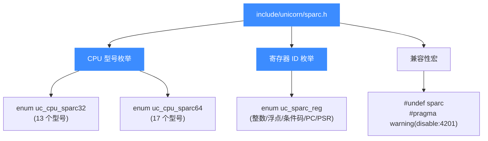
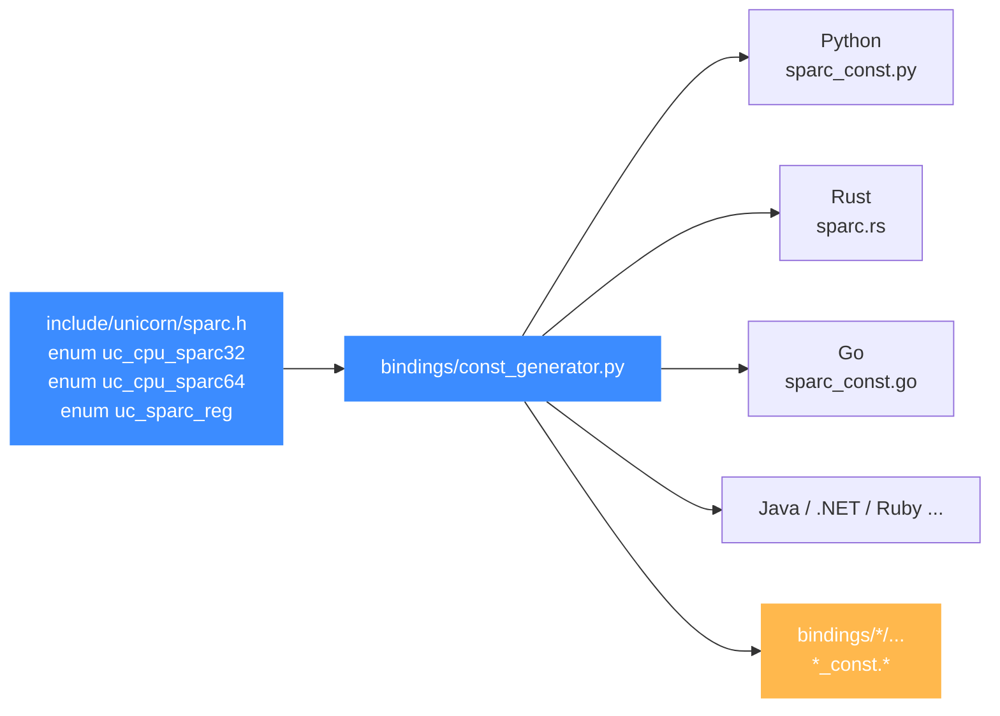

# sparc.h — SPARC 头文件常量参考

本页讲 [`include/unicorn/sparc.h`](https://github.com/android-security-engineer/unicorn-skills/blob/master/include/unicorn/sparc.h)：它是 Unicorn 对 SPARC 架构公开的全部常量的来源（source of truth）——CPU 型号枚举、寄存器 ID 枚举、以及与模式位的对应关系。所有语言绑定的 SPARC 常量都由 `bindings/const_generator.py` 从这个头文件生成，不要手改绑定里的 `*_const.*`。读完你能清楚这个头文件定义了什么、改了它要同步做什么。

## 📌 概述

`sparc.h` 是 SPARC 架构的**公开常量头**，被 `unicorn.h` 聚合进公共接口。它定义了三类对绑定可见的内容：

1. **CPU 型号枚举**：`enum uc_cpu_sparc32` 与 `enum uc_cpu_sparc64`，按位宽分组列出 Unicorn 支持的 SPARC 处理器核。
2. **寄存器 ID 枚举**：`enum uc_sparc_reg`，给 [uc_reg_read](/api/reg-read) / [uc_reg_write](/api/reg-write) 用的寄存器编号，覆盖整数、浮点、条件码与 PC/PSR 等。
3. **少量兼容性宏**：如 `#undef sparc`（绕开 GCC 工具链默认宏冲突）、MSVC 下禁用 C4201 警告。

::: warning 本头没有 UC_SPARC_INS_* 指令 ID
与 x86、arm 不同，`sparc.h` **不定义** `UC_SPARC_INS_*` 指令 ID 枚举——Unicorn 的 SPARC 后端未导出指令级别的反汇编/指令 ID 接口。需要做指令级分析时，请配合外部反汇编器（如 Capstone）使用，不要臆造头文件里没有的 `UC_SPARC_INS_*` 常量。
:::

::: tip 模式位不在本头文件
SPARC 的 `UC_MODE_SPARC32` / `UC_MODE_SPARC64` 模式位定义在 `unicorn.h` 的 `enum uc_mode` 中（与所有架构的模式位并列），**不在 `sparc.h`**。本页后续列出它们是为方便对照，权威定义见 [unicorn.h](/headers/unicorn-h) 与 [SPARC 模式与字节序](/arch/sparc/modes)。
:::

## 🧱 头文件全貌



## 📋 CPU 型号枚举

头文件按位宽给出两个 CPU 型号枚举。型号值在 `uc_open()` 之后通过 [uc_ctl_set_cpu_model](/ctl/set-cpu-model) 设置，必须与打开引擎时选的位宽匹配（32 位配 `UC_CPU_SPARC32_*`，64 位配 `UC_CPU_SPARC64_*`）。

| 枚举 | 位宽 | 默认值 | 个数 | 完整列表 |
|------|------|--------|------|----------|
| `enum uc_cpu_sparc32` | 32 位 | `UC_CPU_SPARC32_FUJITSU_MB86904` (=0) | 13 | 详见 [SPARC CPU 型号](/arch/sparc/cpu-models) |
| `enum uc_cpu_sparc64` | 64 位 | `UC_CPU_SPARC64_FUJITSU` (=0) | 17 | 详见 [SPARC CPU 型号](/arch/sparc/cpu-models) |

两个枚举各有一个 `*_ENDING` 哨兵值标记列表结尾，**不可作为型号传入**。完整型号清单与切换示例见 [SPARC CPU 型号](/arch/sparc/cpu-models)。

## 📝 寄存器 ID 枚举

`enum uc_sparc_reg` 是本头文件最常被绑定消费的部分。下表列出最常用的寄存器（完整定义见源文件，浮点寄存器 `F0`–`F62` 按偶数编号一直延续到 `F62`）：

| 常量 | 类别 | 说明 |
|------|------|------|
| `UC_SPARC_REG_INVALID` | — | 占位 0 值，非法寄存器 |
| `UC_SPARC_REG_G0` | 全局 global | 全局寄存器 g0，**恒读为 0、写入被丢弃** |
| `UC_SPARC_REG_G1` | 全局 global | 全局寄存器 g1 |
| `UC_SPARC_REG_G2` | 全局 global | 全局寄存器 g2 |
| `UC_SPARC_REG_G3` | 全局 global | 全局寄存器 g3（示例中 `add %g1,%g2,%g3` 的结果） |
| `UC_SPARC_REG_G7` | 全局 global | 全局寄存器 g7（组内最后一个） |
| `UC_SPARC_REG_O0` | 输出 out | 输出寄存器 o0，向被调用函数传参 |
| `UC_SPARC_REG_O5` | 输出 out | 输出寄存器 o5 |
| `UC_SPARC_REG_SP` | 输出 out | 栈指针（即 o6，别名见下方说明） |
| `UC_SPARC_REG_O7` | 输出 out | 输出寄存器 o7，存返回地址 |
| `UC_SPARC_REG_L0` | 本地 local | 本地寄存器 l0 |
| `UC_SPARC_REG_L7` | 本地 local | 本地寄存器 l7（组内最后一个） |
| `UC_SPARC_REG_I0` | 输入 in | 输入寄存器 i0，接收调用者传入参数 |
| `UC_SPARC_REG_I5` | 输入 in | 输入寄存器 i5 |
| `UC_SPARC_REG_FP` | 输入 in | 帧指针（即 i6，别名见下方说明） |
| `UC_SPARC_REG_I7` | 输入 in | 输入寄存器 i7，存返回地址 |
| `UC_SPARC_REG_F0` | 浮点 | 单精度浮点寄存器 f0 |
| `UC_SPARC_REG_F31` | 浮点 | 单精度浮点寄存器 f31 |
| `UC_SPARC_REG_F32` | 浮点 | 双精度扩展浮点寄存器起点（f32 起按偶数编号至 f62） |
| `UC_SPARC_REG_FCC0` | 浮点条件码 | 浮点条件码 FCC0 |
| `UC_SPARC_REG_FCC3` | 浮点条件码 | 浮点条件码 FCC3（共 FCC0–FCC3 四个） |
| `UC_SPARC_REG_ICC` | 整数条件码 | 整数条件码（Integer Condition Codes） |
| `UC_SPARC_REG_XCC` | 特殊寄存器 | 64 位整数条件码（Extended Condition Codes） |
| `UC_SPARC_REG_Y` | 特殊寄存器 | Y 寄存器，早期乘除法指令的高位辅助寄存器 |
| `UC_SPARC_REG_PC` | 伪寄存器 | 程序计数器 PC |
| `UC_SPARC_REG_PSR` | 伪寄存器 | 处理器状态寄存器 PSR |
| `UC_SPARC_REG_ENDING` | — | 列表结束哨兵，不可作为寄存器传入 |

::: details O6/I6 的别名
头文件在 `UC_SPARC_REG_ENDING` 之后定义了两条别名：

```c
UC_SPARC_REG_O6 = UC_SPARC_REG_SP,
UC_SPARC_REG_I6 = UC_SPARC_REG_FP,
```

也就是说输出组的第 7 个（`o6`）就是栈指针 SP，输入组的第 7 个（`i6`）就是帧指针 FP。代码里写 `UC_SPARC_REG_SP` / `UC_SPARC_REG_FP` 比 `O6`/`I6` 更直观，二者值相等。寄存器窗口机制见 [SPARC 寄存器参考](/arch/sparc/registers)。
:::

::: warning 没有独立的 NPC 常量
SPARC 硬件上有 nPC（next PC）用于延迟槽语义，但 `enum uc_sparc_reg` 只导出 `UC_SPARC_REG_PC`，**没有独立的 NPC 常量**。延迟槽如何影响执行见 [SPARC 指令与特性](/arch/sparc/instructions)。
:::

## ⚡ SPARC 模式位对照

模式位定义在 `unicorn.h` 的 `enum uc_mode` 中。SPARC 只用其中两个位宽位，再按位或上大端标志：

| 模式常量 | 值 | 适用 | 说明 |
|----------|----|------|------|
| `UC_MODE_SPARC32` | `1<<2` | SPARC | 32 位 SPARC（32 位 Solaris、老 Sun 工作站） |
| `UC_MODE_SPARC64` | `1<<3` | SPARC | 64 位 SPARC（UltraSPARC / 64 位 Solaris） |
| `UC_MODE_V9` | `1<<4` | SPARC | SPARC V9（**未实现**，预留位，勿用） |
| `UC_MODE_BIG_ENDIAN` | `1<<30` | 全部 | 大端；SPARC 标准配置，示例统一带上 |
| `UC_MODE_LITTLE_ENDIAN` | `0` | 全部 | 小端（默认）；不用于常规 SPARC 目标 |

打开引擎的典型组合见 [SPARC 模式与字节序](/arch/sparc/modes)。

## 💻 用法：读源码常量做寄存器读写

```c
#include <unicorn/unicorn.h>
#include <stdio.h>

uc_engine *uc;
// 32 位大端 SPARC，常量均来自 sparc.h / unicorn.h
uc_err err = uc_open(UC_ARCH_SPARC,
                     UC_MODE_SPARC32 | UC_MODE_BIG_ENDIAN, &uc);
if (err != UC_ERR_OK) {
    printf("uc_open 失败: %s\n", uc_strerror(err));
    return -1;
}

int g1 = 0x1230, g2 = 0x6789;
uc_reg_write(uc, UC_SPARC_REG_G1, &g1); // 写 G1
uc_reg_write(uc, UC_SPARC_REG_G2, &g2); // 写 G2

// ... 映射内存、写机器码、uc_emu_start 跑 add %g1,%g2,%g3 ...

int g3 = 0;
uc_reg_read(uc, UC_SPARC_REG_G3, &g3);  // 读回 G3
printf("G3 = 0x%x\n", g3);

uc_close(uc);
```

上面的常量名（`UC_SPARC_REG_G1/G2/G3`、`UC_MODE_SPARC32`）正是本头文件与 `unicorn.h` 的原始定义，Python/Rust/Go 等绑定里同名常量由生成器自动产出，名称保持一致。

## 🔧 实现：常量如何流到各绑定

`sparc.h` 是各语言绑定 SPARC 常量的唯一来源。`bindings/const_generator.py` 解析本头文件中的 `enum`，按语言模板生成对应的 `*_const.*` 文件（如 Python 的 `sparc_const.py`、Rust 的 `sparc.rs`、Go 的 `sparc_const.go` 等）。



::: tip 改了头文件就要重新生成
如果你在 `sparc.h` 中新增/调整了常量（例如加入一个新型号、或修正枚举顺序），**必须**重新运行 `const_generator.py` 刷新各绑定的 `*_const.*`，否则绑定层会与 C 头不同步、出现编号错位。生成器用法与各绑定产物见 [常量生成器](/bindings/const-generator)。手改绑定常量文件会被下次生成覆盖。
:::

## ⚠️ 注意事项

- **`#undef sparc`**：GCC SPARC 工具链默认定义了一个名为 `sparc` 的宏，会破坏编译。头文件开头 `#undef sparc` 专门用来绕开这个冲突，删不得。
- **MSVC C4201**：用 `#pragma warning(disable : 4201)` 禁用「无名结构体」警告，与 vendored QEMU 的位段写法配套。
- **`ENDING` 不是有效值**：`UC_CPU_SPARC32_ENDING`、`UC_CPU_SPARC64_ENDING`、`UC_SPARC_REG_ENDING` 都是哨兵，用于遍历边界，不能传给 `uc_ctl_set_cpu_model` 或 `uc_reg_read/write`。
- **没有指令 ID**：本头不含 `UC_SPARC_INS_*`，SPARC 不支持指令级 Hook（`UC_HOOK_INSN` 的指令组语义），需要指令分析请外接反汇编器。
- **C++ 包裹**：头文件用 `extern "C"` 包裹全部声明，C++ 源文件可直接 `#include`。

## 📖 参考

- 源文件：[`include/unicorn/sparc.h`](https://github.com/android-security-engineer/unicorn-skills/blob/master/include/unicorn/sparc.h)（本项目仓库根）
- 公共入口头：[unicorn.h — 公共 C API 头文件](/headers/unicorn-h) —— 模式位、架构枚举、API 函数原型的权威定义
- 常量生成器：[常量生成器](/bindings/const-generator) —— 本头如何被消费成各绑定常量

## 📂 相关源码

| 文件 | 角色 |
|------|------|
| [`include/unicorn/sparc.h`](https://github.com/android-security-engineer/unicorn-skills/blob/master/include/unicorn/sparc.h#L66) | `UC_SPARC_REG_*` 寄存器枚举与 `uc_cpu_*` CPU 型号定义 |
| [`qemu/target/sparc/unicorn.c`](https://github.com/android-security-engineer/unicorn-skills/blob/master/qemu/target/sparc/unicorn.c) | 后端：`reg_read`/`reg_write`/`uc_init` 等函数指针实现 |
| [`qemu/target/sparc/unicorn64.c`](https://github.com/android-security-engineer/unicorn-skills/blob/master/qemu/target/sparc/unicorn64.c) | SPARC64 后端补充 |
| [`qemu/target/sparc/translate.c`](https://github.com/android-security-engineer/unicorn-skills/blob/master/qemu/target/sparc/translate.c) | 前端：机器码翻译（TCG） |
| [`samples/sample_sparc.c`](https://github.com/android-security-engineer/unicorn-skills/blob/master/samples/sample_sparc.c) | 该架构的 C 示例程序 |
| [`include/unicorn/unicorn.h`](https://github.com/android-security-engineer/unicorn-skills/blob/master/include/unicorn/unicorn.h#L104) | `UC_ARCH_SPARC` 架构常量与 `UC_MODE_*` 公共模式定义 |

## 相关页面

- [SPARC 架构概览](/arch/sparc/) — 位宽、字节序与寄存器窗口直觉
- [SPARC 寄存器参考](/arch/sparc/registers) — `UC_SPARC_REG_*` 的语义与窗口机制
- [SPARC CPU 型号](/arch/sparc/cpu-models) — `UC_CPU_SPARC32_*/SPARC64_*` 完整列表
- [常量生成器](/bindings/const-generator) — 从本头生成各绑定常量
- [unicorn.h 头文件](/headers/unicorn-h) — 模式位与架构枚举的来源
