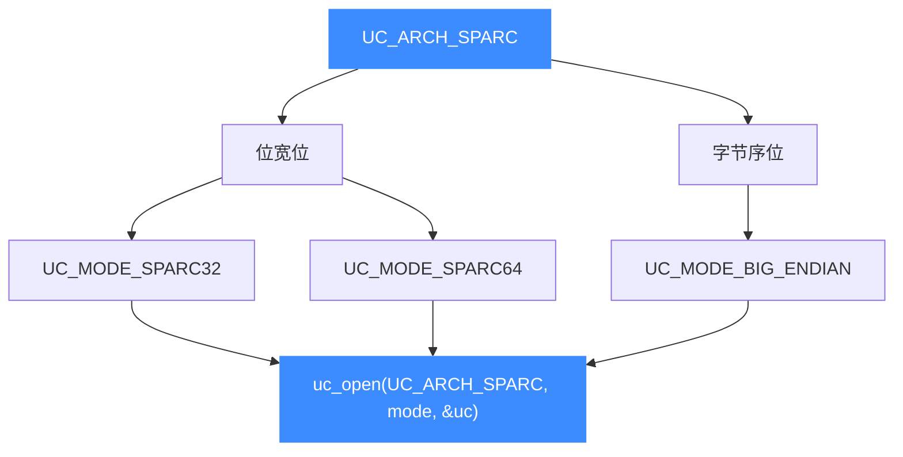
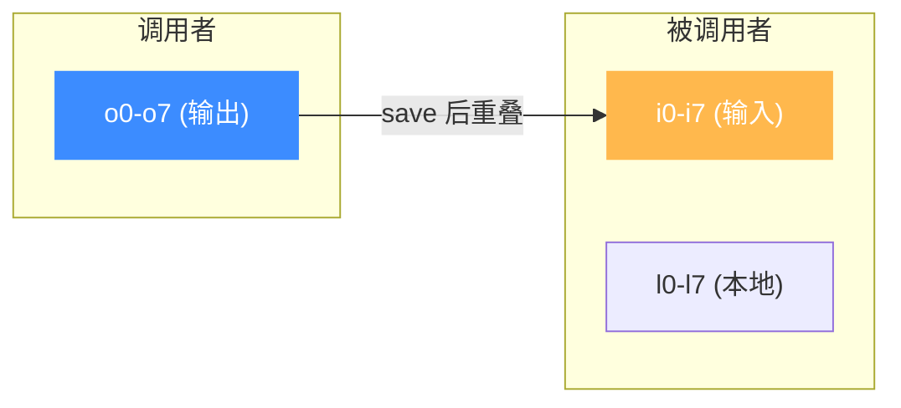

# SPARC 架构概览

本页介绍 Unicorn 对 SPARC 架构（[`UC_ARCH_SPARC`](https://github.com/android-security-engineer/unicorn-skills/blob/master/include/unicorn/unicorn.h#L104)）的支持：`UC_MODE_SPARC32` / `UC_MODE_SPARC64` 两种位宽、SPARC 恒定的大端字节序，以及 SPARC 最鲜明的"寄存器窗口"机制。读完你能正确地用 `uc_open` 打开一个 SPARC 引擎，并知道后续该看本章哪几页。

## 🧩 为什么 SPARC 值得单独一章

SPARC（Scalable Processor ARChitecture）是 Sun Microsystems 主导的经典 RISC 架构，长期用于 Solaris 服务器与老式 Sun 工作站。它有两个和其他 RISC 明显不同的地方：

- **寄存器窗口（register window）**：程序某一时刻只能看到 32 个整数寄存器（`g0-g7` / `o0-o7` / `l0-l7` / `i0-i7`），函数调用通过 `save` / `restore` 指令"滑动窗口"来切换本地寄存器组，避免频繁压栈。
- **恒定大端**：Unicorn 的 SPARC 后端始终以大端方式解释机器码，示例里也统一带上 `UC_MODE_BIG_ENDIAN`。

做 Solaris 二进制逆向、老工作站固件分析，或研究延迟槽 / trap 机制时，Unicorn 让你无需真机即可把 SPARC 代码片段跑起来，配合 [Hook 体系](/features/hooks) 观察寄存器与内存变化。

## ⚡ 位宽 × 字节序

Unicorn 用 mode 位表达 SPARC 的位宽，再按位或上大端标志：



| 组合 | mode 表达式 | 典型目标 |
|------|-------------|----------|
| SPARC32 大端 | `UC_MODE_SPARC32 \| UC_MODE_BIG_ENDIAN` | 32 位 Solaris、老 Sun 工作站 |
| SPARC64 大端 | `UC_MODE_SPARC64 \| UC_MODE_BIG_ENDIAN` | 64 位 UltraSPARC Solaris |

::: warning SPARC 用大端
Unicorn 的官方示例（`sample_sparc.c`）与单元测试都以 `UC_MODE_SPARC32 | UC_MODE_BIG_ENDIAN` 打开引擎。分析 SPARC 目标时请显式带上大端标志，字节序细节见 [字节序](/features/endianness)。
:::

## 🔧 最小示例

```c
#include <unicorn/unicorn.h>

uc_engine *uc;
// 打开一个大端 SPARC32 引擎（最常见的 Solaris 目标）
uc_err err = uc_open(UC_ARCH_SPARC, UC_MODE_SPARC32 | UC_MODE_BIG_ENDIAN, &uc);
if (err != UC_ERR_OK) {
    printf("uc_open 失败: %s\n", uc_strerror(err));
    return -1;
}
// ... 映射内存、写机器码、设寄存器、uc_emu_start ...
uc_close(uc);
```

## 🪟 寄存器窗口（先建立直觉）

同一时刻，SPARC 程序看到的整数寄存器只有 32 个，分为四组：**全局 `g`**、**输出 `o`**、**本地 `l`**、**输入 `i`**。函数调用时用 `save` 打开一个新窗口——调用者的 `o` 组变成被调用者的 `i` 组，本地 `l` 组重新分配；返回时用 `restore` 滑回。这套机制让参数传递与局部变量大多不必碰栈。



完整讨论见 [寄存器参考](/arch/sparc/registers) 与 [指令与特性](/arch/sparc/instructions)。

## 📚 本章导航

| 页面 | 内容 |
|------|------|
| [寄存器参考](/arch/sparc/registers) | `g/o/l/i` 四组、PC/NPC、Y、状态寄存器与 `UC_SPARC_REG_*` 常量 |
| [模式与字节序](/arch/sparc/modes) | `UC_MODE_SPARC32` vs `UC_MODE_SPARC64`、恒定大端 |
| [指令与特性](/arch/sparc/instructions) | 延迟槽、`save`/`restore` 窗口、`ta` trap 与中断 Hook |
| [CPU 型号](/arch/sparc/cpu-models) | `UC_CPU_SPARC32_*/SPARC64_*` 列表与 `uc_ctl_set_cpu_model` |
| [实战示例](/arch/sparc/example) | 完整可运行的整数加法仿真走读 |

## 📂 相关源码

| 文件 | 角色 |
|------|------|
| [`include/unicorn/sparc.h`](https://github.com/android-security-engineer/unicorn-skills/blob/master/include/unicorn/sparc.h#L66) | `UC_SPARC_REG_*` 寄存器枚举与 `uc_cpu_*` CPU 型号定义 |
| [`qemu/target/sparc/unicorn.c`](https://github.com/android-security-engineer/unicorn-skills/blob/master/qemu/target/sparc/unicorn.c) | 后端：`reg_read`/`reg_write`/`uc_init` 等函数指针实现 |
| [`qemu/target/sparc/unicorn64.c`](https://github.com/android-security-engineer/unicorn-skills/blob/master/qemu/target/sparc/unicorn64.c) | SPARC64 后端补充 |
| [`qemu/target/sparc/translate.c`](https://github.com/android-security-engineer/unicorn-skills/blob/master/qemu/target/sparc/translate.c) | 前端：机器码翻译（TCG） |
| [`samples/sample_sparc.c`](https://github.com/android-security-engineer/unicorn-skills/blob/master/samples/sample_sparc.c) | 该架构的 C 示例程序 |
| [`include/unicorn/unicorn.h`](https://github.com/android-security-engineer/unicorn-skills/blob/master/include/unicorn/unicorn.h#L104) | `UC_ARCH_SPARC` 架构常量与 `UC_MODE_*` 公共模式定义 |

## 相关页面

- [sample_sparc.c 走读](/samples/sample-sparc)
- [字节序（Endianness）](/features/endianness)
- [SPARC 寄存器参考](/arch/sparc/registers)
- [SPARC 指令与特性](/arch/sparc/instructions)
