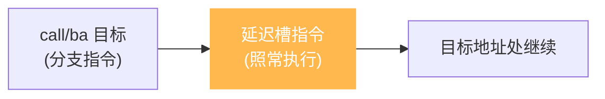
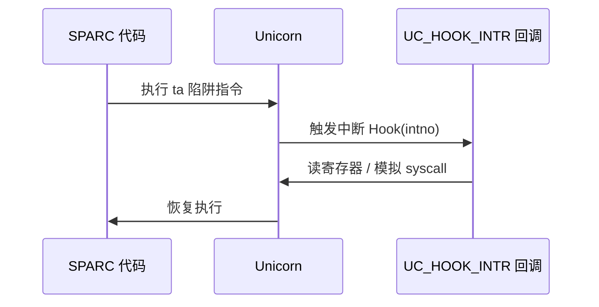

# SPARC 指令与特性

本页讲解仿真 SPARC 时必须理解的三个特性：**延迟槽**（分支后一条指令照常执行）、**寄存器窗口**的 `save` / `restore`、以及 **`ta` 陷阱指令**如何触发中断并被 [UC_HOOK_INTR](/hooks/intr) 捕获。读完你能预判 SPARC 代码的执行顺序，并用 Hook 观察它。

## 🌀 延迟槽（branch delay slot）

和 MIPS 一样，SPARC 的分支/跳转指令带一个**延迟槽**：跳转指令之后紧跟的那条指令，会在跳转真正生效前先执行。这直接影响单步语义与 [UC_HOOK_CODE](/hooks/code) 的触发顺序。



::: warning 单步时延迟槽也会跑
当你以"执行 1 条指令"方式单步一条分支时，其延迟槽通常也会被执行，`UC_HOOK_CODE` 会为延迟槽再触发一次。分析控制流时要把分支与它的延迟槽当作一个整体看待。
:::

## 🪟 寄存器窗口：save / restore

`save` 指令打开一个新寄存器窗口，`restore` 滑回上一个窗口。窗口切换后，调用者的 `o0-o7` 与被调用者的 `i0-i7` 物理重叠，`l0-l7` 换成新的本地组。这让函数调用大多无需压栈传参。

```c
// 概念性汇编片段（大端机器码略）
// save %sp, -96, %sp   ; 打开新窗口，同时下移栈指针
// ... 使用 %l0-%l7 作为本地变量、%i0-%i5 读入参 ...
// ret                  ; 返回（跳到 %i7 + 8）
// restore              ; 延迟槽里滑回旧窗口
```

用 Hook 观察窗口切换时，重点看 `UC_SPARC_REG_SP`（`o6`）与 `UC_SPARC_REG_FP`（`i6`）在 `save`/`restore` 前后的变化，寄存器映射详见 [寄存器参考](/arch/sparc/registers)。

## 🪤 trap 指令 ta 与中断 Hook

SPARC 用 `ta`（trap always）等陷阱指令触发软件中断——这正是 Solaris 上系统调用的入口方式。在 Unicorn 中，这类陷阱会被 [UC_HOOK_INTR](/hooks/intr) 类型的 Hook 捕获，回调里可读取陷阱号并模拟内核行为。



```c
#include <unicorn/unicorn.h>

// 中断回调：SPARC 的 ta 陷阱会走到这里
static void hook_intr(uc_engine *uc, uint32_t intno, void *user_data)
{
    printf(">>> 捕获陷阱，intno = %u\n", intno);
    // 在此读取寄存器、模拟系统调用行为
}

// 注册中断 Hook
uc_hook h_intr;
uc_hook_add(uc, &h_intr, UC_HOOK_INTR, hook_intr, NULL, 1, 0);
```

::: tip 指令级追踪配合中断
把 [UC_HOOK_CODE](/hooks/code)（逐指令追踪）和 [UC_HOOK_INTR](/hooks/intr)（陷阱捕获）一起挂上，就能既看到每条指令的地址与长度，又能在 `ta` 触发时介入。官方示例 `sample_sparc.c` 演示了 `UC_HOOK_BLOCK` + `UC_HOOK_CODE` 的组合追踪。
:::

## 🔧 指令追踪示例

```c
static void hook_code(uc_engine *uc, uint64_t address, uint32_t size,
                      void *user_data)
{
    printf(">>> 执行指令 @ 0x%" PRIx64 ", 长度 = 0x%x\n", address, size);
}

uc_hook trace;
uc_hook_add(uc, &trace, UC_HOOK_CODE, hook_code, NULL, 1, 0);
```

## 📂 相关源码

| 文件 | 角色 |
|------|------|
| [`include/unicorn/sparc.h`](https://github.com/android-security-engineer/unicorn-skills/blob/master/include/unicorn/sparc.h#L66) | `UC_SPARC_REG_*` 寄存器枚举与 `uc_cpu_*` CPU 型号定义 |
| [`qemu/target/sparc/unicorn.c`](https://github.com/android-security-engineer/unicorn-skills/blob/master/qemu/target/sparc/unicorn.c) | 后端：`reg_read`/`reg_write`/`uc_init` 等函数指针实现 |
| [`qemu/target/sparc/unicorn64.c`](https://github.com/android-security-engineer/unicorn-skills/blob/master/qemu/target/sparc/unicorn64.c) | SPARC64 后端补充 |
| [`qemu/target/sparc/translate.c`](https://github.com/android-security-engineer/unicorn-skills/blob/master/qemu/target/sparc/translate.c) | 前端：机器码翻译（TCG） |
| [`samples/sample_sparc.c`](https://github.com/android-security-engineer/unicorn-skills/blob/master/samples/sample_sparc.c) | 该架构的 C 示例程序 |
| [`include/unicorn/unicorn.h`](https://github.com/android-security-engineer/unicorn-skills/blob/master/include/unicorn/unicorn.h#L104) | `UC_ARCH_SPARC` 架构常量与 `UC_MODE_*` 公共模式定义 |

## 相关页面

- [UC_HOOK_CODE 指令 Hook](/hooks/code) — 逐指令追踪
- [UC_HOOK_INTR 中断 Hook](/hooks/intr) — 捕获 ta 陷阱
- [SPARC 寄存器参考](/arch/sparc/registers) — save/restore 影响的寄存器
- [SPARC 实战示例](/arch/sparc/example) — 完整仿真走读
