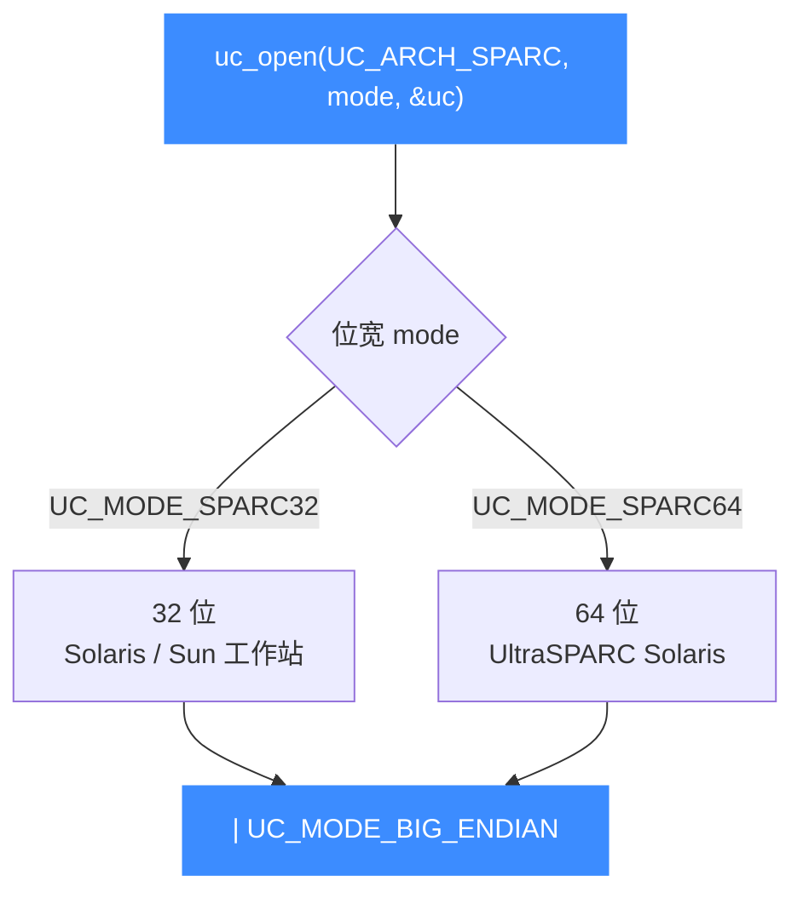

# SPARC 模式与字节序

本页讲清打开 SPARC 引擎时的 mode 组合：`UC_MODE_SPARC32` 与 `UC_MODE_SPARC64` 两种位宽，以及 SPARC 恒定的大端字节序。读完你能为 32/64 位 SPARC 目标写出正确的 `uc_open` 参数。

## ⚡ 两种位宽

Unicorn 用一个 mode 位选择 SPARC 的位宽，二者互斥：



| mode 表达式 | 位宽 | 典型目标 |
|-------------|------|----------|
| `UC_MODE_SPARC32 \| UC_MODE_BIG_ENDIAN` | 32 位 | 32 位 Solaris、老 Sun 工作站固件 |
| `UC_MODE_SPARC64 \| UC_MODE_BIG_ENDIAN` | 64 位 | UltraSPARC / 64 位 Solaris |

## 🔤 字节序：SPARC 走大端

SPARC 是大端架构。Unicorn 官方示例 `sample_sparc.c` 与单元测试 `test_sparc.c` 均以 `UC_MODE_SPARC32 | UC_MODE_BIG_ENDIAN` 打开引擎：

| 字节序常量 | 取值语义 | SPARC 用法 |
|------------|----------|-----------|
| `UC_MODE_BIG_ENDIAN` | 大端 | ✅ SPARC 标准，示例统一带上 |
| `UC_MODE_LITTLE_ENDIAN` | 小端（值为 0） | ❌ 不用于常规 SPARC 目标 |

::: warning 别忘了大端标志
SPARC 机器码按大端解释。写机器码字节（如 `\x86\x00\x40\x02`）时，若忘记 `| UC_MODE_BIG_ENDIAN`，指令会被错误解码。示例与测试都显式带上它，照做即可。字节序总览见 [字节序](/features/endianness)。
:::

## 🔧 打开引擎示例

```c
#include <unicorn/unicorn.h>

uc_engine *uc;

// 32 位 SPARC，大端
uc_err err = uc_open(UC_ARCH_SPARC, UC_MODE_SPARC32 | UC_MODE_BIG_ENDIAN, &uc);
if (err != UC_ERR_OK) {
    printf("uc_open 失败: %s\n", uc_strerror(err));
    return -1;
}

// ... 仿真逻辑 ...
uc_close(uc);
```

64 位目标只需把位宽换成 `UC_MODE_SPARC64`：

```c
uc_open(UC_ARCH_SPARC, UC_MODE_SPARC64 | UC_MODE_BIG_ENDIAN, &uc);
```

::: tip 位宽与 CPU 型号要匹配
位宽决定了随后能选的 CPU 型号：`UC_MODE_SPARC32` 配 `UC_CPU_SPARC32_*`，`UC_MODE_SPARC64` 配 `UC_CPU_SPARC64_*`，两组常量不能混用。详见 [CPU 型号](/arch/sparc/cpu-models)。
:::

## 📂 相关源码

| 文件 | 角色 |
|------|------|
| [`include/unicorn/sparc.h`](https://github.com/android-security-engineer/unicorn-skills/blob/master/include/unicorn/sparc.h#L66) | `UC_SPARC_REG_*` 寄存器枚举与 `uc_cpu_*` CPU 型号定义 |
| [`qemu/target/sparc/unicorn.c`](https://github.com/android-security-engineer/unicorn-skills/blob/master/qemu/target/sparc/unicorn.c) | 后端：`reg_read`/`reg_write`/`uc_init` 等函数指针实现 |
| [`qemu/target/sparc/unicorn64.c`](https://github.com/android-security-engineer/unicorn-skills/blob/master/qemu/target/sparc/unicorn64.c) | SPARC64 后端补充 |
| [`qemu/target/sparc/translate.c`](https://github.com/android-security-engineer/unicorn-skills/blob/master/qemu/target/sparc/translate.c) | 前端：机器码翻译（TCG） |
| [`samples/sample_sparc.c`](https://github.com/android-security-engineer/unicorn-skills/blob/master/samples/sample_sparc.c) | 该架构的 C 示例程序 |
| [`include/unicorn/unicorn.h`](https://github.com/android-security-engineer/unicorn-skills/blob/master/include/unicorn/unicorn.h#L104) | `UC_ARCH_SPARC` 架构常量与 `UC_MODE_*` 公共模式定义 |

## 相关页面

- [字节序（Endianness）](/features/endianness) — 大小端机制总览
- [SPARC 架构概览](/arch/sparc/) — 架构入门
- [SPARC CPU 型号](/arch/sparc/cpu-models) — 位宽对应的处理器核
- [SPARC 寄存器参考](/arch/sparc/registers) — 寄存器与窗口
