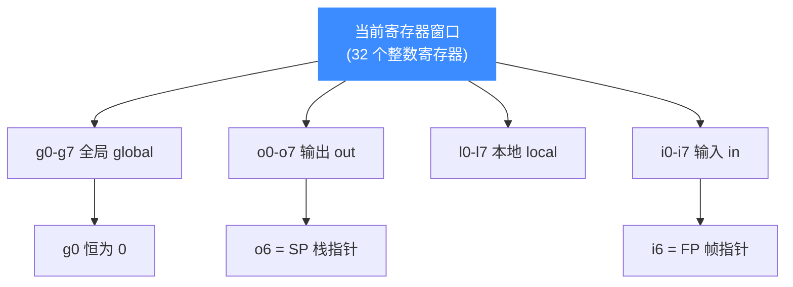
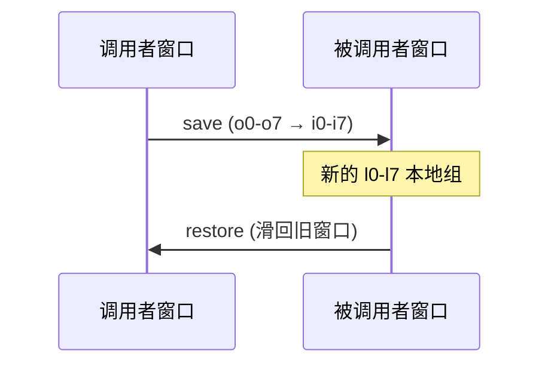

# SPARC 寄存器参考

本页列出 Unicorn 在 SPARC 架构下可读写的寄存器：四组整数寄存器 `g/o/l/i`、程序计数器 PC/NPC、乘除辅助寄存器 Y、状态寄存器，以及寄存器窗口机制。所有常量均取自 [`include/unicorn/sparc.h`](https://github.com/android-security-engineer/unicorn-skills/blob/master/include/unicorn/sparc.h)（`enum uc_sparc_reg`）。读完你能用 [uc_reg_read](/api/reg-read) / [uc_reg_write](/api/reg-write) 准确访问每个寄存器。

## 🧠 四组整数寄存器

SPARC 在任一时刻暴露 32 个整数寄存器，按用途分四组，每组 8 个：



| 组 | 常量 | 用途 |
|----|------|------|
| 全局 global | `UC_SPARC_REG_G0` … `UC_SPARC_REG_G7` | 跨窗口共享；`g0` 恒读为 0、写入被丢弃 |
| 输出 out | `UC_SPARC_REG_O0` … `UC_SPARC_REG_O5`、`UC_SPARC_REG_SP`、`UC_SPARC_REG_O7` | 向被调用函数传参；`o6` 即栈指针 SP，`o7` 存返回地址 |
| 本地 local | `UC_SPARC_REG_L0` … `UC_SPARC_REG_L7` | 当前函数私有的临时寄存器 |
| 输入 in | `UC_SPARC_REG_I0` … `UC_SPARC_REG_I5`、`UC_SPARC_REG_FP`、`UC_SPARC_REG_I7` | 接收调用者传入的参数；`i6` 即帧指针 FP，`i7` 存返回地址 |

::: tip SP/FP 与 O6/I6 是同一个寄存器
头文件里有别名定义：`UC_SPARC_REG_O6 = UC_SPARC_REG_SP`、`UC_SPARC_REG_I6 = UC_SPARC_REG_FP`。也就是说输出组第 7 个（`o6`）就是栈指针，输入组第 7 个（`i6`）就是帧指针。代码里用 `UC_SPARC_REG_SP` / `UC_SPARC_REG_FP` 更直观。
:::

## 📍 程序计数器与特殊寄存器

| 常量 | 说明 |
|------|------|
| `UC_SPARC_REG_PC` | 程序计数器（伪寄存器），指向当前指令 |
| `UC_SPARC_REG_Y` | Y 寄存器，早期乘除法指令的辅助高位寄存器 |
| `UC_SPARC_REG_ICC` | 整数条件码（Integer Condition Codes） |
| `UC_SPARC_REG_XCC` | 64 位整数条件码（特殊寄存器） |
| `UC_SPARC_REG_PSR` | 处理器状态寄存器（伪寄存器） |

::: warning 头文件里没有独立的 NPC 常量
SPARC 硬件上确有 nPC（next PC）用于延迟槽语义，但 `enum uc_sparc_reg` 中**只提供 `UC_SPARC_REG_PC`**，并未导出独立的 NPC 常量。延迟槽如何影响执行见 [指令与特性](/arch/sparc/instructions)，请不要臆造头文件里没有的常量名。
:::

## 🔢 浮点与条件码寄存器

`enum uc_sparc_reg` 还导出浮点寄存器与浮点条件码：

| 常量范围 | 说明 |
|----------|------|
| `UC_SPARC_REG_F0` … `UC_SPARC_REG_F31` | 单精度浮点寄存器 f0–f31 |
| `UC_SPARC_REG_F32`、`F34` … `UC_SPARC_REG_F62`（偶数） | 双精度扩展浮点寄存器（f32 起按偶数编号） |
| `UC_SPARC_REG_FCC0` … `UC_SPARC_REG_FCC3` | 浮点条件码（Floating Condition Codes） |

## 🔧 读写寄存器示例

```c
#include <unicorn/unicorn.h>

int g1 = 0x1230; // G1
int g2 = 0x6789; // G2

// 写入两个全局寄存器
uc_reg_write(uc, UC_SPARC_REG_G1, &g1);
uc_reg_write(uc, UC_SPARC_REG_G2, &g2);

// 仿真结束后读回结果寄存器 G3
int g3 = 0;
uc_reg_read(uc, UC_SPARC_REG_G3, &g3);
printf("G3 = 0x%x\n", g3);
```

上面的取值直接对应官方示例 `sample_sparc.c` 中的 `add %g1, %g2, %g3` 场景，完整走读见 [实战示例](/arch/sparc/example)。

## 🪟 窗口如何切换寄存器视图

`save` 指令打开一个新窗口：调用者的 `o0-o7` 与被调用者的 `i0-i7` 物理上重叠，因此参数无需压栈即可传递；`l0-l7` 换成一组全新的本地寄存器。`restore` 把窗口滑回。全局 `g` 组不随窗口变化，始终共享。



## 📂 相关源码

| 文件 | 角色 |
|------|------|
| [`include/unicorn/sparc.h`](https://github.com/android-security-engineer/unicorn-skills/blob/master/include/unicorn/sparc.h#L66) | `UC_SPARC_REG_*` 寄存器枚举与 `uc_cpu_*` CPU 型号定义 |
| [`qemu/target/sparc/unicorn.c`](https://github.com/android-security-engineer/unicorn-skills/blob/master/qemu/target/sparc/unicorn.c) | 后端：`reg_read`/`reg_write`/`uc_init` 等函数指针实现 |
| [`qemu/target/sparc/unicorn64.c`](https://github.com/android-security-engineer/unicorn-skills/blob/master/qemu/target/sparc/unicorn64.c) | SPARC64 后端补充 |
| [`qemu/target/sparc/translate.c`](https://github.com/android-security-engineer/unicorn-skills/blob/master/qemu/target/sparc/translate.c) | 前端：机器码翻译（TCG） |
| [`samples/sample_sparc.c`](https://github.com/android-security-engineer/unicorn-skills/blob/master/samples/sample_sparc.c) | 该架构的 C 示例程序 |
| [`include/unicorn/unicorn.h`](https://github.com/android-security-engineer/unicorn-skills/blob/master/include/unicorn/unicorn.h#L104) | `UC_ARCH_SPARC` 架构常量与 `UC_MODE_*` 公共模式定义 |

## 相关页面

- [uc_reg_read](/api/reg-read) — 读取寄存器值
- [uc_reg_write](/api/reg-write) — 写入寄存器值
- [SPARC 架构概览](/arch/sparc/) — 位宽、字节序与窗口直觉
- [SPARC 指令与特性](/arch/sparc/instructions) — 延迟槽与 save/restore
