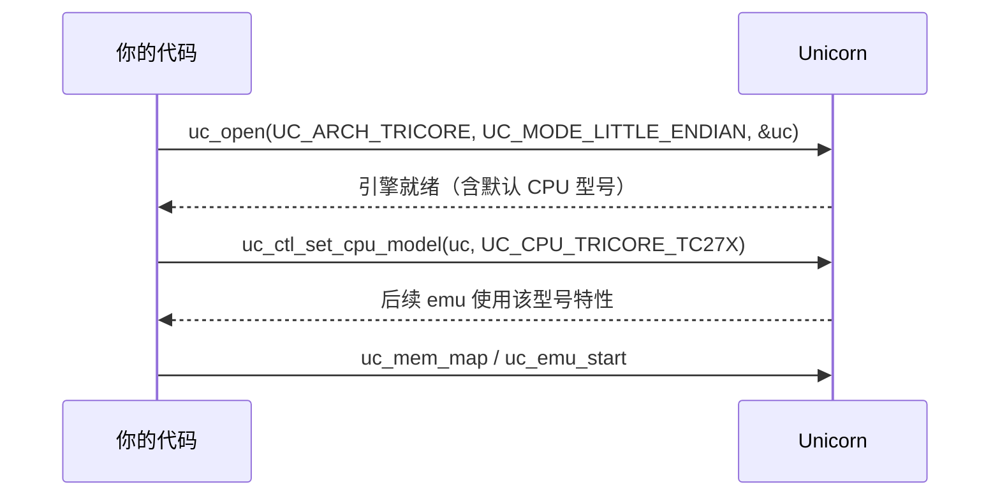

# TriCore CPU 型号

本页列出 Unicorn 支持的 TriCore CPU 型号常量 `UC_CPU_TRICORE_*`，并说明如何用 [uc_ctl_set_cpu_model](/ctl/set-cpu-model) 在打开引擎后选择具体型号。读完你能为仿真挑选合适的 TriCore 核心。

## 🧩 支持的型号

型号常量的权威来源是 [`include/unicorn/tricore.h`](https://github.com/android-security-engineer/unicorn-skills/blob/master/include/unicorn/tricore.h) 中的 `uc_cpu_tricore` 枚举。当前支持三款：

| 常量 | 型号 | 说明 |
|------|------|------|
| `UC_CPU_TRICORE_TC1796` | TC1796 | 早期 AUDO 系列，TriCore 1.3 架构 |
| `UC_CPU_TRICORE_TC1797` | TC1797 | AUDO Future，TriCore 1.3.1 架构 |
| `UC_CPU_TRICORE_TC27X` | TC27x | AURIX 第一代多核系列 |

::: warning 只列真实存在的型号
以上三个是头文件里真正定义的枚举值（外加用于标记结尾的 `UC_CPU_TRICORE_ENDING`，它**不是**可用型号）。不要传入头文件中不存在的型号名。
:::

## ⚡ 默认型号与选择时机



::: tip 先 open 再设型号
`uc_ctl_set_cpu_model` 必须在 `uc_open` 之后、开始仿真之前调用。它属于 [uc_ctl 控制接口](/ctl/set-cpu-model) 家族的一员。
:::

## 🔧 代码示例

```c
#include <unicorn/unicorn.h>

uc_engine *uc;
uc_err err = uc_open(UC_ARCH_TRICORE, UC_MODE_LITTLE_ENDIAN, &uc);
if (err != UC_ERR_OK) {
    printf("uc_open 失败: %s\n", uc_strerror(err));
    return -1;
}

// 选择 AURIX TC27x 核心
err = uc_ctl_set_cpu_model(uc, UC_CPU_TRICORE_TC27X);
if (err != UC_ERR_OK) {
    printf("设置 CPU 型号失败: %s\n", uc_strerror(err));
}

// ... 映射内存、写机器码、uc_emu_start ...
uc_close(uc);
```

::: details 型号影响什么
不同型号对应不同的 TriCore 架构版本（1.3 / 1.3.1 等），可能在可用系统寄存器、内存保护单元、部分指令行为上存在差异。若你要精确复现某款车规 MCU 的行为，选对型号很重要；若只是跑一段与型号无关的算术代码，使用默认值通常也可以。
:::

## 📂 相关源码

| 文件 | 角色 |
|------|------|
| [`include/unicorn/tricore.h`](https://github.com/android-security-engineer/unicorn-skills/blob/master/include/unicorn/tricore.h#L32) | `UC_TRICORE_REG_*` 寄存器枚举与 `uc_cpu_*` CPU 型号定义 |
| [`qemu/target/tricore/unicorn.c`](https://github.com/android-security-engineer/unicorn-skills/blob/master/qemu/target/tricore/unicorn.c) | 后端：`reg_read`/`reg_write`/`uc_init` 等函数指针实现 |
| [`qemu/target/tricore/translate.c`](https://github.com/android-security-engineer/unicorn-skills/blob/master/qemu/target/tricore/translate.c) | 前端：机器码翻译（TCG） |
| [`samples/sample_tricore.c`](https://github.com/android-security-engineer/unicorn-skills/blob/master/samples/sample_tricore.c) | 该架构的 C 示例程序 |
| [`include/unicorn/unicorn.h`](https://github.com/android-security-engineer/unicorn-skills/blob/master/include/unicorn/unicorn.h#L108) | `UC_ARCH_TRICORE` 架构常量与 `UC_MODE_*` 公共模式定义 |

## 相关页面

- [uc_ctl_set_cpu_model](/ctl/set-cpu-model)
- [CPU 型号总览](/features/cpu-models)
- [TriCore 架构概览](/arch/tricore/)
- [TriCore 实战示例](/arch/tricore/example)
