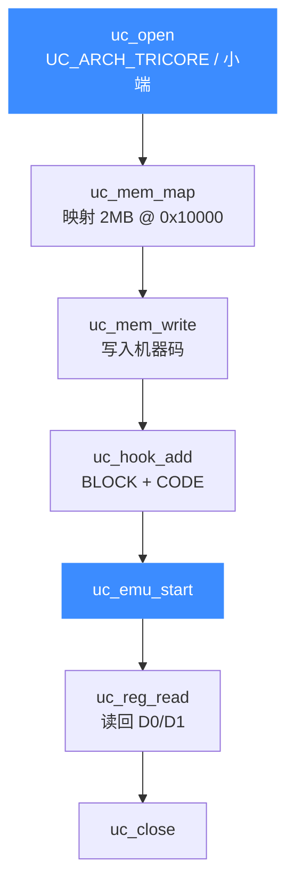

# TriCore 实战示例

本页逐段走读官方 `sample_tricore.c`：一段完整可运行的 TriCore 仿真——打开引擎、映射内存、写入两条指令、挂 Hook、运行、读回寄存器。读完你能独立写出并运行自己的 TriCore 仿真程序。

## 🎯 目标

模拟执行两条指令：

```asm
mov   d1, #0x1      ; 把立即数 1 写入 D1
mov.u d0, #0x8000   ; 把无符号立即数 0x8000 写入 D0
```

机器码为 `82 11 bb 00 00 08`（小端），运行后期望 `D0 = 0x8000`、`D1 = 0x1`。

## 🧩 整体流程



## 🔧 完整代码

```c
#include <unicorn/unicorn.h>
#include <string.h>

// 待仿真的机器码：mov d1, #0x1; mov.u d0, #0x8000
#define CODE "\x82\x11\xbb\x00\x00\x08"

// 仿真起始地址
#define ADDRESS 0x10000

static void hook_block(uc_engine *uc, uint64_t address, uint32_t size,
                       void *user_data)
{
    printf(">>> Tracing basic block at 0x%" PRIx64 ", block size = 0x%x\n",
           address, size);
}

static void hook_code(uc_engine *uc, uint64_t address, uint32_t size,
                      void *user_data)
{
    printf(">>> Tracing instruction at 0x%" PRIx64
           ", instruction size = 0x%x\n", address, size);
}

static void test_tricore(void)
{
    uc_engine *uc;
    uc_err err;
    uc_hook trace1, trace2;

    uint32_t d0 = 0x0;
    uint32_t d1 = 0x0;

    printf("Emulate TriCore code\n");

    // 1. 以小端模式初始化 TriCore 引擎
    err = uc_open(UC_ARCH_TRICORE, UC_MODE_LITTLE_ENDIAN, &uc);
    if (err) {
        printf("Failed on uc_open() with error returned: %u (%s)\n", err,
               uc_strerror(err));
        return;
    }

    // 2. 映射 2MB 内存
    uc_mem_map(uc, ADDRESS, 2 * 1024 * 1024, UC_PROT_ALL);

    // 3. 写入机器码
    uc_mem_write(uc, ADDRESS, CODE, sizeof(CODE) - 1);

    // 4. 挂 Hook：追踪基本块与逐条指令
    uc_hook_add(uc, &trace1, UC_HOOK_BLOCK, hook_block, NULL, 1, 0);
    uc_hook_add(uc, &trace2, UC_HOOK_CODE, hook_code, NULL, ADDRESS,
                ADDRESS + sizeof(CODE) - 1);

    // 5. 运行（超时 0 = 不限时，跑完全部代码为止）
    err = uc_emu_start(uc, ADDRESS, ADDRESS + sizeof(CODE) - 1, 0, 0);
    if (err) {
        printf("Failed on uc_emu_start() with error returned: %u\n", err);
    }

    // 6. 读回寄存器
    printf(">>> Emulation done. Below is the CPU context\n");
    uc_reg_read(uc, UC_TRICORE_REG_D0, &d0);
    printf(">>> d0 = 0x%x\n", d0);
    uc_reg_read(uc, UC_TRICORE_REG_D1, &d1);
    printf(">>> d1 = 0x%x\n", d1);

    uc_close(uc);
}

int main(int argc, char **argv, char **envp)
{
    test_tricore();
    return 0;
}
```

## 🧠 逐段解读

- **CODE / ADDRESS 宏**：`CODE` 是两条指令的原始字节；`sizeof(CODE) - 1` 去掉末尾的 `\0`，得到真实字节数 6。
- **uc_open**：架构 [`UC_ARCH_TRICORE`](https://github.com/android-security-engineer/unicorn-skills/blob/master/include/unicorn/unicorn.h#L108) + 模式 `UC_MODE_LITTLE_ENDIAN`，参见 [模式与字节序](/arch/tricore/modes)。
- **uc_mem_map**：在 `0x10000` 处映射 2MB 可读写执行内存，容纳代码与运行空间。
- **两个 Hook**：`UC_HOOK_BLOCK` 追踪基本块起点；`UC_HOOK_CODE` 逐条指令回调，`size` 会显示 16/32 位指令的不同长度，详见 [指令与特性](/arch/tricore/instructions)。
- **uc_emu_start**：从 `ADDRESS` 执行到代码末尾；后两个 0 分别是超时与指令数上限（0 表示不限制）。
- **uc_reg_read**：仿真结束后读回 `UC_TRICORE_REG_D0/D1`。

## 📤 预期输出

```text
Emulate TriCore code
>>> Tracing basic block at 0x10000, block size = 0x6
>>> Tracing instruction at 0x10000, instruction size = 0x2
>>> Tracing instruction at 0x10002, instruction size = 0x4
>>> Emulation done. Below is the CPU context
>>> d0 = 0x8000
>>> d1 = 0x1
```

::: tip 观察指令长度
第一条 `instruction size = 0x2`（16 位 `mov`），第二条 `= 0x4`（32 位 `mov.u`）——这正是 TriCore 变长指令的直观体现。
:::

::: warning 结束地址要覆盖全部指令
`uc_emu_start` 的结束地址是 `ADDRESS + sizeof(CODE) - 1`，即代码末尾。若设得太短，第二条指令可能不被执行，`D0` 会保持为 0。
:::

## 📂 相关源码

| 文件 | 角色 |
|------|------|
| [`include/unicorn/tricore.h`](https://github.com/android-security-engineer/unicorn-skills/blob/master/include/unicorn/tricore.h#L32) | `UC_TRICORE_REG_*` 寄存器枚举与 `uc_cpu_*` CPU 型号定义 |
| [`qemu/target/tricore/unicorn.c`](https://github.com/android-security-engineer/unicorn-skills/blob/master/qemu/target/tricore/unicorn.c) | 后端：`reg_read`/`reg_write`/`uc_init` 等函数指针实现 |
| [`qemu/target/tricore/translate.c`](https://github.com/android-security-engineer/unicorn-skills/blob/master/qemu/target/tricore/translate.c) | 前端：机器码翻译（TCG） |
| [`samples/sample_tricore.c`](https://github.com/android-security-engineer/unicorn-skills/blob/master/samples/sample_tricore.c) | 该架构的 C 示例程序 |
| [`include/unicorn/unicorn.h`](https://github.com/android-security-engineer/unicorn-skills/blob/master/include/unicorn/unicorn.h#L108) | `UC_ARCH_TRICORE` 架构常量与 `UC_MODE_*` 公共模式定义 |

## 相关页面

- [sample_tricore.c 走读](/samples/sample-tricore)
- [TriCore 架构概览](/arch/tricore/)
- [TriCore 指令与特性](/arch/tricore/instructions)
- [TriCore 寄存器参考](/arch/tricore/registers)
