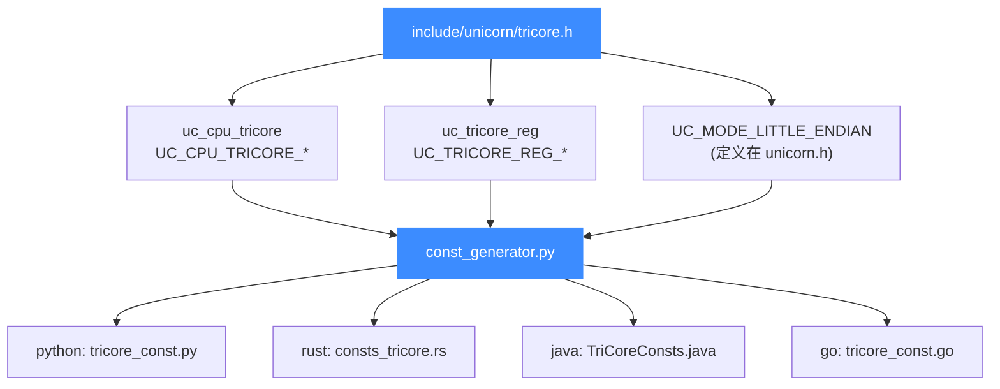

# TriCore 头文件常量参考

本页对应源码 [`include/unicorn/tricore.h`](https://github.com/android-security-engineer/unicorn-skills/blob/master/include/unicorn/tricore.h)，逐一说明该头文件定义的 TriCore 常量：CPU 型号枚举 `uc_cpu_tricore`、寄存器 ID 枚举 `uc_tricore_reg`，以及该架构的模式位用法。这些常量是所有语言绑定（Python/Rust/Java/Go/…）常量文件的**唯一真源**。

## 📌 概述

[`include/unicorn/tricore.h`](https://github.com/android-security-engineer/unicorn-skills/blob/master/include/unicorn/tricore.h) 是 TriCore 架构的公开 C 头文件，结构上分为以下几类定义：

| 类别 | 枚举/宏 | 用途 |
|------|---------|------|
| CPU 型号 | `uc_cpu_tricore` | 选择具体 TriCore 芯片型号（TC1796/TC1797/TC27X） |
| 寄存器 ID | `uc_tricore_reg` | 供 `uc_reg_read` / `uc_reg_write` 使用的寄存器编号 |
| 模式位 | `UC_MODE_LITTLE_ENDIAN` | 打开引擎时指定小端字节序 |
| 指令 ID | — | TriCore 头文件**未定义** `UC_TRICORE_INS_*` 指令枚举 |

::: tip 该头文件是常量真源
Unicorn 每个架构的 `<arch>.h` 都是各自绑定的常量来源。改了这里的枚举，就必须跑 [const_generator.py](/bindings/const-generator) 重新生成各语言常量，否则绑定会与 C 库漂移。
:::



## 💡 CPU 型号枚举

`uc_cpu_tricore` 枚举列出 Unicorn 当前支持的三款 TriCore 型号，外加一个用于标记结尾的 `UC_CPU_TRICORE_ENDING`（**不是**可用型号）。

| 常量 | 型号 | 说明 |
|------|------|------|
| `UC_CPU_TRICORE_TC1796` | TC1796 | 早期 AUDO 系列，TriCore 1.3 架构 |
| `UC_CPU_TRICORE_TC1797` | TC1797 | AUDO Future，TriCore 1.3.1 架构 |
| `UC_CPU_TRICORE_TC27X` | TC27x | AURIX 第一代多核系列 |
| `UC_CPU_TRICORE_ENDING` | — | 结尾标记，不可用作型号 |

型号选择细节见 [CPU 型号](/arch/tricore/cpu-models)。

## 📥 寄存器 ID 枚举

`uc_tricore_reg` 是本头文件的核心，定义了 `uc_reg_read` / `uc_reg_write` 接受的寄存器编号。下表列出常用寄存器（完整清单以源码为准）。

### 数据寄存器（Data GPR）

| 常量 | 寄存器 | 含义 |
|------|--------|------|
| `UC_TRICORE_REG_D0` | D0 | 通用数据寄存器 |
| `UC_TRICORE_REG_D1` | D1 | 通用数据寄存器 |
| `UC_TRICORE_REG_D2` | D2 | 通用数据寄存器 |
| `UC_TRICORE_REG_D3` | D3 | 通用数据寄存器 |
| `UC_TRICORE_REG_D4` | D4 | 通用数据寄存器 |
| `UC_TRICORE_REG_D5` | D5 | 通用数据寄存器 |
| `UC_TRICORE_REG_D6` | D6 | 通用数据寄存器 |
| `UC_TRICORE_REG_D7` | D7 | 通用数据寄存器 |
| `UC_TRICORE_REG_D8`-`D14` | D8-D14 | 通用数据寄存器 |
| `UC_TRICORE_REG_D15` | D15 | 隐式数据寄存器（别名 `UC_TRICORE_REG_ID`） |

### 地址寄存器（Address GPR）

| 常量 | 寄存器 | 别名 | 含义 |
|------|--------|------|------|
| `UC_TRICORE_REG_A0` | A0 | `UC_TRICORE_REG_GA0` | 全局地址寄存器 |
| `UC_TRICORE_REG_A1` | A1 | `UC_TRICORE_REG_GA1` | 全局地址寄存器 |
| `UC_TRICORE_REG_A2` | A2 | — | 通用地址寄存器 |
| `UC_TRICORE_REG_A3` | A3 | — | 通用地址寄存器 |
| `UC_TRICORE_REG_A4` | A4 | — | 通用地址寄存器 |
| `UC_TRICORE_REG_A5` | A5 | — | 通用地址寄存器 |
| `UC_TRICORE_REG_A6` | A6 | — | 通用地址寄存器 |
| `UC_TRICORE_REG_A7` | A7 | — | 通用地址寄存器 |
| `UC_TRICORE_REG_A8` | A8 | `UC_TRICORE_REG_GA8` | 全局地址寄存器 |
| `UC_TRICORE_REG_A9` | A9 | `UC_TRICORE_REG_GA9` | 全局地址寄存器 |
| `UC_TRICORE_REG_A10` | A10 | `UC_TRICORE_REG_SP` | 栈指针 SP |
| `UC_TRICORE_REG_A11` | A11 | `UC_TRICORE_REG_LR` | 返回地址 LR |
| `UC_TRICORE_REG_A12`-`A14` | A12-A14 | — | 通用地址寄存器 |
| `UC_TRICORE_REG_A15` | A15 | `UC_TRICORE_REG_IA` | 隐式地址寄存器 |

### 核心与系统寄存器

| 常量 | 寄存器 | 含义 |
|------|--------|------|
| `UC_TRICORE_REG_PC` | PC | 程序计数器 |
| `UC_TRICORE_REG_PSW` | PSW | 程序状态字 |
| `UC_TRICORE_REG_PCXI` | PCXI | 上一上下文信息 |
| `UC_TRICORE_REG_SYSCON` | SYSCON | 系统配置寄存器 |
| `UC_TRICORE_REG_CPU_ID` | CPU_ID | CPU 标识 |
| `UC_TRICORE_REG_BIV` | BIV | 中断向量基址 |
| `UC_TRICORE_REG_BTV` | BTV | 陷阱向量基址 |
| `UC_TRICORE_REG_ISP` | ISP | 中断栈指针 |
| `UC_TRICORE_REG_ICR` | ICR | 中断控制寄存器 |
| `UC_TRICORE_REG_FCX` | FCX | 空闲上下文列表头指针 |
| `UC_TRICORE_REG_LCX` | LCX | 上下文列表限界指针 |
| `UC_TRICORE_REG_COMPAT` | COMPAT | 兼容模式寄存器 |

::: details PSW 标志缓存与扩展寄存器
头文件还为 PSW 定义了标志缓存常量：`UC_TRICORE_REG_PSW_USB_C`（进位）、`UC_TRICORE_REG_PSW_USB_V`（溢出）、`UC_TRICORE_REG_PSW_USB_SV`（粘滞溢出）、`UC_TRICORE_REG_PSW_USB_AV`（地址溢出）、`UC_TRICORE_REG_PSW_USB_SAV`（粘滞地址溢出），用于快速读写单个标志位。此外还有 DPR/CPR/DPM/CPM 内存保护寄存器、`UC_TRICORE_REG_MMU_*` MMU 寄存器、以及 `UC_TRICORE_REG_DBGSR`/`UC_TRICORE_REG_CCNT` 等调试寄存器。完整清单以 [`include/unicorn/tricore.h`](https://github.com/android-security-engineer/unicorn-skills/blob/master/include/unicorn/tricore.h) 为准。
:::

## 🌐 模式位

TriCore 头文件本身**不定义** `UC_MODE_*` 宏——这些定义在公共头 [`include/unicorn/unicorn.h`](https://github.com/android-security-engineer/unicorn-skills/blob/master/include/unicorn/unicorn.h) 中。对 TriCore 而言只有一个相关模式位：

| 常量 | 定义位置 | 含义 |
|------|----------|------|
| `UC_MODE_LITTLE_ENDIAN` | `unicorn.h` | 小端字节序（TriCore 固定使用） |

::: warning 不要臆造 mode 位
TriCore 的位宽（32 位）由架构隐含，无需在 `mode` 里叠加 `UC_MODE_32` 之类的位。按 `uc_open(UC_ARCH_TRICORE, UC_MODE_LITTLE_ENDIAN, &uc)` 调用即可。详见 [模式与字节序](/arch/tricore/modes)。
:::

## 🔧 指令 ID 枚举

与 x86、ARM 等架构不同，TriCore 头文件**未定义** `UC_TRICORE_INS_*` 指令 ID 枚举。这意味着：

- 没有 `UC_TRICORE_INS_MOV`、`UC_TRICORE_INS_ADD` 之类的指令编号常量。
- [UC_HOOK_INSN](/hooks/insn)（按指令名 Hook）在 TriCore 上不可用——该 Hook 依赖 Capstone 反汇编出来的指令 ID，而 Unicorn 的 TriCore 头文件并未暴露这套枚举。
- 想观察指令执行请用 [UC_HOOK_CODE](/hooks/code)，它按地址/范围触发，不依赖指令 ID。

::: tip 用 UC_HOOK_CODE 代替
对 TriCore 单步或区间跟踪代码，统一用 `UC_HOOK_CODE`。需要在回调里知道当前指令再去看 `UC_TRICORE_REG_PC` 或自行反汇编。详见 [指令与特性](/arch/tricore/instructions)。
:::

## 💻 用法：从头文件到仿真代码

```c
#include <unicorn/unicorn.h>
#include <unicorn/tricore.h>   // 经 unicorn.h 间接包含，也可显式写

uc_engine *uc;
uc_err err = uc_open(UC_ARCH_TRICORE, UC_MODE_LITTLE_ENDIAN, &uc);
if (err != UC_ERR_OK) {
    printf("uc_open 失败: %s\n", uc_strerror(err));
    return -1;
}

// 写初值
uint32_t d1 = 0x1, sp = 0xC0000000;
uc_reg_write(uc, UC_TRICORE_REG_D1, &d1);
uc_reg_write(uc, UC_TRICORE_REG_SP, &sp);   // A10 别名

// 读回
uint32_t d0 = 0;
uc_reg_read(uc, UC_TRICORE_REG_D0, &d0);
printf("d0 = 0x%x\n", d0);

uc_close(uc);
```

## ⚠️ 注意

::: warning 别名与本体同值
`UC_TRICORE_REG_SP` 与 `UC_TRICORE_REG_A10` 在枚举里被定义为同一常量（`UC_TRICORE_REG_SP = UC_TRICORE_REG_A10`），读写任一个效果完全相同。别名只是提升可读性。同类还有 `LR=A11`、`IA=A15`、`ID=D15`。
:::

::: warning INVALID 与 ENDING 不可用
`UC_TRICORE_REG_INVALID`（=0）和 `UC_TRICORE_REG_ENDING` 是哨兵值，分别表示"无效"和"列表结尾"，**不能**作为寄存器传给 `uc_reg_read`/`uc_reg_write`。`UC_CPU_TRICORE_ENDING` 同理不可作为型号。
:::

## 📖 参考

- 源码：[`include/unicorn/tricore.h`](https://github.com/android-security-engineer/unicorn-skills/blob/master/include/unicorn/tricore.h)（版权 LGPL2，由 Eric Poole 于 2022 年为 Unicorn 创建，Copyright Aptiv）
- 架构总览：[unicorn.h 公共 API](/headers/unicorn-h)
- 常量生成：[const_generator.py](/bindings/const-generator)

## 📂 相关源码

| 文件 | 角色 |
|------|------|
| [`include/unicorn/tricore.h`](https://github.com/android-security-engineer/unicorn-skills/blob/master/include/unicorn/tricore.h#L32) | `UC_TRICORE_REG_*` 寄存器枚举与 `uc_cpu_*` CPU 型号定义 |
| [`qemu/target/tricore/unicorn.c`](https://github.com/android-security-engineer/unicorn-skills/blob/master/qemu/target/tricore/unicorn.c) | 后端：`reg_read`/`reg_write`/`uc_init` 等函数指针实现 |
| [`qemu/target/tricore/translate.c`](https://github.com/android-security-engineer/unicorn-skills/blob/master/qemu/target/tricore/translate.c) | 前端：机器码翻译（TCG） |
| [`samples/sample_tricore.c`](https://github.com/android-security-engineer/unicorn-skills/blob/master/samples/sample_tricore.c) | 该架构的 C 示例程序 |
| [`include/unicorn/unicorn.h`](https://github.com/android-security-engineer/unicorn-skills/blob/master/include/unicorn/unicorn.h#L108) | `UC_ARCH_TRICORE` 架构常量与 `UC_MODE_*` 公共模式定义 |

## 相关页面

- [TriCore 架构概览](/arch/tricore/)
- [TriCore 寄存器参考](/arch/tricore/registers)
- [TriCore CPU 型号](/arch/tricore/cpu-models)
- [常量生成器 const_generator.py](/bindings/const-generator)
- [unicorn.h 公共 API 头](/headers/unicorn-h)
