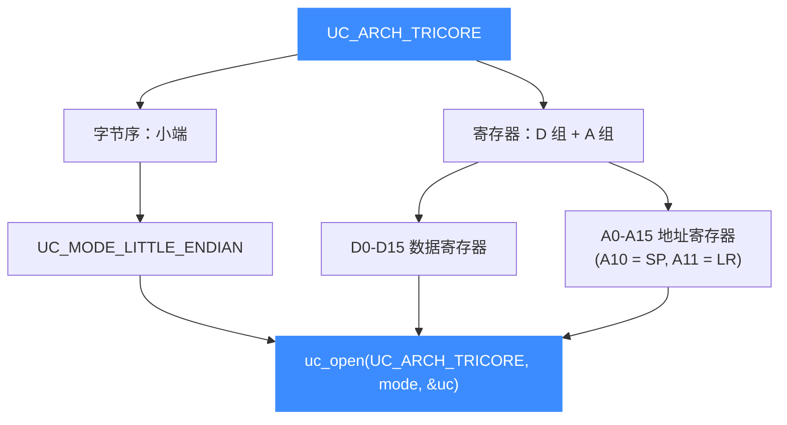
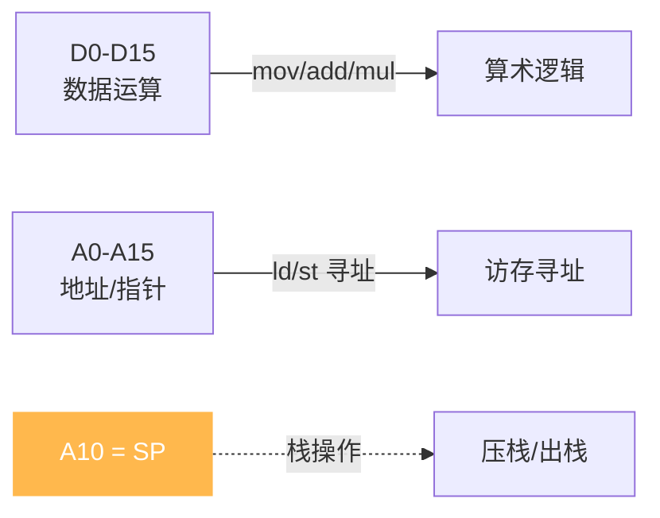

# TriCore 架构概览

本页介绍 Unicorn 对英飞凌 TriCore（[`UC_ARCH_TRICORE`](https://github.com/android-security-engineer/unicorn-skills/blob/master/include/unicorn/unicorn.h#L108)）的支持：这是一颗面向汽车与实时控制的 **32 位微控制器**核心，采用**小端**字节序。读完你能用 `uc_open` 正确打开一个 TriCore 引擎，并知道后续该看本章哪几页。

## 🧩 为什么要模拟 TriCore

TriCore 由英飞凌（Infineon）设计，把 MCU、DSP 与实时控制能力融合在同一套指令集里。它最典型的落地场景是：

- **汽车 ECU**：发动机管理、变速箱、底盘与安全气囊控制器大量使用 AURIX（TC2xx/TC3xx）系列，TriCore 是其主计算核心。
- **工业实时控制**：电机驱动、电源管理等对确定性延迟敏感的嵌入式系统。
- **固件逆向与安全研究**：分析车载固件、刷写工具、诊断协议时，常需要在无真机的情况下单独跑一段机器码。

Unicorn 让你把一段 TriCore 机器码隔离运行起来，配合 [Hook 体系](/features/hooks) 观察寄存器与内存变化，非常适合做定点逆向与算法还原。

## ⚡ 一句话记住 TriCore 的两个特点



TriCore 与 M68K 一样把通用寄存器分成**数据（D）**与**地址（A）**两组，但寄存器数量翻倍（各 16 个），且字节序是小端而非大端。

## 🔧 最小示例

```c
#include <unicorn/unicorn.h>

uc_engine *uc;
// TriCore 使用小端
uc_err err = uc_open(UC_ARCH_TRICORE, UC_MODE_LITTLE_ENDIAN, &uc);
if (err != UC_ERR_OK) {
    printf("uc_open 失败: %s\n", uc_strerror(err));
    return -1;
}
// ... 映射内存、写机器码、设寄存器、uc_emu_start ...
uc_close(uc);
```

::: tip 小端字节序
TriCore 引擎使用 `UC_MODE_LITTLE_ENDIAN`。字节序细节见 [字节序](/features/endianness)。
:::

## 🧠 数据寄存器 vs 地址寄存器

TriCore 的通用寄存器（GPR）明确分成两组：**D0-D15** 用于算术逻辑运算（数据），**A0-A15** 用于存放地址（指针）。其中若干地址寄存器有专用别名，例如 **A10 = SP（栈指针）**、**A11 = LR（返回地址）**。这种"数据/地址分家"的设计是读 TriCore 汇编的第一课。完整清单见 [寄存器参考](/arch/tricore/registers)。



## 📚 本章导航

| 页面 | 内容 |
|------|------|
| [寄存器参考](/arch/tricore/registers) | D0-D15、A0-A15、PC、PSW 及 `UC_TRICORE_REG_*` 常量 |
| [模式与字节序](/arch/tricore/modes) | 小端字节序、`UC_MODE_LITTLE_ENDIAN` 用法 |
| [指令与特性](/arch/tricore/instructions) | 16/32 位混合变长指令、`UC_HOOK_CODE` 单步 |
| [CPU 型号](/arch/tricore/cpu-models) | `UC_CPU_TRICORE_*` 列表与 `uc_ctl_set_cpu_model` |
| [实战示例](/arch/tricore/example) | 完整可运行的 TriCore 仿真走读 |

## 📂 相关源码

| 文件 | 角色 |
|------|------|
| [`include/unicorn/tricore.h`](https://github.com/android-security-engineer/unicorn-skills/blob/master/include/unicorn/tricore.h#L32) | `UC_TRICORE_REG_*` 寄存器枚举与 `uc_cpu_*` CPU 型号定义 |
| [`qemu/target/tricore/unicorn.c`](https://github.com/android-security-engineer/unicorn-skills/blob/master/qemu/target/tricore/unicorn.c) | 后端：`reg_read`/`reg_write`/`uc_init` 等函数指针实现 |
| [`qemu/target/tricore/translate.c`](https://github.com/android-security-engineer/unicorn-skills/blob/master/qemu/target/tricore/translate.c) | 前端：机器码翻译（TCG） |
| [`samples/sample_tricore.c`](https://github.com/android-security-engineer/unicorn-skills/blob/master/samples/sample_tricore.c) | 该架构的 C 示例程序 |
| [`include/unicorn/unicorn.h`](https://github.com/android-security-engineer/unicorn-skills/blob/master/include/unicorn/unicorn.h#L108) | `UC_ARCH_TRICORE` 架构常量与 `UC_MODE_*` 公共模式定义 |

## 相关页面

- [sample_tricore.c 走读](/samples/sample-tricore)
- [字节序（Endianness）](/features/endianness)
- [TriCore 寄存器参考](/arch/tricore/registers)
- [TriCore CPU 型号](/arch/tricore/cpu-models)
